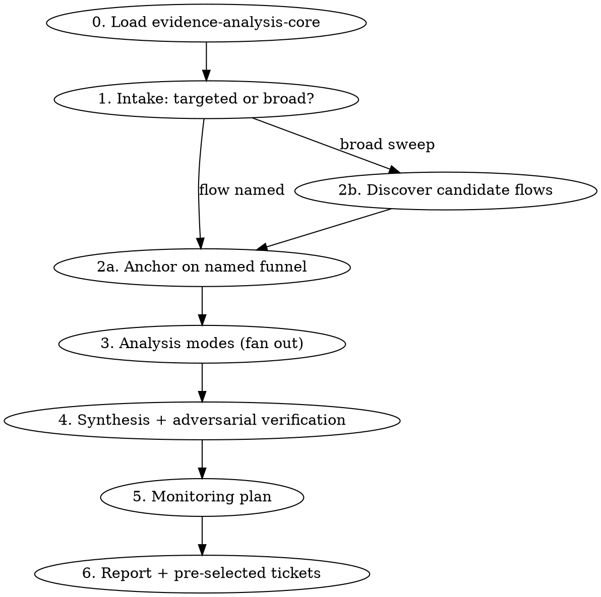

# Analytics Friction Analysis

## Overview

A **proactive, analytics-first** dig for where users get stuck when *nothing has been reported as broken*.
There is no metric regression to anchor on — you go find the friction: funnels bleeding users
step-to-step, drop-offs concentrated in a platform or app version, and analytics events that are
defined in code but silent (or newly zero) in the analytics tool. The deliverable is a research
report plus a **monitoring plan** — where to look and how to confirm a fix later, not the fix itself.

> **Load `evidence-analysis-core` via the Skill tool for the shared method (source discovery,
> evidence-vs-hypothesis standard, subagent digest schema, adversarial verification, app-version
> dimension, artifact + ticketing conventions), then apply the analytics-specific workflow below.**

This skill is **read-only** — it reads the codebase and queries analytics, but never edits code or
opens PRs. The base carries the doctrine; this file only adds what is analytics-specific.

## When to Use

- "Where are users dropping out of the document-upload flow?"
- "Take a look at our onboarding funnel and tell me where we're losing people."
- "Are our analytics events even firing right? Something feels under-reported."
- A broad, open-ended "go find friction in the product" with no flow named.

## When NOT to Use

- A **measured** worsening of a metric tied to a window/alert/dashboard → `regression-analysis`
  (reactive, metric-grounded).
- Digesting an **error tracker** to cut noise and triage scary issues → `error-triage`
  (error-tracker hygiene).
- A known bug needing a fix → `investigate` / `superpowers:systematic-debugging`.

The distinction: this skill starts from *no established signal* and mines analytics to find one.
`regression-analysis` starts from a signal that already got worse.

## Workflow

## Intake — prompt-driven (supports both)

- **Targeted** — the prompt names a flow/funnel ("why do people drop out of document upload?"):
  anchor on that funnel immediately and go straight to the analysis modes.
- **Broad sweep** — no flow named: run a **discovery step first** to identify candidate flows
  before drilling in. Rank candidates by **event volume** (high-traffic flows worth attention) and
  by **drop-off magnitude** (steepest step-to-step losses). Surface the shortlist, pick the most
  promising, then anchor and proceed.

## Analysis Modes

### 1. Funnel drop-off

Quantify **step-to-step conversion** across the flow, locate the **worst drop-offs**, and always
**segment** — by **app version** (first-class, per the base), **platform** (iOS / Android / web),
and **cohort** (new vs. returning, entry source). A drop-off that is uniform across segments points
at UX/content; one concentrated in a single segment points at a platform- or version-specific defect.

### 2. Event-not-firing

Cross-reference **code instrumentation** against **received events**:

1. **Discover the instrumentation pattern from the codebase at runtime** — find the analytics
   wrapper / `capture`-style call sites. **Do not assume a specific helper name**; grep for the
   actual API in use (it may be a thin wrapper around a vendor SDK) and learn how events are named
   and where they fire.
2. **Enumerate the events the code should emit** for the flow under analysis.
3. **Compare against event definitions / volumes** in the analytics tool.
4. **Classify the gap.** Distinguish **"never fired"** (defined/instrumented but zero events ever)
   from **"regressed to zero at release X"** (fired historically, then dropped off at a version
   boundary). A **defined-but-silent** event is a candidate **instrumentation bug** — flag it as a
   `hypothesis` unless a `file:line` + a concrete zero-volume query makes it `evidence-based`.

## Monitoring Plan (required output)

For **every actionable finding**, specify how to confirm resolution *after a fix ships*:

| Field | What to specify |
|---|---|
| Metric / event | The exact event or funnel-step conversion to watch |
| Expected direction & threshold | e.g. "step-3 conversion rises from 42% toward ≥ 60%" |
| Segment | Which slice to watch — **especially app version** (the fixed release onward) |
| Watch window | A suggested duration (e.g. "2 weeks post-release, or until N sessions") |

The monitoring plan is not optional garnish — it is what makes a finding *closeable*. It rides into
the ticket body (below).

## Terminal Prompts

1. **Present findings** — evidence-based vs. hypothesis, quarantined per the base (never interleaved).
2. **Pre-select ticket-worthy findings.** Criteria: `evidence-based` **and** material user impact
   **and** actionable. Hypotheses are offered **only** as clearly-labeled *investigation* tickets
   (e.g. "confirm whether `upload_started` is instrumented on Android") — never as work orders.
3. **Prompt the user about the pre-selected set** — confirm which to file. Create nothing external
   without explicit confirmation.
4. **Ticket body carries the monitoring plan** plus the evidence links, segment, and (for
   instrumentation bugs) the `file:line`. Ticketing uses the base's discovered-MCP flow
   (Asana is the connected example).
