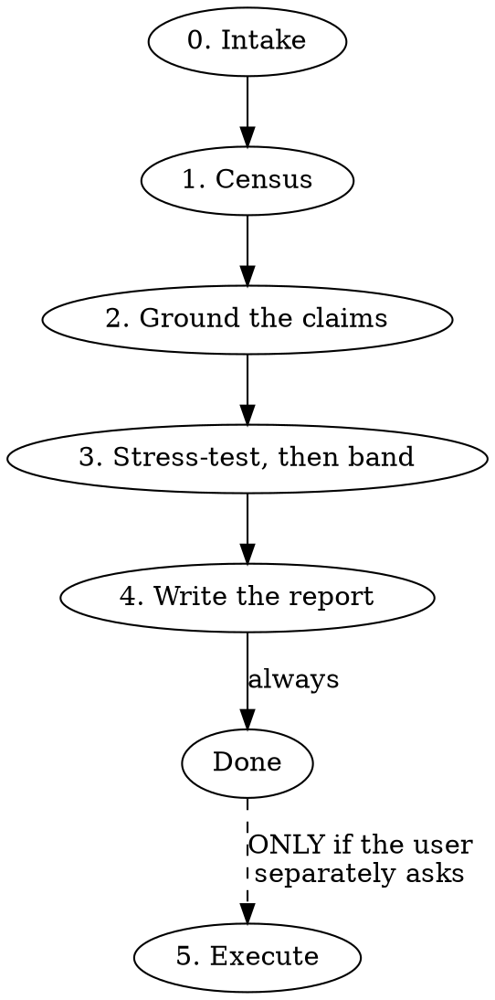

# Backlog Review

## Overview

A whole-project read: what each ticket claims, what is actually true, and which claims the
evidence cannot settle. The output is a report — **open decisions, plus duplicates ranked by
confidence.** That report is the finished product, not a step toward cleaning anything up.

> **Load `evidence-analysis-core` via the Skill tool for the shared method (source discovery,
> evidence-vs-hypothesis standard, subagent digest schema, adversarial verification, artifact
> conventions), then apply the backlog-specific workflow below.**

This file adds only what is domain-specific — it does not re-document the base doctrine.

**The base governs the whole of this skill, §1 read-only guarantee included.** Phase 5 exists
outside that guarantee and is entered only when the user separately asks for it.

## When to Use

- A backlog has accumulated and nobody knows which items are still real.
- An active feature's tickets have drifted from what shipped.
- Duplicate or superseded tickets are suspected across a project or milestone.
- Preparing a backlog for a grooming session someone else will run.
- User says "review the X project", "which of these tickets are still needed", "is this backlog
  accurate".

## When NOT to Use

- Triaging your own recently-active tasks → `asana-review`.
- Planning implementation from one ticket → `asana-plan`.
- Digesting an error tracker → `error-triage`.
- Root-causing a measured regression → `regression-analysis`.

The tell for this skill: the unit of work is **a project**, the question is **which tickets are
true**, and the deliverable is a document rather than a change.

## Workflow



### 0. Intake

Ask these together, before reading anything. Proceed on defaults for anything unanswered.

| Ask | Default |
|---|---|
| Which project, milestone, or epic? | — |
| Which lens — **feature** (do tickets match what shipped?) or **debt** (what is still real?) | infer from the project, say which you inferred |
| Where does the report go — local markdown, a doc connector, a hosted page, a `.docx`? | local markdown |
| Length budget for the report's **prose** | ~1,200 words, excluding the dispositions table |
| Is the codebase checked out locally? Path? | assume not; degrade per **Portability** |

**Do not ask whether the user also wants the backlog cleaned up.** Research is the mandate.
Asking plants execution as an expectation before a single ticket has been read.

### 1. Census

List-view counts are almost always wrong, because subtasks do not appear in them. Report:

- Total tasks · completed · incomplete
- **Incomplete split: top-level vs subtask** — these usually differ by multiples
- **Subtasks orphaned under a completed parent** — open work invisible behind a green milestone
- Tickets created per year
- How many have an assignee; how many have a due date
- Blank or near-blank tickets

Structural findings are reported before individual tickets are read; they usually change what the
individual tickets mean.

### 2. Ground the claims

Fan out one subagent per partition (milestone, section, feature area) using the base's digest
schema, so ticket bodies and query output stay out of the main context. Each ticket gets an
evidence class from `references/classification.md`, or is marked unverifiable.

Evidence classes, strongest first: `file:line` · merged PR or release · repo archive status with
date · telemetry value with its exact query · dependency-manifest count · absence-grep with the
successor named · name-and-purpose match.

### 3. Stress-test, then band

Run the base's adversarial pass. Then band every surviving claim against the confidence table in
`references/classification.md`, **from the evidence actually held** — never from how convincing
the claim feels.

**Low and Unverifiable can never carry a delete or close reading.** They are questions. Obsolescence
is a claim that requires evidence; absence of evidence is not evidence of absence. An unreachable
check is a named blind spot.

A duplicate claim requires naming the survivor **and** one confirming check. Two tickets that
sound alike routinely address different surfaces.

### 4. Write the report

Follow `references/decision-doc.md`. **Author it from the classification, never from a run
ledger.** Check it against the Phase 0 budget with `wc -w`.

Resolve the artifact root and write there unless Phase 0 chose otherwise. **A backlog review's
subject is a ticket project, not a repo**, so the base's bare snippet does not apply — key on the
repo that *grounds* the review, and fall back to the session's own repo, never to the cwd:

```bash
REPO_DIR="${REVIEW_REPO:-$PWD}"   # REVIEW_REPO = the Phase 0 codebase path, if any
SLUG="$(basename -s .git "$(git -C "$REPO_DIR" remote get-url origin 2>/dev/null \
  || git -C "$REPO_DIR" rev-parse --show-toplevel 2>/dev/null || echo UNRESOLVED)")"
ARTIFACTS="${MY_AGENT_ARTIFACTS_ROOT:?run 'make rebuild', then start a new session}/$SLUG"
```

**If `SLUG` is `UNRESOLVED`, or names a directory that does not already exist under the artifacts
root, stop and ask where the report should go.** Do not create a new top-level root. A review run
against a scratch directory once invented an artifacts root named after a fixture, which is how
this guard came to exist.

**When Phase 0 found no codebase, say where the report is going before writing it.** The fallback
files under the session's repo, which is a sane default and the wrong answer whenever the ticket
project belongs to a different system — one verification run filed a review of an unrelated
project into the current repo's plans directory. One line naming the path lets the user redirect.

Print the absolute path. **Publish nothing external without confirmation.**

**This is the end of the skill.** State the findings and stop. Do not offer to execute, do not
close with "want me to clean these up?", and do not append a runnable command block. If the user
wants that, they will say so.

### 5. Execute — only if separately requested

Reached only when the user asks, in their own words, after reading the report.

| Operation | Approval needed |
|---|---|
| **comment** | Proposed in the report; written only on request. Annotating a project is a visible change to shared team state |
| **close / complete** | **Itemized** — the user sees every ticket by title and ID and approves that exact list |
| **delete** | **Itemized**, same bar |
| label, assign, due date, move section | Batch approval of an enumerated list |

Three rules, applying to **close and delete alike**:

1. **No close and no delete without approval of an enumerated list the user has actually seen.**
   "Go ahead", "clean it up", and "ok" are not that. The list cannot grow after approval — a
   ticket found later needs its own approval, not inclusion by precedent.
2. **Low and Unverifiable items never appear on such a list.** They were routed to questions in
   Phase 3 and stay there.
3. **Disclose cascade before approval.** Deleting a parent takes its subtasks; the count goes in
   the request, not in the write-up afterwards.

Then: append to the run ledger **as each operation lands**, never from memory afterwards; record
every ID with the recovery deadline; and reconcile per `references/audit-log.md`.

## Rationalizations — captured from baseline runs

| Excuse | Reality |
|---|---|
| "It's just a close, not a delete — that's reversible" | Close is the operation that gets used without asking. It needs the same enumerated list as delete |
| "Comments are harmless, they're just annotations" | A baseline wrote 17 comments and reported "I closed 2 and deleted 0". Seventeen writes to shared team state, invisible in its own summary |
| "They said go ahead" | Go ahead to *what*? Approval attaches to a list, not to a mood |
| "If the milestone was abandoned, deleting is still my call" | Verbatim from a baseline that had just named the gap in its own evidence. It is not your call. It is a question |
| "Nobody has touched it in two years" | Inactivity is a property of the ticket, not of the work. Yesterday's *TRPC JSON Errors* was untouched and live |
| "The tracker is gone, so the evidence is unrecoverable" | Then it is Unverifiable. Dead links are why the eight N+1 tickets were nearly deleted — they cost 3,156 s/week |
| "No code matches, so the premise is gone" | Only if the grep covered the whole system. Say which repo you searched |
| "The user obviously wants this cleaned up" | The user asked for a review. A report is a complete answer |

## Red flags — stop

- About to call `delete` or `close` against a list the user has not seen item by item
- A delete or close list containing anything banded Low or Unverifiable
- Writing a comment nobody asked for
- Ending the report with an offer to execute, or a pasteable command block
- Reconciling counts with arithmetic instead of a re-query
- Deriving the decision report from the run ledger

**All of these mean: stop, and put it in the report as a question instead.**

## Error Handling

- **Ticketing MCP absent:** name it as a blind spot and stop — there is no backlog to review.
  Do not substitute a local issue list without saying so.
- **Premium-gated search:** fall back to per-project listing plus `get_task` per ID, and say the
  census may undercount subtasks.
- **Repo not available:** degrade per **Portability** below. Never guess.
- **Telemetry MCP absent:** any claim that needed a measurement is Unverifiable, not Low.
- **Artifact root unset:** `MY_AGENT_ARTIFACTS_ROOT` missing means `make rebuild` has not run in
  this session. Say so and write nowhere else.

## Portability — with or without the codebase

| Check | With local repo | Without |
|---|---|---|
| `file:line`, absence-grep | `grep` / `rg` | GitHub MCP code search, else **unavailable** |
| Repo archived, last commit | `gh repo list`, `git log` | `gh` if authenticated, else unavailable |
| Dependency versions | read the manifest | unavailable |
| Telemetry | whichever MCP fills the role | same |

A check that cannot run makes the ticket **Unverifiable**, which routes it to the report as a
question. It never becomes a finding of obsolescence, and the report's coverage notes name every
check that could not run.
