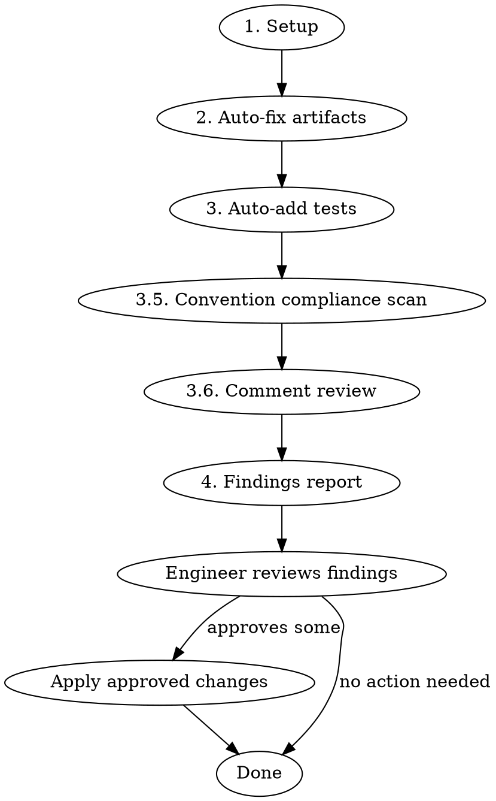

# Code Hygiene

## Overview

Branch cleanup and scope compliance tool. Removes development artifacts, verifies changes stay in scope, identifies test gaps, and auto-adds unit tests where patterns exist. Usable at any point during development — not just pre-PR.

## When to Use

- Before opening a PR
- Mid-development to clean up accumulated artifacts
- After a large implementation to verify scope compliance
- When invoked by the `pre-pr` orchestrator skill

## When NOT to Use

- On branches with no changes from the base (nothing to review)
- For deep code quality / architecture review (use `superpowers:requesting-code-review`)

## Input Resolution

### Base Branch

Auto-detect via merge base. Fallback order: `develop` → `main` → `master`.

```bash
# Detect base branch
BASE_BRANCH=$(git rev-parse --verify develop 2>/dev/null && echo develop || \
  git rev-parse --verify main 2>/dev/null && echo main || echo master)
MERGE_BASE=$(git merge-base $BASE_BRANCH HEAD)
```

### Scope Reference

Resolve in priority order. Use whichever the engineer provides:

1. **Asana task ID/URL** — Pull task name and description via Asana MCP (`get_task`)
2. **GitHub issue number** — Pull via `gh issue view <number>`
3. **Freeform text** — Engineer provides scope description inline
4. **None provided** — Ask the engineer. If still none, skip scope compliance (Phase 4) and note it in the report

## Workflow



### Phase 1 — Setup

Collect all data needed for subsequent phases:

```bash
# Changed files
git diff --name-only $MERGE_BASE...HEAD

# Full diff (for artifact detection)
git diff $MERGE_BASE...HEAD

# Diff of only added/modified lines (for precise artifact targeting)
git diff $MERGE_BASE...HEAD --diff-filter=AM
```

Parse the scope reference per the priority order above. If an Asana task ID is provided, fetch the task description. If a GH issue number, fetch the issue body.

**Empty diff guard:** If `git diff --name-only` returns nothing, report "No changes found between HEAD and $BASE_BRANCH — nothing to review." and stop.

**Load project convention docs.** Locate and read the project's own convention sources — this is what makes the Phase 3.5 scan project-specific instead of generic:

1. The nearest `CLAUDE.md` chain — repo root first, then any `CLAUDE.md` closer to the changed files (e.g. an app subdirectory). A root `CLAUDE.md` often `@`-imports a per-project doc (`@<project>/docs/CODE_CONVENTIONS.md` and the like); follow those imports.
2. Any dedicated convention doc the `CLAUDE.md` points at or that sits beside the changed files: `CODE_CONVENTIONS.md`, `STYLE.md`, `CONTRIBUTING.md`, `docs/conventions*`.

From those docs, extract an explicit **documented-bans list** — the "never do X", "always use Y instead of X", banned-API, and banned-pattern rules. For each, record the rule text and its source `file:line` so findings can cite it. Examples of the *kind* of rule to capture (do not assume these exist — only capture what the docs actually state): banned logging calls, banned styling patterns (styled `Pressable` used as a button, hardcoded hex colors in `className` **or** in color props like `color="#fff"`, arbitrary-bracket Tailwind values), banned state/data-layer patterns, required wrappers. Also note any explicit **exceptions** the doc grants (e.g. "`bg-red-600` is allowed for destructive semantics") so the Phase 3.5 scan doesn't flag a sanctioned pattern.

If the project has no convention docs, record that and skip Phase 3.5 (note it in the report). **Never invent bans** — Phase 3.5 only enforces what a project doc explicitly states.

### Phase 2 — Auto-fix Artifacts

Remove development artifacts **only from lines introduced in the branch diff**. Never modify pre-existing code.

**Auto-removed (no approval needed):**

| Artifact | Detection |
|----------|-----------|
| `console.log` / `console.warn` / `console.error` | Statement on a diff-added line |
| `debugger` | Statement on a diff-added line |
| Commented-out code blocks | Multi-line `//` or `/* */` blocks on diff-added lines that contain code structure (function calls, variable assignments, JSX) — not prose comments |

**Safety rules:**
- **Logger files:** Skip auto-removal for `console.*` inside files whose path contains `logger`, `logging`, or `debug` in the name
- **Diff-only:** Only target lines that appear as additions in the branch diff. Use the diff hunks to identify exact line ranges.
- **Commented-out code vs. real comments:** Only remove comments that contain code patterns (e.g., `// const x = ...`, `// return <Foo />`). Preserve explanatory prose comments, TODOs, and documentation comments.

After applying removals, record what was removed (file, line, content) for the report.

### Phase 3 — Auto-add Tests

Identify new exports that lack test coverage and add unit tests where an existing test suite can be extended.

**Step 1 — Find new exports:**
Scan the diff for newly exported functions, hooks, constants, and types in:
- Utility files (`lib/`, `utils/`, `helpers/`)
- Custom hooks (`hooks/`, files matching `use*.ts`)
- Pure functions and data transforms

**Step 2 — Check for existing test files:**
For each new export, look for a corresponding test file:
- `*.test.ts` / `*.test.tsx` sibling
- `__tests__/` directory with matching name

**Step 3 — Auto-add or suggest:**

| Condition | Action |
|-----------|--------|
| Test file exists | Add unit tests matching the file's existing patterns (imports, describe blocks, naming) |
| No test file exists | **Do not create** — surface as a suggestion in Phase 4 |
| Complex logic where expected behavior is ambiguous | **Do not auto-add** — surface as a suggestion in Phase 4 |

**Scope:** Unit tests only — utilities, hooks, pure functions. Never auto-add integration or E2E tests.

**Step 4 — Falsify every test you add.**

A new test is not done until it has failed. Before reporting any added test as coverage, run it against the pre-fix implementation — `git stash` the change, or import from `git show HEAD:<file>` — and confirm it **fails for the right reason**. Report that result alongside the pass:

```
Added 3 tests to `src/lib/__tests__/useAuth.test.ts` — all 3 fail against HEAD, pass after ✅
```

If a test passes both before and after, **it pins nothing.** Say so plainly rather than counting it as coverage; a test that passes for the wrong reason is worse than no test, because it reports the behavior as protected and stops anyone re-testing it.

**Two traps that produce vacuously-passing tests, both seen in practice:**

- **Default parameters in test helpers.** A signature like `mockThing(steps = [], ...)` silently turns `undefined` into `[]`, so a test meant to assert the *unknown* state asserts the *empty* state instead — and passes. When covering an absent/unknown case, assert the mock actually delivered `undefined`.
- **Mocking above the layer under test.** Mocking a data-fetching hook wholesale means the library never runs, so options like `placeholderData` or `select` are never invoked and the behavior you meant to pin is unobservable. If the mock level makes the real consequence unreachable, note that limitation in the report rather than implying end-to-end coverage.

### Phase 3.5 — Convention Compliance Scan

Mechanically check the branch diff against the **documented-bans list** captured in Phase 1. This catches convention violations that linters miss and that single-file review tends to overlook — the rules already exist in the project's docs; this step operationalizes them.

**Process:**

1. For each documented ban, derive a concrete search pattern and grep the **diff-added lines only** (`git diff $MERGE_BASE...HEAD --diff-filter=AM`). Examples of turning a doc rule into a pattern:
   - "never styled `Pressable` buttons" → flag `<Pressable` additions carrying both `className=` and `onPress=` (not wrapped in an allowed component)
   - "no hardcoded hex" → flag `text-[#`, `bg-[#`, `border-[#`, and color-prop literals like `color="#`, `color={'#`
   - "no arbitrary brackets" → flag `p-[`, `gap-[`, `text-[NNpx]`, etc. where a preset exists
   - "banned API X, use Y" → flag additions calling `X(`
2. Respect documented **exceptions** — if the doc sanctions a pattern (e.g. `bg-red-600` for destructive, `text-white` on dark backgrounds), do not flag it.
3. Scope to the projects the docs apply to. A convention doc living under one project directory governs that project's subtree only; do not flag files in sibling projects against another project's rules.

**Output:** every violation is either auto-fixed (policy below) or becomes a Phase 4 finding under "Convention Violations", citing the offending `file:line`, the diff content, and the rule's source `file:line`.

**Auto-fix policy.** A convention violation is auto-fixable when the documented rule **names its own replacement** and that replacement takes no further choice — "use `logError` instead of `console.error`", a banned API with exactly one documented successor, a literal with exactly one matching token. Apply those and list each under "Auto-fixed" with its rule citation.

Surface rather than fix when any of these hold:

- The rule bans a pattern without naming what replaces it, or names more than one candidate (*which* Button variant? *which* color token?).
- The right replacement depends on what the call site is trying to do rather than on the rule.
- The violation is a codebase-wide pattern this diff merely extends — fixing it here either misses the rest or balloons the diff. Say which, and how many other sites exist.
- The fix would touch a line the branch did not introduce. Phase 2's diff-only rule is not relaxed for conventions.

**A swap that does not hold up is not a fix.** After each auto-fixed violation, re-read the edited region and confirm the replacement is used correctly — right import, right props, right arity. Then run the project's typecheck once after all swaps (from `PROJECT_COMMANDS` when running under `pre-pr`; from the project manifest when running standalone). If a swap does not hold, revert it and demote that violation to a Phase 4 finding stating what broke. A half-applied convention fix is worse than an unfixed violation, because it reads as done.

### Phase 3.6 — Comment Review

Invoke the `comment-review` skill in **diff-scoped mode** against the branch diff.
It judges each comment by whether it describes the line it sits on (keep) or
restates a convention documented elsewhere (cut), and surfaces comments that are
factually wrong about the code below them.

**Scope:** comments on diff-added/modified lines only — same "never touch
pre-existing code" rule as Phase 2. This is narrower than a standalone
comment-review pass, which sweeps whole files.

**Boundary with Phase 2:** Phase 2 already removes *commented-out code* on added
lines. Phase 3.6 handles *prose* comments, which Phase 2 explicitly preserves.
They do not overlap — if a block is commented-out code, it is Phase 2's.

**Auto-fix policy:** comment deletions that the skill classifies as **Cut** with
a confirmed doc citation may be applied automatically and listed under
"Auto-fixed". Everything else — **Relocate** (needs a doc edit), and every
**⚠️ Finding** (a comment that contradicts its code) — goes to Phase 4 for
engineer judgment. Never auto-apply a relocation; writing to a project doc is not
a hygiene-level decision.

If the project has no convention docs, the skill cannot confirm anything as a
duplicate — run it for the wrong-comment findings only and note that in the
report.

### Phase 4 — Findings Report

Present all findings that require engineer judgment. **Do not act on any of these without explicit approval.**

#### Report Structure

```markdown
## Code Hygiene Report

### Auto-fixed
- Removed `console.log` at `src/lib/api/client.ts:47`
- Removed `console.log` at `src/components/ProfileScreen.tsx:23`
- Removed commented-out code block at `src/utils/format.ts:15-22`
- Replaced `console.error` with `logError` at `src/lib/api/client.ts:112` — rule: `docs/CODE_CONVENTIONS.md:44` — typecheck clean after
- Added 2 unit tests to `src/lib/hooks/__tests__/useAuth.test.ts` — both fail against HEAD, pass after ✅

### Needs Your Review

#### Scope
- `prisma/schema.prisma` was modified but not referenced in ticket scope — intentional?
- `src/components/unrelated/Footer.tsx` changed but ticket describes header work

#### Convention Violations
- `components/video/ScreenshareLandscapeView.tsx:88` — styled `<Pressable>` used as a button (`className` + `onPress`) — rule: `docs/CODE_CONVENTIONS.md:117` "never create styled Pressable buttons — use Button/FWButton"
- `components/video/CallScreen.tsx:142` — hardcoded hex `color="#fff"` on icon — rule: `docs/CODE_CONVENTIONS.md:378` "no `text-[#...]`/color literals — use the matching token"

#### TODO/FIXME Comments
- `src/components/FWButton.tsx:42` — `// TODO: add haptic feedback` — remove or keep?
- `src/lib/api/client.ts:89` — `// FIXME: retry logic` — remove or keep?

#### Comments
- **Relocate:** `src/lib/cache.ts:8-14` restates the caching policy from
  `docs/ARCHITECTURE.md` — move the one detail the doc lacks, then remove inline?
- **⚠️ Wrong comment:** `src/lib/api/client.ts:31` says "retries 3×" but the
  constant below it is `MAX_RETRIES = 5` — which is correct?

#### Test Suggestions
- **New test file needed:** `src/lib/utils/formatDate.ts` has no test file — consider creating `src/lib/utils/__tests__/formatDate.test.ts`
- **Integration test:** The new form submission flow touches validation, API call, and navigation — consider an integration test
- **Edge case:** `parseUserInput` doesn't handle empty string input — worth a test case

#### Other Observations
- `calculateTotal` in `src/utils/pricing.ts:30` duplicates logic from `src/lib/cart/totals.ts:12` — consider reusing
- The new `UserCard` component is 180 lines — consider extracting the avatar section
```

## Rules

- **Never auto-fix anything in Phase 4** — all findings require explicit engineer approval before action
- **Convention checks come from the project's own docs, never hardcoded** — if a project documents no bans, skip Phase 3.5 and say so, and respect every documented exception.
- **Auto-fix a convention violation only when the documented rule names its one replacement** — verify the swap afterward, and demote it to a finding if it does not hold. Anything requiring a choice between candidates is a Phase 4 finding, not a fix.
- **Never touch pre-existing code** — only lines introduced in the branch diff
- **Never create new test files** — only extend existing test suites
- **Never auto-add integration or E2E tests** — suggest only
- **Never report an added test as coverage until it has failed against the pre-fix code** — a test that passes both before and after pins nothing, and must be reported as such
- **Comment review is diff-scoped and comment-only** — never relocate a comment
  into a project doc without approval, and never fix code a comment reveals as
  wrong; report it
- **Skip logger files** for console.* removal (path contains `logger`, `logging`, or `debug`)
- **Report what you did** — every auto-fix and auto-added test must appear in the report with file:line references
