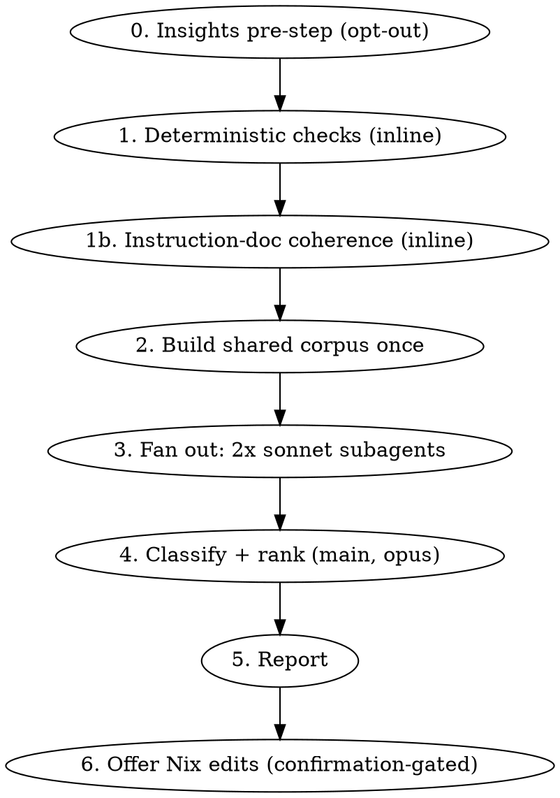

# Config Health

An orchestrator over the checks that tell you whether this **Claude Code
installation** is working as configured — not whether your product code is
healthy. It runs two sets of deterministic checks (config state, and the
coherence of the instruction documents themselves), fans out the two
transcript-analysis skills, and merges everything into one report where every
finding carries its evidence class and its fix.

This skill is **read-only except for Nix files you approve at the end.** It
never writes `~/.claude/settings.json` (a read-only Nix store symlink), never
edits an instruction document (see Step 1b), never runs `make rebuild`, and never
commits.

## When to Use

- A periodic "is my setup still sound?" pass.
- Permission prompts feel excessive and you want the full picture, not one angle.
- After adding several skills, commands, or hooks — drift accumulates silently.
- Before deciding whether to tighten permission mode.
- After a round of edits to `CLAUDE.md` — a rule added to one section routinely
  contradicts one three sections down, and both readings stay defensible.

## When NOT to Use

- One specific question about permission mode → `permission-audit` directly.
- Building an allowlist on a **new machine** with no history → `fewer-permission-prompts`.
- Changing one setting or adding one hook → `update-config`.
- Product-code health (`dead-code-survey`, `npm-cve`, `dependency-upgrades`,
  `error-triage`) — deliberately out of scope. Folding those in produces a
  report nobody acts on.

## Workflow



## Step 0 — `/insights` pre-step

`/insights` is a **built-in slash command, not a skill** — no tool can invoke it,
and it leaves no report file on disk to read afterward. So it has to come from
the user, and it has to come *first*.

Open with `AskUserQuestion`:

- **Include insights (recommended)** — ask the user to run `/insights` now and
  let its report land in the conversation. Then continue. Its session-level
  friction counts (`user_rejected`, `wrong_approach`) are the only *behavioural*
  evidence in the whole report; without them, every finding is structural.
- **Skip insights** — proceed without it. Record the omission in Coverage.

Hand over the literal command to run — `/insights` — rather than describing it.
If the user picks include, **wait**; do not start Step 1 and circle back, because
the insights numbers change how Step 4 classifies behavioural findings.

Do not reimplement `/insights` by recomputing its counts from transcripts. It
would drift from whatever the real command measures, and a number that disagrees
with the tool the user actually trusts is worse than a stated gap.

## Step 1 — Deterministic checks (inline, no subagent)

```bash
bash "$HOME/.claude/skills/config-health/config-checks.sh"
```

Output is `STATUS<TAB>CHECK<TAB>DETAIL`, where `STATUS` is `OK`, `FAIL`
(provably broken), or `REVIEW` (needs human eyes — the script deliberately
refuses to decide). Four checks: settings.json symlink integrity, allow rules
neutralised by deny, hook registration + executability, and skill inventory
drift.

**Comparing the `Skill()` allowlist against the skills directory is still
deliberately absent**, because `modules/home/claude/default.nix` generates those
rules from the same `config/{skills,commands}` directories the check would have
compared them against — there is nothing left to diverge. What the inventory
check tests instead is the layer *underneath* that guarantee: a unit git does
not track is not in the flake source at all, so the generator never sees it and
silently emits no rule. The directory and the allowlist stay in perfect
agreement about a skill that is effectively invisible.

The inventory check is **structural only** — untracked units, and ledger rows
naming a unit that no longer exists. Whether a skill is *working* is behavioural
and belongs to `/system-review`, which owns the transcript arms and the run
thresholds. Keeping that boundary is the same judgment as "When NOT to Use"
below, applied to this skill's own growth.

**Run these inline. Do not dispatch a subagent for them.** They read a handful of
small files; agent dispatch would cost more than it saves *and* insert a
summarizing layer between you and ground truth — the exact failure mode that
turns a verifiable fact into an overstated claim.

These are the highest-value findings per token in the whole skill, because each
one is a **silent** failure: a missing settings.json takes every permission rule
with it, an unregistered hook simply never fires, a non-executable hook fails
with no error. Nothing surfaces them at the moment they break.

Trust the script's own tiering. A `REVIEW` line is not a finding you may promote
to `FAIL` by reasoning about it — verify it against the file or report it as
review.

## Step 1b — Instruction-document coherence (inline, no subagent)

```bash
REPO="$(git rev-parse --show-toplevel)" bash "$HOME/.claude/skills/config-health/doc-coherence.sh"
```

Same `STATUS<TAB>CHECK<TAB>DETAIL` contract, same tiering rules, same reason to run
it inline. The subject is the **instruction documents themselves** — this repo's
`CLAUDE.md`, the deployed global one, and whatever the global `@`-imports — read as
plain text. The script knows nothing about how either file got where it is, and that
is deliberate: this arm is the one part of `config-health` that works in any repo, and
the deployment mechanism is irrelevant to whether a document contradicts itself.

**The first line names the mode, and it decides what the rest means.** `CHECKOUT`
means there is no deployed harness to compare against, so the policy check
announces itself as *skipped, not passed*. Never report a checkout-mode run as a
clean bill of health for the live-mode checks.

**Then do the reading pass.** Seven of the fourteen documented failure classes are
not mechanically detectable — competing thresholds on one event, adjacent sentences
that undo each other, an absolute the same document voids earlier, a rationale
naming an entity the document excludes, and the two documents contradicting each
other. Read `$HOME/.claude/skills/config-health/references/instruction-doc-rubric.md`
and apply it to the same documents the script just reported on. The rubric is the
audit that produced these classes, reduced to a reading order; it also records which
classes are deliberately out of scope and why.

**Two checks are absent from the script on purpose, and the rubric carries them
instead** — dangling cross-references, and a claim whose referent exists while the
behavior attributed to it does not. Both were written, both failed to find the
instance they were written for, and both were cut. Do not reintroduce them as greps:
a check that cannot find its own known defect turns an open question into a false
all-clear, which is worse than the gap it was meant to close.

**Two script lines are instructions to you, not findings:**

- `doc-priority` is a **weight**, never a finding. It fires when some sections of a
  document carry a "hard requirements" banner and others do not, which means the
  banner cannot arbitrate a labelled-vs-unlabelled conflict — so a conflict where
  only one side is bannered is worse than one where neither is. Apply it to the
  rubric findings; do not report it on its own.
- `doc-unenforced` is a **handoff**. Those rules leave no artifact when followed, so
  compliance is invisible in the record and no amount of reading settles it. Name the
  count, say it routes to `skill-reviewer`, and rule on none of them.

**This arm reports and never rewrites — this is a hard rule, not a default.** A check
that edits instruction documents is a check that can quietly rewrite its own rules.
Step 6 offers Nix edits; it must never offer to apply a `CLAUDE.md` edit, only to
show the proposed wording.

One class is **permanently uncovered and the report must say so**: a conflict between
a document and the harness's own built-in instructions. Deciding it needs the harness
prompt as an input, which nothing here has. State the gap; a guessed answer is worse.

## Step 2 — Build the shared corpus once

Both analysis skills scan `~/.claude/projects/**/*.jsonl`. That is the single
largest cost in this skill, and running it twice is pure waste. Build the tagged
corpus once, into scratchpad:

```bash
SK="$HOME/.claude/skills/permission-audit"
OUT="<scratchpad>/tagged.json"
cd "$HOME/.claude/projects" && find . -name '*.jsonl' -print0 \
  | xargs -0 cat 2>/dev/null | jq -s -f "$SK/mode-attribution.jq" > "$OUT"
```

The corpus is a file path, so it costs nothing in context regardless of size.
Pass `$OUT` to both subagents in Step 3.

`permission-audit` consumes this directly (it is that skill's own Step 1 output).
`fewer-permission-prompts` is a built-in with its own methodology — tell its
subagent the corpus exists and to prefer it, but treat reuse there as best-effort
and do not claim the scan was deduplicated if it re-scanned anyway.

## Step 3 — Fan out (two `sonnet` subagents, read-only)

Dispatch both in a **single message** so they run concurrently.

| Subagent | Model | Tools | Returns |
|---|---|---|---|
| Runs `permission-audit` | `sonnet` | `Bash, Read, Grep, Glob` | Raw findings: counts, example commands, denial→replacement pairs |
| Runs `fewer-permission-prompts` | `sonnet` | `Bash, Read, Grep, Glob` | Candidate allow patterns with frequencies |

**Why `sonnet`:** both steps are mechanical extraction over a large corpus —
run committed `jq`/`grep`, tabulate, return examples. High volume, low judgment.
This matches the tiering the rest of this config already uses (`investigate`'s
verification runner, `npm-cve`'s researchers, all three custom agents). The
reasoning worth paying for is classification and ranking, and that stays in the
main `opus` context in Step 4.

**Read-only tools are a structural guard, not a courtesy.** Omit `Edit` and
`Write` from both. `fewer-permission-prompts` writes project
`.claude/settings.json` as its final step — under Nix that either fails or
creates a shadow config that silently overrides the declarative one. Denying the
tool prevents it; an instruction not to write only asks nicely.

**Instruct both subagents to stop before their terminal prompts.** Each skill
ends by asking the user to apply its findings. A subagent cannot prompt the user,
so that step either dies or turns into a silent write. Tell each one explicitly:
return findings, apply nothing, prompt for nothing. This skill owns the single
consolidated prompt in Step 6.

**Do not let either subagent classify or rank.** They return raw findings and
counts. See Step 4 for why.

## Step 4 — Classify and rank (main context, `opus`)

Sort every finding — from every source above, however many ran — into exactly one
bucket. This is `permission-audit`'s Step 3 rule, applied report-wide because
findings now arrive from several places rather than one:

- **Missing allowlist entry** — a legitimate operation with no matching rule.
  Fix: propose a narrow `permissions.allow` pattern.
- **Behaviour to correct** — an operation that violates a documented rule and
  should never have been issued (`node -e` to read a file, relative
  `node_modules/.bin/` paths). Fix: **do not allowlist it.** These prompt
  *correctly*. A high count means auto mode suppressed the feedback that would
  have corrected the habit; the remedy is a CLAUDE.md rule or a hook.
- **Config defect** — a Step 1 `FAIL`. Fix: repair the Nix config.
- **Document defect** — a Step 1b `FAIL`, or a rubric finding. Fix: **a proposed
  wording, never an applied edit.** These are the findings most likely to be
  misfiled as one of the buckets above, because a document defect often *looks*
  like a permission problem: a command the deny list blocks is a documentation
  bug when the document tells you to run it, and loosening the deny to match the
  prose is precisely the wrong repair.

Misfiling the second bucket as the first is the primary failure mode of this
skill, and its blast radius is larger than `permission-audit`'s alone: it
converts a behavioural problem into permanently loosened permissions across the
whole config. This is why the ranking call never goes to a cheaper tier.

Then tag each finding with its **evidence class**, and keep the classes visually
separate in the report:

| Class | Source | How to state it |
|---|---|---|
| **Fact** | Step 1 and Step 1b `FAIL` lines | Assert plainly. Verified off disk. |
| **Inference** | permission-audit, fewer-permission-prompts | *Always* hedged. See below. |
| **Behavioural** | `/insights`, denial→replacement pairs, `doc-unenforced` candidates | Points at a rule or hook, never at a permission. |
| **Reading** | the instruction-doc rubric | Quote both sides. A contradiction asserted without both quotations is not a finding. |

**The inference caveat is mandatory and non-negotiable.** An approved permission
prompt leaves *no trace whatsoever* in the transcripts. You therefore cannot
count prompts you approved — every frequency claim from Steps 2–3 is inferred
from rule matching, never measured. State this in the report body, not only in a
footnote. Two prior sessions in this repo asserted a prompt cause with no
recorded denial and shipped a workaround for a non-problem.

Before asserting that any pattern prompts, require either a **recorded denial**
or an **observed prompt from running a harmless variant.** The permission engine
is more permissive than folklore suggests: `cd <path> && cmd`, `cmd 2>&1 | tail`,
`cmd > file`, and `mkdir -p … && cmd` all auto-approve when each segment is
allowlisted or built-in read-only. Chaining alone does not force a prompt.

## Step 5 — Report

Write to `$ARTIFACTS/config-health/YYYY-MM-DD-config-health.md` (the artifact
root is defined in the global CLAUDE.md under "Dev Artifact Storage"), print its
absolute path, and summarize inline. Order sections by actionability:

1. **Config defects (facts)** — Step 1 `FAIL` lines, each with its one-line fix.
   Lead here: provable, cheap to fix, silent until checked.
2. **Document defects** — Step 1b `FAIL` lines and rubric findings, each with the
   two quotations that establish it and a **proposed wording**. Group by document,
   and say which mode the script ran in. Note explicitly that nothing here was
   applied.
3. **Review items** — Step 1 and Step 1b `REVIEW` lines. Say what the script could
   not decide and what the user should look at.
4. **Missing allowlist entries (inferred)** — ranked by count, each with a real
   example command and the proposed narrow pattern. Carries the caveat.
5. **Behaviour to correct** — with the proposed CLAUDE.md rule or hook. Never a
   permission change. The `doc-unenforced` candidate list belongs here, named as a
   handoff to `skill-reviewer` rather than as findings.
6. **Coverage** — whether `/insights` was included or skipped, which tier ran the
   fan-out, whether the corpus was shared or re-scanned, whether Step 1b ran in
   `CHECKOUT` or `LIVE` mode, and anything not checked. The harness-conflict class
   is permanently uncovered and belongs here every run, not only when someone asks.

Report **every** finding. If you pare the apply-list down in Step 6, the full
list still lives here so nothing is silently dropped.

The artifact lives outside the repo, so there is nothing to stage or commit.

## Step 6 — Offer the fixes (confirmation-gated)

Use `AskUserQuestion` to offer applying only the **highest-value** items: config
defects first, then missing-allowlist entries with real counts behind them. Apply
only what is approved.

- Permissions and hook registrations live in `modules/home/claude/default.nix`
  (base) or in the identity file the machine imports — `hosts/darwin/fw-skyler/claude.nix`
  for work, `roles/home/personal-claude.nix` for personal. **Never** write
  `~/.claude/settings.json`.
- Any allow pattern surfaced by `fewer-permission-prompts` gets redirected into
  Nix — never into a project `.claude/settings.json`.
- Never propose `permissions.deny` changes. Check every proposal against the
  existing deny list first: deny wins, so a contradictory allow entry is dead
  weight on arrival (and Step 1's `dead-allow` check will flag it next run).
- **Never offer to apply an instruction-document edit.** Document defects are
  reported with a proposed wording and stop there — including when the fix looks
  trivial and the user says go ahead. The asymmetry with Nix files is deliberate:
  a wrong permission is caught by the next run of this skill, while a rule
  rewritten to match a mistaken reading becomes the premise every later session
  reasons from. Hand over the wording; the edit is theirs.
- A document defect is **never** repaired by loosening a permission. If a document
  prescribes a command the deny list blocks, the document is wrong.
- Adding a skill or command means getting it **git-tracked** in the same change.
  Its `Skill(<name>)` entry is derived by `readDir` in `default.nix` and must
  never be written by hand, but flake evaluation cannot see untracked files, so
  an unstaged skill generates no entry. Ask the user to stage it — staging is
  theirs to do.

**Stop at the commit boundary.** Report which files changed and stop. Leave
`make rebuild` to the user — a rebuild while any session is live deletes
`settings.json` and every permission rule with it.
