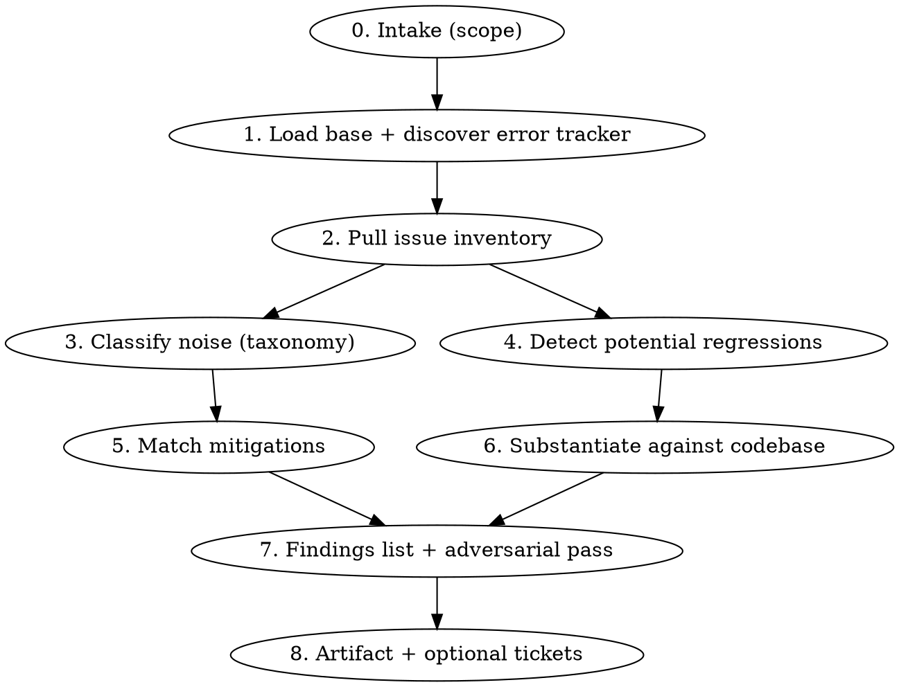

# Error Triage

## Overview

A hygiene pass over an **error tracker** to raise signal-to-noise: classify and mitigate the noise
that drowns a project, then surface the scariest potential regressions and **substantiate them
against the actual code** before they become tickets. The deliverable is a triaged findings list —
noise to suppress + top regressions with evidence — and, on request, tickets that always link back
to the related error(s). It is **read-only** except for the local artifact and (confirmed) tickets.

> **Load `evidence-analysis-core` via the Skill tool for the shared method (source discovery,
> evidence-vs-hypothesis standard, subagent digest schema, adversarial verification, app-version
> dimension, artifact + ticketing conventions), then apply the error-triage-specific workflow below.**

This file adds only what is domain-specific — it does not re-document the base doctrine.

## When to Use

- "Triage / clean up / digest our Sentry (or PostHog error tracking) project."
- Recurring error-tracker hygiene — cut noise, find what actually matters.
- "Which of these issues are real regressions vs. junk we can ignore?"

## When NOT to Use

- Proactively mining product analytics — funnels, drop-off, events not firing → `analytics-friction-analysis`.
- A single measured metric regression tied to a dashboard/alert/window → `regression-analysis`.
- A known, reproduced bug needing a fix → `investigate` / `superpowers:systematic-debugging`.

The tell for this skill: the **error tracker is the primary source** and the goal is *hygiene +
triage across many issues*, not root-causing one measured metric.

## Workflow

## Intake (scope)

**Default:** the active error-tracker project(s) over a recent window (e.g. last 14 days). The prompt
may narrow to a specific **project**, **release/app version**, or **time range** — honor it if given,
otherwise triage the default scope and state it explicitly.

Discover the error tracker per the base's capability-role source discovery — resolve "error tracking"
to whatever fills the role (Sentry, PostHog error tracking, or both). Report covered vs. absent roles
in Coverage; do not hardcode a vendor.

## Noise Taxonomy

Classify each issue against the categories below. Fan out per partition (project / release) using the
base's subagent digest schema so heavy issue payloads stay out of the main context.

| Category | How to recognize | Typical mitigation |
|---|---|---|
| **Out of our control** | Third-party SDK internals, browser-extension injection, transient network blips — origin is outside our code. | Inbound filter on the tracker; `ignoreErrors` / deny-list at the SDK. |
| **Expected & handled** | Caught and recovered in code but still captured (e.g. anticipated 4xx, user-cancelled flow). | `beforeSend` drop or downgrade to breadcrumb; stop capturing at the source. |
| **Already fixed** | Concentrated in old app versions/releases, **absent from current** (ties to the base's app-version dimension). | Archive/resolve; scope alerts to current release. |
| **Stale / dormant** | Not seen recently — last-seen well outside the window. | Auto-resolve / ignore until it recurs. |
| **Negligible impact** | Very low event count **and** low unique-user count. | Mute / ignore; revisit only if it grows. |
| **Poor grouping** | One root cause fragmented across many issues, or many distinct causes merged into one. | Regroup / fingerprint fix (merge or split the grouping rule). |

## Mitigations (matched per category)

Each recommendation must name the **concrete lever**, not just "reduce noise":

- **Inbound filter** — tracker-side rule dropping the event on ingest (project/inbound-data settings).
- **`beforeSend` / `ignoreErrors`** — SDK-side suppression in our code; name the config location.
- **Archive / ignore / mute** — tracker-side triage action on the issue itself.
- **Regroup / fingerprint fix** — adjust grouping so one cause is one issue (merge fragments or split a merged issue).
- **Fix at source** — the "noise" is a real defect; hand it to the regression track below, not to suppression.

Sentry is the recognition example for these levers; stay **vendor-neutral** where the tracker may be
PostHog error tracking — name the equivalent lever the connected tracker actually exposes.

## Biggest Potential Regressions

Detect candidates via:

- **New-since-release** — first-seen at or after the current release (discover the current version per
  the base's app-version dimension).
- **Spiking volume** — event or user count climbing sharply within the window.
- **Tracker-flagged** — the tracker's own regressed / reopened markers.

Then **substantiate against the codebase** — this is a good opportunity to read the actual code. Find
the implicated `file:line` from the stack trace, check recent changes touching it (git blame / recent
commits), and use what you find to **raise or lower confidence**. Per the base's evidence standard,
a candidate tied to a concrete `file:line` + a recent change is `evidence-based`; a plausible-but-
uncorroborated one stays a `hypothesis`. Run the base's adversarial pass before ranking.

## Terminal Prompts

Present a **findings list** combining:

1. **Noise to mitigate** — each item with its category, the matched lever, and a link to the issue(s).
2. **Top potential regressions** — each ranked High/Medium/Low, tagged `evidence-based` vs.
   `hypothesis` (per the base), with the implicated `file:line` and links to the related error(s).

After the user **engages** with the list, propose tickets for the designated units of work. Ticketing
uses the base's discovered-MCP flow (Asana is the connected example). **Every ticket must always
include context and LINKS to the related error(s)** — the issue URL(s), the classification, the
implicated `file:line`, and the recommended lever. Create nothing external without explicit
confirmation.
