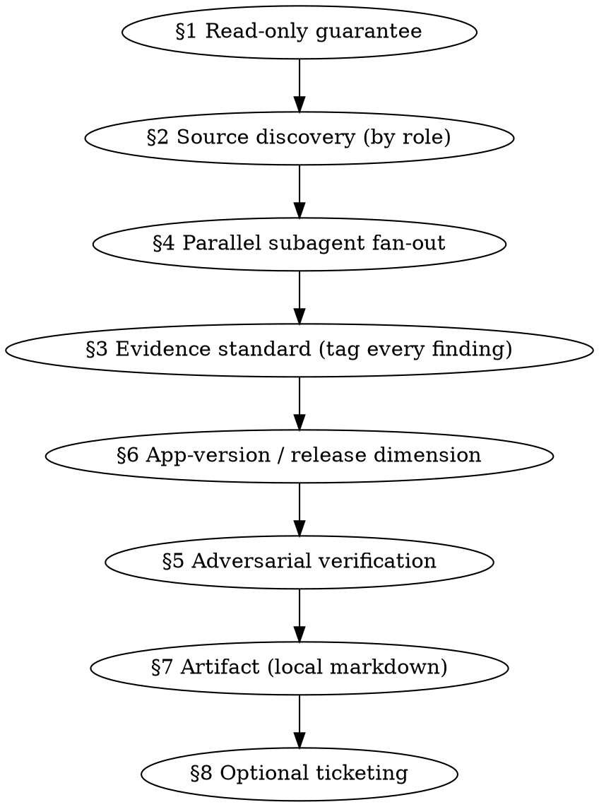

# Evidence Analysis Core

## What This Is — Read First

> **This is an internal reference skill, not a runnable workflow.** It has no intake, no
> entry point, and no user-facing trigger. It is loaded via the Skill tool **by** the leaf
> skills — `analytics-friction-analysis`, `error-triage`, and `regression-analysis` — which
> then *apply* the doctrine below to their own domain workflow. If a user request appears to
> land here directly, it was mis-routed: hand off to the appropriate leaf instead.

The leaves differ by domain (which source role is primary, what a finding *is*, how intake
works). What they **share** is method: how sources are discovered, what counts as evidence,
how work is fanned out, how claims are stress-tested, how releases are accounted for, how the
artifact is written, and how tickets are offered. That shared method lives here, in one place,
so hardening it happens once.

The eight sections below are doctrine to be applied, in roughly this order within a leaf's run:



## §1 — Read-only guarantee

The analysis produces a report, never a change. The **only** permitted side effects are:

1. Writing the local markdown artifact (§7).
2. Creating tickets — and only **after explicit user confirmation** (§8).

Everything else is read-only.

> **Reading the codebase is allowed and encouraged.** Reading source, configs, git history, and
> instrumentation is a read — do it freely to substantiate findings against real code. What is
> forbidden is *writing* code, editing files (other than the artifact), staging/committing, or
> opening PRs. "Read-only" constrains mutations, not curiosity.

## §2 — Capability-role source discovery (nothing hardcoded)

> **There is no hardcoded source list.** At runtime, enumerate the `mcp__*` tools present in the
> session and bucket each server by the **capability role** it fills. Product names below are
> *recognition examples only* — match by role, not by name. Swap Datadog for BetterStack or Linear
> for Asana and the method is unchanged; install a new MCP tomorrow and it gets picked up with no
> edit here.

| Capability role | Example servers that fill it (not exhaustive) |
|---|---|
| Product / session analytics | PostHog, Amplitude |
| Error tracking | Sentry, PostHog error tracking |
| Metrics / telemetry | BetterStack, Datadog |
| Ticketing (§8, opt-in) | Asana, Linear, Jira |
| Change history | git (local — **always present**) |

Report **covered vs. absent** roles in the artifact's Coverage section (§7). A role with no
configured source is not a silent failure — it is a named blind spot. No silent gaps, ever.

## §3 — Evidence standard (non-negotiable)

> **Every finding is tagged `evidence-based` or `hypothesis`. There is no third state and no
> untagged finding.**

- **`evidence-based` requires a linkable artifact** — one of: a metric/event **value + the EXACT
  query used**, an issue ID, a `file:line`, or a release/version. No artifact → the finding
  **cannot** be `evidence-based`, and **cannot rank above Low**. "Errors went up" is not evidence;
  "`SignupSubmit` failures rose 12→410/day since v4.2.0 [query: `…`]" is.
- **`hypothesis` findings are included but quarantined.** They belong in their own section of the
  report and are **never interleaved** with evidence-based findings. A plausible idea is worth
  recording — it is not worth disguising as a fact.
- **Correlation ≠ causation.** Two things moving together is not a finding until synthesis names a
  **mechanism** (the code path, the release, the query that ties cause to effect). Adversarial
  verification (§5) exists precisely to kill plausible-but-coincidental links.
- **Report faithfully.** If a role had no source, or a query returned nothing, say so — a null
  result is itself evidence.

## §4 — Parallel subagent fan-out with a digest schema

Fan out **one focused subagent per source or partition** (use the Agent tool — `Explore` or
`general-purpose`, both of which can reach the session's MCP tools). Each subagent runs its own
heavy queries and returns a **structured digest, not raw payloads** — so multi-thousand-row query
output and stack traces stay out of the main context. Always include a **change-history** subagent
over git for any window under investigation. **Choose each subagent's model per §9** — fan-out is
the mechanical, high-volume work that belongs on the cheaper tiers.

Every subagent returns this shared schema **verbatim**:

```
- source: <role or server>
- findings[]:
    - claim: one sentence
    - classification: evidence-based | hypothesis
    - evidence: concrete artifact (value + exact query, issue ID, file:line, release)
    - user_impact: unique users / sessions affected (if determinable)
    - strength: direct | suggestive | absent
```

The `evidence` field must carry the **exact query** (not a paraphrase) so any claim is
independently reproducible. `strength: absent` is a legitimate return — it means the subagent
looked and found nothing, which feeds the Coverage notes.

## §5 — Adversarial verification

Before anything is ranked, every non-trivial finding gets a **skeptic pass**: could this evidence
be explained another way? (A release that aligns in time but only touched copy. A spike that is
really a logging change. A drop-off that is a tracking-plan edit, not a user behavior change.)
Dispatch skeptic subagents for the non-obvious ones.

- **Survivors** are ranked **High / Medium / Low**, with the reasoning that earned the tier.
- **Refuted** findings move to a **"Considered & ruled out"** list, each with *why* it was ruled
  out — so the same dead end is not re-walked next time.

Ranking never happens before this pass. An unverified finding ranks Low at best (§3).

## §6 — App-version / release dimension (first-class)

Segment findings by **app version / release** — it is a primary axis, not an afterthought.

- **Discover the current released version(s)** — do not assume. Read app config, check the store
  listing, or read the version distribution straight from the analytics tool. The mobile app is
  **`fwapp2proto`**.
- **Discount** friction or errors that are concentrated in **old versions and absent from the
  current one** — flag these as *"likely already fixed in `<version>`"* rather than ranking them as
  live problems. Conversely, a finding that is **new or rising in the current release** is more
  urgent, not less.
- Distinguish "present across all versions" from "regressed at release X" — they imply different
  causes and different fixes.

## §7 — Artifact convention

Always write the report as **local markdown** to:

```
docs/local/<area>/YYYY-MM-DD-slug.md
```

where `<area>` is the leaf's domain (e.g. `analytics`, `error-triage`, `regressions`). The path is
relative to the root of the repo under analysis; create the directory if it does not exist.

> **The artifact is a local dev artifact and is git-ignored (`**/docs/local/`).** It is not
> meant to be committed — writing the file is the side effect; version control is the user's call.

Standard report skeleton (leaves may add domain sections, not remove these; §5-numbered
"For engineering discussion" is the one **optional** section — include it when qualifying
items exist, omit it rather than padding it):

1. **Summary** — the question and the headline answer, quantified.
2. **Evidence-based findings (ranked)** — High → Low, each with its artifact, mechanism, and
   user impact.
3. **Hypotheses (quarantined)** — ideas worth recording, clearly separated from the above.
4. **Considered & ruled out** — refuted candidates and why.
5. **For engineering discussion** *(optional)* — items the data cannot resolve, framed as
   discussion prompts, never work orders. Two admission criteria, and an item must meet one:
   - **Ambiguous design** — the "correct" behavior is a judgment or policy call (enforcement
     policy, capture policy for expected errors, security-vs-UX messaging tradeoffs, which of
     several code paths is canonical). More queries cannot answer these; a decision can.
   - **Thin evidence needing categorization** — a real signal whose competing mechanisms imply
     different owners/fixes, distinguishable only with access the analysis lacks (code review,
     a QA/device test, server-side logs). Name the candidate categorizations and the cheapest
     probe that separates them.

   Distinct from §3 hypotheses: a hypothesis is a candidate *explanation* awaiting evidence;
   a discussion item is a *question* whose answer is a human decision or a categorization.
   Don't file decision forks as hypotheses to dodge the tagging standard — route them here.
6. **Coverage notes** — which roles were queried, which were absent, what could not be grounded.

## §8 — Optional ticketing flow

After findings are presented, **offer** tickets via the **discovered** ticketing MCP from §2
(Asana is the connected example here; match by role, not name). This is opt-in and
**confirmation-gated**.

- **Group by root cause; don't force one-per-finding.** Default to one ticket per selected finding,
  but when several findings share a root cause, an owner, or a single investigation, combine them
  into one ticket with the findings as a checklist — common after cross-domain reconciliation (§10),
  where one defect explains several symptoms.
- **Report what is *not* ticketed.** When only a subset is filed, state explicitly what was left out
  and why (deferred / owned-directly / watch-only) — a pared-down slate must never silently drop a
  finding.
- Each ticket body carries the **evidence, links** (issue IDs, `file:line`, query, dashboards), and
  — where relevant — the **monitoring plan** (which metric/event confirms resolution, expected
  direction & threshold, the segment, a watch window) inlined.
- Hypotheses, if ticketed at all, are framed as **investigation** tickets and labeled as such.
- "For engineering discussion" items (§7.5), if ticketed at all, are framed as **discussion /
  decision** tickets — the ticket asks for a categorization or a policy call, not a change.
- **Create nothing external without explicit confirmation.** Present the pre-selected set, wait for
  the user's go, then create.

## §9 — Model tiering (cost-aware fan-out)

> **Match the model to the cognitive weight of the step.** The reasoning value of an analysis lives
> in synthesis and adversarial verification, not in running queries — so spend the expensive tier
> there and push mechanical work down. Set the model explicitly via the Agent tool's `model`
> parameter; a subagent dispatched without one inherits the main context's model, which for bulk
> fan-out is usually more than the step needs.

| Step | Model | Why |
|---|---|---|
| Pure enumeration — list instrumented events, pull an issue inventory, dump commits in a window | `haiku` | No judgment, just retrieval into the digest schema. Cheapest tier is sufficient. |
| Per-source fan-out (§4) — run the heavy queries, classify each finding, return the digest | `sonnet` | Mechanical but requires the evidence-standard judgment (§3). High volume — this is where token spend concentrates, so it must not sit on the top tier. |
| Synthesis, adversarial verification (§5), cross-domain reconciliation (§10) | `opus` | The load-bearing reasoning: does this evidence survive a skeptic, and what does it mean across sources? Keep this in the main context (already `opus`) or dispatch an `opus` skeptic. |

Two guards so tiering never silently degrades a finding:

- **Never let a cheaper tier make the ranking call.** Enumeration and fan-out subagents *classify*
  (`evidence-based` | `hypothesis`, `strength`) and return artifacts; they do **not** assign
  High/Medium/Low. Ranking happens only after the `opus` adversarial pass (§5).
- **State the tiering in Coverage (§7).** One line noting which tier ran the fan-out — so a
  surprising null result can be re-checked at a higher tier rather than trusted blindly.

## §10 — Cross-domain reconciliation

> **Applies when more than one leaf's evidence is in play** — either a run that spans domains or the
> `evidence-consolidation` aggregator merging separate reports. A single leaf reconciles only its own
> evidence in §5; this section is how two evidence sets are merged into one ranking without
> double-counting or letting a concern survive that a *sibling domain already refuted*.

Run this as an `opus` step (§9), in order:

1. **Dedup by mechanism, not by wording.** Two findings are the same when they name the same
   underlying cause — matched on `file:line`, issue ID, event/funnel name, or release — even if one
   report calls it "signup errors" and the other "onboarding drop-off." Merge them into one finding
   that carries **both** sources' evidence artifacts.
2. **Cross-domain skeptic pass.** For every finding, ask whether the *other* domain's evidence
   raises or lowers it — this is the step a single leaf structurally cannot do:
   - Error-tracker regression concentrated in an app version analytics shows is nearly unused →
     **downgrade / rule out** (already-fixed, per §6), even though the error data alone looked scary.
   - Analytics "silent event" explained by an error-tracker issue showing the capture call throwing →
     **upgrade** from `hypothesis` to `evidence-based` (mechanism now named).
   - A finding one report ruled out that the other still ranks High → the ruling-out evidence wins
     **only if it is itself `evidence-based`**; otherwise both are surfaced with the conflict named.
3. **One merged ranking + one merged "Considered & ruled out."** Re-rank the survivors across the
   combined evidence. Every ruled-out item records which domain's evidence refuted it and why, so the
   same dead end is not re-walked by a future single-leaf run.
4. **Attribute every finding to its source report(s).** The merged report must be traceable back to
   its inputs, never a re-assertion that loses provenance. But the consolidated report often travels
   outside the repo (exported, pasted into a ticket), so attribute in **plain language** ("the
   friction sweep," "the error triage") readable without repo access — keep the source file paths in
   one "inputs" line up top for auditors, not as inline sigils through the body. (See the
   evidence-consolidation Artifact section for the convention.)

Conflicts are a first-class output, not something to resolve silently: when two domains genuinely
disagree and neither's evidence dominates, surface the disagreement and route it to §7.5 "For
engineering discussion" rather than picking a winner.
