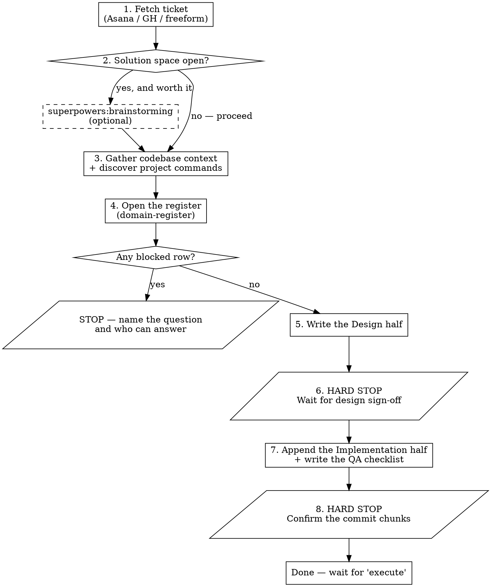

# Feature Plan

## Overview

One skill, two artifacts, one sign-off gate in the middle.

| Artifact | Path | Holds |
|---|---|---|
| Plan document | `$ARTIFACTS/plans/YYYY-MM-DD-<slug>.md` | **Design** — approach, alternatives, files, edge cases, out-of-scope. Signed off, then **Implementation** — phases and checkpoints appended below it. |
| QA checklist | `$ARTIFACTS/plans/YYYY-MM-DD-<slug>-qa.md` | Risk-ordered manual test matrix, checked off during testing |

Artifact root: `CLAUDE.md` § Dev Artifact Storage.

**This skill is the two templates below plus two hard stops.** Everything else it needs
is already loaded or already invoked, so it is not restated here:

| Subject | Lives in |
|---|---|
| One commit per phase, and why (the Yubikey touch) | `CLAUDE.md` § Plan Execution |
| Artifact paths, and never committing them | `CLAUDE.md` § Dev Artifact Storage |
| Build/test/lint command discovery | `CLAUDE.md` § Project Command Discovery |
| Never staging or committing | `CLAUDE.md` § Git |
| Executing the phases once written | `superpowers:executing-plans`, or `superpowers:subagent-driven-development` in-session |

**Design and implementation share one document** because split apart they duplicated six
sections. The **QA checklist stays separate** because it is checked off while testing,
against a document that must not shift underneath the tester.

The sign-off gate is what makes the design authoritative: phases are not written until the
design half is approved, because once they exist the design assumptions are baked in.

## When to Use

- New feature work from a ticket (Asana, GitHub issue, Linear) that needs more than one commit
- A non-trivial refactor or architectural change that needs alignment before code
- Mid-flight: the design was revised and the phases need regenerating
- User asks: "write a design doc", "write the TDD", "design this", "plan this feature", "write the plan"

## When NOT to Use

- Small bug fixes, one-off scripts, chore work, pure documentation → go straight to a PR
- The work is one file and one commit — a plan is ceremony
- A bug, test failure, or unexpected behavior → `investigate`

**Not having a design is not a reason to refuse.** This skill writes the design, so
there is nothing to redirect to. When the approach is already settled, keep the design
half short and say so — a thin design that names the files and the out-of-scope is worth
more than a padded one. Do not manufacture alternatives to fill a section.

## Before writing: brainstorm if the space is open, and open the register always

**If the solution space is genuinely open, invoke `superpowers:brainstorming` first** and
let "Alternatives considered" capture its output. Skip it when the ticket names the
approach or the codebase already has the pattern to mirror — then say which alternatives
went unexplored, rather than letting the section imply it was exhaustive.

**Open the register unconditionally.** Invoke `domain-register`. The design's real risk is
not a missing alternative, it is a product rule the repository does not contain. A rule you
cannot settle is a `blocked` row that **stops the design** — not a sentence hedged in a
paragraph, which proceeds by default and is never read again.

## Workflow



## Inputs

Resolve before writing:

1. **Ticket reference** — Asana task ID/URL, GitHub issue number, or freeform description. Fetch via the relevant MCP / `gh` command. If there is no reference, ask.
2. **Target paths** — `$ARTIFACTS/plans/YYYY-MM-DD-<slug>.md` and `-qa.md`. Today's date, kebab-case slug from the ticket title.
3. **Branch + base branch** — from `git status` / `git remote`. Goes in the header.
4. **Existing patterns to mirror** — `grep` for features that already exist. The design's strongest move is "we already do X for Y, mirror that here."
5. **Project commands** — per `CLAUDE.md` § Project Command Discovery, resolved **before
   writing**, because the phases quote them. Exact commands into the phases, never "run the
   tests."

## Phase sizing

`CLAUDE.md` § Plan Execution already establishes one commit per phase and why. What it does
not give you is the sizing call, which is this skill's job:

**A phase is a vertical slice a reviewer would want as one commit — roughly 2–5 files.**
"New hook + its tests" is one phase. "New component skeleton + lifecycle effects" is one.
"Wiring into parent + safety effect + integration test" is one. A medium feature lands in
3–5. At 8+ you are over-fragmenting; consolidate. A phase touching six files for a single
conceptual change is worse than two touching three each.

## Part 1 — the Design half

Write these sections, in this order, then **stop**. Skip one only if it genuinely does not apply.

````markdown
# <Feature Title>

**Repo:** <repo name>
**Branch:** `<branch>` (in progress)
**Base branch:** `<base>`
**Ticket:** <Asana/GH link>
**Register:** `$ARTIFACTS/registers/<branch>.md`
**Last updated:** YYYY-MM-DD
**Status:** design — awaiting sign-off

> Self-contained. Whatever conversation produced this is not available in the worktree
> where it will be executed. If no brainstorm informed it, say so here rather than
> letting the alternatives section imply one did.

## Background

Two paragraphs max. The *structural facts that shape the work* — not a retelling of the
ticket. Name an existing pattern in the codebase this should mirror, with a link, or
state explicitly that there isn't one.

## Approach

One paragraph: the chosen approach.

### Alternatives considered and rejected

- **<alternative>** — one-line reason for rejection.
- **<alternative>** — one-line reason for rejection.

### User flow (if user-facing)

Numbered, 4–8 steps, from the user's perspective.

## Files

The single file table for this document. **Exhaustive, not representative** — the
phases below draw their scope from it, and implementation touching a file outside it
means the design needs revising rather than silently expanding.

| Path | State | Purpose |
|---|---|---|
| `path/a` | new | What it does |
| `path/b` | modified | What changes |

No other files change.

## <Per-component design sections>

One subsection per row above. Interface boundaries — signatures, `interface`s, JSX
shape — never full implementations.

## <Lifecycle / contract section if applicable>

A snippet for any non-obvious lifecycle: setup, cleanup, subscription, ordering.

### Edge cases

One sentence describing the case, one on the handling. Cover at minimum: the flow ends
mid-way, the app is backgrounded, a network blip, the parent unmounts, state rolls back
during a transient.

### Why we are not handling <X> in v1

A deferred-but-tempting feature gets its own subsection with the cost/benefit. Distinct
from Out of scope: this is *tempting and refused*, that is *never in frame*.

## Domain assumptions

Lift the register's rows for this branch. Every `assumed` row appears here — an
assumption the reviewer never sees is indistinguishable from one nobody made. A
`blocked` row means this document is not ready for sign-off.

## Telemetry (if observability matters)

Event names and sample payloads. Part of the design, not an afterthought.

## Out of scope

Explicit non-goals. If a reviewer could ask "why didn't you do X?", X belongs here or
in "Why we are not handling X in v1".

## Open questions to resolve at implementation time

Each carries a known fallback, so a wrong answer does not block execution. A question
with no fallback is a research request, not a design.

1. **<question>** — fallback if unclear.
````

### HARD STOP — design sign-off

1. **Print the absolute path.**
2. **Print a 3–5 bullet summary**: chosen approach, files affected, key edge cases, any `assumed` register rows.
3. **Stop the turn.** Do not write phases. Wait for explicit sign-off — "design looks good", "proceed to plan".
4. If changes are requested, edit and re-print. Still do not write phases.

## Part 2 — the Implementation half

Appended to the **same document** after sign-off. Update the header's `Status:` to
`design signed off — implementing`.

````markdown
---

# Implementation

**Goal:** one sentence.

**Tech stack:** relevant libraries and frameworks, with versions where they matter.

**Commands:** the exact commands discovered from the manifest — typecheck, lint, test.

### Current state / Target state (if architectural)

ASCII diagram or table for each. Skip when the change is not structural.

### Constraints

- One bullet per constraint, including project-specific gotchas (peer dep conflicts, API limits)
- **Git:** do not run `git add`, `git commit`, or any staging command. Report changed files and wait for the developer to review and commit.

---

## Phase 1: <Phase Title>

One paragraph: what this phase delivers.

### Task 1.1: <Task Title>

**Files:** Modify/Create `path` — drawn from the Files table above.

**Step 1: <Action>**

Detail, with snippets where they help. Test-first encouraged; the phase as a whole must
have tests.

**Step 2: Verify**

```bash
<exact command from Commands above>
```

Expected: no new errors.

### Task 1.2: <Task Title>

As above.

### -- MANUAL REVIEW CHECKPOINT 1 --

**Files changed in this phase:** `<list>`

**Suggested commit message:**
```
<message>
```

**What to test:**
1. <check>

**What could go wrong:**
- <risk, and how to recover>

**STOP here. Wait for the user to commit and confirm before starting Phase 2.**

---

## Phase 2: <Phase Title>

As above, with its own checkpoint.

---

## Summary of changes

| File | Change |
|---|---|
| `path` | Description |

Reconcile against the Files table. A divergence is a design revision, not a footnote.
````

## The QA checklist

A separate file, so it can be checked off while testing without the plan shifting underneath it.

````markdown
# <Feature Title> — Manual QA Checklist

**Branch:** `<branch>`
**Plan:** `<plan path>`
**Ticket:** <link>

The only honest test of <user-facing feature> is a real <device> with a real <account>.

## Pre-flight setup

- [ ] <Build / deploy step>
- [ ] <Test account ready>
- [ ] <Capture tool ready>

## Highest-risk checks (do these first)

These have hedges specified in the design; if one fails, the fix path is already known.

### A. <Risk name>

<Why this is risky>

- [ ] <Repro step>
- [ ] **Pass** = <expected>
- [ ] **Fail** = <failure mode>

If fail: <fix path from the design half>.

## Happy path

- [ ] <Step>

## Exit paths

- [ ] **<Exit>** — <repro> → <expected>

## Regression spot-checks

- [ ] <Adjacent feature not affected>

## Screenshots for the PR

- [ ] **Before, <platform>** — <what to capture>
- [ ] **After, <platform>** — <what to capture>

## QA findings

> Per finding: platform/device · which checklist item · what happened ·
> fix-now / follow-up / wontfix · follow-up ticket if any.

Also record anything that **deviated from the design half** during real-device testing.

(empty until QA runs)

## Decision after QA

- [ ] **Ship as-is**
- [ ] **Fix-now small** — minor issues resolved in this PR
- [ ] **Fix-now structural** — a high-risk check failed, code change needed
- [ ] **Punt** — known issues documented as follow-ups and called out in the PR
````

## HARD STOP — confirm the commit chunks

1. **Print both absolute paths.**
2. **Get explicit sign-off on the chunks.** Each phase is one commit-sized chunk and one review unit. List each — files touched, what its checkpoint reviews — then ask: *"These are the N commits I'll build. I stop after each for you to review and sign it. Confirm or adjust the boundaries before I start."* Negotiate granularity here: too many stops is over-fragmented, too few and the user cannot review in reasonable units.
3. **Resolve every stop/continue question now, never at execution time.** An unsure boundary is a planning question. Do not carry the ambiguity into execution and quietly resolve it as "keep going."
4. **Do not auto-invoke execution.** Wait for "execute" or similar.

## Quality Bar

| Section | Bar |
|---|---|
| Background | Names an existing pattern to mirror, or states there isn't one |
| Alternatives | Two or more, each with a one-line rejection reason — or an explicit note that the space was not open |
| Files | Exhaustive. If implementation deviates, the design is revised, not quietly widened |
| Edge cases | The five minimum cases above, each with its handling |
| Domain assumptions | Every `assumed` register row surfaced; no `blocked` row outstanding |
| Out of scope | Explicit, and distinguished from "why not X in v1" |
| Open questions | Each has a fallback |
| Phases | 3–5 commits, each a vertical slice of ~2–5 files, each with What to test and What could go wrong |
| QA | Risk-ordered, fix paths inline, decision matrix at the end |

## Common Mistakes

- **Writing the design during implementation.** The point is locking scope before code. If implementation has started, this is a postmortem.
- **A Files table that "covers most files."** Either exhaustive or wrong.
- **Open questions with no fallback.** A plan punts cleanly; a research request blocks.
- **Writing phases before sign-off.** Once phases exist the design assumptions are baked in, and redoing both costs more than waiting.
- **Skipping the register and hedging the rule in prose instead.** Prose proceeds by default. That is the whole failure the register's `blocked` state exists to catch.
- **QA with the happy path first.** Risk-order it. The doc earns its keep when something breaks.
- **Treating QA as test cases for QE.** It is a checklist for the engineer to walk on real devices, plus a deviation log.
- **Letting the document become a narrative.** It is a reference. Any one section should be readable without the rest.
- **Citing a specific plan file as an example.** Paths into a work repository go stale, and this repository is public.
