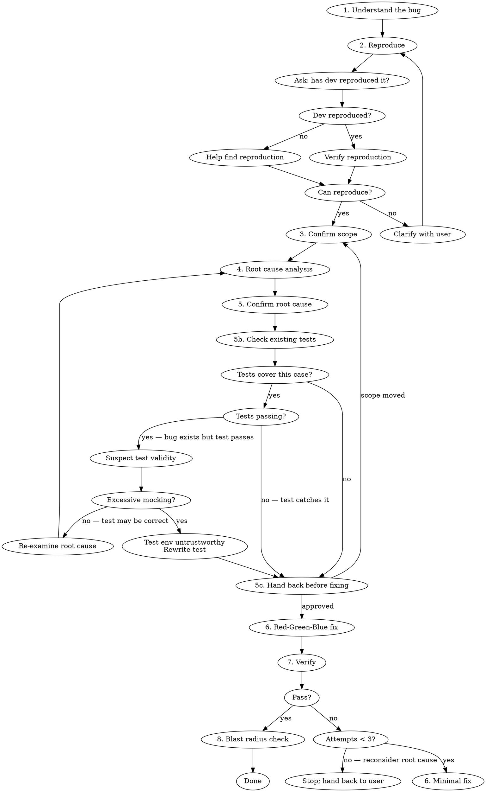

# Debug Workflow

## Overview

Disciplined debugging workflow for TypeScript projects. Enforces reproduction-first investigation, root cause confirmation before fixing, and full verification gates. Complements `superpowers:systematic-debugging` which covers root cause analysis methodology — this skill focuses on workflow discipline and TypeScript-specific guardrails.

## When to Use

- Bug report or ticket needs investigation
- Test failure needs diagnosis
- Unexpected runtime behavior

## When NOT to Use

- Greenfield feature work (use brainstorming/TDD skills instead)
- Refactoring without a known bug

## Step 0 — Intake

Before reproducing or analyzing, assemble the inputs below.

1. **Read linked sources first.** If the user linked or named a ticket, issue,
   or doc, read it before asking anything — use the matching tool:
   Asana (Asana MCP), GitHub issue/PR (`gh`), or any URL (WebFetch). Pull the
   symptom, repro steps, affected area, and any stated hypothesis from it.
2. **Reconcile against the input slots** and fill every slot you can from the
   ticket + the user's message.
3. **Ask once for what's still missing or ambiguous.** Batch all gaps into a
   single round of questions — do not ask one at a time, and do not ask for
   anything you already have or can reasonably infer (note the inference so the
   user can correct it). If **Symptom** is still unclear after reading, that is
   the one blocker — stop and ask.

Only after intake is settled do you proceed to Reproduce.

| Slot | Required? | If still missing after reading sources |
|---|---|---|
| **Symptom** | Yes | Blocker — ask; can't investigate without it |
| **Platform / component** | No | Infer from symptom + ticket, state the inference |
| **Repro status / steps** | No | Ask in this round (step 2 needs it anyway) |
| **Hypothesis / suspected area** | No | Fine to omit — you'll generate your own in step 4 |

## Step 0b — Project command discovery

Steps 5b, 6, 7, and 8 all run this project's own checks, and the step 7
verification subagent inherits whatever you resolve here rather than discovering
it itself. Resolve it once, now, before reproducing.

1. **Read the manifest** at the repo root — `package.json`, or `Cargo.toml` /
   `pyproject.toml` / `go.mod` / `Gemfile` / `mix.exs` for a non-JS project — plus
   any `Makefile` or `justfile`. Take the exact script names it defines. Do not
   guess at conventional ones.
2. **Detect the package manager** from the lockfile: `pnpm-lock.yaml` → pnpm,
   `yarn.lock` → yarn, `bun.lockb` → bun, `package-lock.json` → npm.
3. **Detect a monorepo orchestrator** — `turbo.json`, `nx.json`, `lerna.json`,
   `pnpm-workspace.yaml` — and prefer its affected-only form when scoping a run to
   the files the fix touched.
4. **Read the nearest `CLAUDE.md`** (repo root first, then any closer to the
   suspected area) for conventions the fix itself must obey: logging helpers,
   error wrappers, banned APIs, test file patterns.
5. **Record a `PROJECT_COMMANDS` block.** Pass it verbatim into the step 7
   subagent, which does not inherit this discovery and will guess without it.

   ```
   PROJECT_COMMANDS:
   - package manager: <pnpm|yarn|bun|npm|other>
   - typecheck: <exact command>
   - lint (non-mutating): <exact command>
   - test: <exact command> | single-file form: <exact command>
   - monorepo: <orchestrator, and the affected-only form> | none
   - conventions: <banned APIs, required helpers, test patterns>
   ```

Prefer a non-mutating lint variant (`lint:ci`, `lint:check`) over one that
autofixes: a gate that edits files mid-investigation muddies the very diff you are
reasoning about. Prefer `test:ci` over `test` where both exist.

If a check genuinely has no command in this project, **record it as absent.** Step
7 then reports that check unverified, which is a true result. Substituting a
plausible guess is not.

## Workflow



### 1. Understand the Bug

Read the ticket, error message, or user description. Identify:
- Expected vs actual behavior
- Affected code area (file, module, endpoint)
- Any provided reproduction steps

### 2. Reproduce

**First, ask the developer:** "Have you been able to reproduce this bug?" This determines the next step:

- **If yes:** Have them share their reproduction steps, then verify you can trigger it the same way.
- **If no:** Offer to help find a reproduction path. Use the bug description, logs, and affected code area to construct likely scenarios:
  - Identify the input conditions and state that could trigger the behavior
  - Check for environment-specific factors (data, config, feature flags, race conditions)
  - Propose concrete steps and try them together
  - If error logging references Sentry or Posthog, check for available MCP tools (see "External Observability Tools" below)

**For "it reverts / changes on refresh" bugs, localize the layer first.** Determine whether the value actually changed in the datastore (persisted) or only in the response/cache/serialization. A refresh that re-reads the source of truth distinguishes a real write from a cache/read artifact. **Inspect the actual request payload and response body** (network tab, server logs): the gap between *what the client sent* and *what came back* often names the responsible layer directly. (In this kind of bug, a request carrying only field A coming back with field B changed points away from the form/client and toward server-side validation, an ORM/serialization layer, or a trigger.)

**Rule out your own environment before diagnosing the product.** Several recorded
runs spent real effort on a "bug" that was local state: the wrong worktree, a
stale generated client, an unpublished CMS entry, a broken toolchain that
`expo-doctor` named immediately. These are cheap to exclude and expensive to
miss, because every one of them produces a plausible false root cause. Confirm
the branch and worktree are what you think, that generated artifacts are current,
and that the failure reproduces somewhere other than your machine — or say
explicitly that it has only been seen locally.

Confirm the issue exists before touching any code. Run the failing test, hit the endpoint, or trigger the UI flow. If you cannot reproduce after exhausting these approaches, clarify with the user — do not guess at fixes.

### 3. Confirm Scope with User

Before making changes, state:
- What you believe the bug is
- Where you plan to make changes
- What you will NOT change

Get explicit confirmation. Do not expand scope beyond the confirmed bug.

### 4. Root Cause Analysis

Identify the correct abstraction layer for the fix. Use `superpowers:systematic-debugging` for complex investigations.

**A user-supplied hypothesis is the first lead to test — and to actively
disprove — not the answer.** A confident-sounding steer ("it's almost certainly
X") narrows the search usefully, but treat it as hypothesis #1 in a set, not a
conclusion. Look for evidence that would *falsify* it before you build on it. If
you find yourself only gathering support for the user's guess, that's the
confirmation-bias failure mode step 5b guards against.

Ask: **"Why does this happen?"** not just **"Where does it break?"**

- **Search for prior art of the same bug class.** Grep the codebase and git history (`git log -S '<symbol>'`, `--diff-filter=A`) for the same symptom or an existing fix elsewhere. The same class fixed in one place but not another both confirms the mechanism and exposes the blast radius.
- **Date regressions via provenance.** If the bug appeared after an upgrade or integration, use git history and lockfile/dependency diffs to pin the behavior change to a specific dependency version or migration. "It started after we pulled in X" is a testable claim, not a hunch.
- **Fix the class, not the instance — but propose the altitude, don't pick it.** Decide whether the bug is one reachable instance of a shared root cause, and prefer a fix that eliminates the whole class (e.g. a generation/serialization chokepoint) over a per-site patch. This rule pushes outward, and step 3's boundary is what contains it: when the class-level fix falls outside the confirmed scope, that is a decision to hand back at step 5c, not one to make here. State the blast radius either way.

### 5. Confirm Root Cause

Before writing any fix, articulate the root cause — not the symptom. If you can only describe the symptom, you haven't found the root cause yet.

**Name the product rules your root cause assumes.** The single largest class of
correction on this workflow is not a code error — the code reasoning is usually
right — it is a business rule that is nowhere in the repository. Real examples:
field agents can supply jobs outside the industry, so counting them is a false
positive; every class had already moved to async, so the missing email was only
ever orientation's; a column that looked like the obvious join key was "not the
right case" and a hardcoded map was wanted instead.

None of that is discoverable from the source. So before calling a root cause
confirmed, list the assumptions about *intended product behavior* it depends on
and mark each **verified in code** or **assumed**. If a load-bearing assumption
is assumed, that is a question for the user, not a detail to note in passing —
and a divergence between two surfaces may mean they answer different questions
rather than that one is broken.

**Prove the mechanism in isolation.** Reproduce the suspected mechanism in the smallest possible standalone form — a few-line script or a focused unit test — using the project's *actual* dependency versions. A theory you can describe but cannot reproduce in isolation is still a hypothesis. When the evidence is "the response shows X," reproduce X from the raw inputs rather than inferring it; the isolated repro is what turns a plausible story into a confirmed root cause (and it usually becomes the Red test in step 6).

### 5b. Check Existing Tests

After confirming root cause and before writing any fix, check if tests already cover the affected code path.

**If tests exist for this case and are passing** — this is a red flag. The bug is real but the tests don't catch it. Investigate why:
- **Excessive mocking** — if the test mocks away the layer where the bug lives, the test environment is untrustworthy. The test needs to be rewritten with realistic dependencies before proceeding.
- **No excessive mocking** — the test may be validating correctly, which means your suspected root cause may not be the actual issue. Return to step 4 and re-examine.

**If tests exist and are failing** — good, the test already catches the bug. Proceed to the fix.

**If no tests cover this case** — proceed to the fix, using a test-driven approach to add coverage.

**A passing test may encode the buggy behavior as "expected."** If you find a test asserting the wrong outcome (e.g. asserting the very value the bug produces), that is a signal the bug is systemic — not evidence the code is correct. Flipping that assertion is part of the fix, not a regression; call it out explicitly when you do.

### 5c. Hand Back Before Fixing

**Stop here and wait.** Root cause in hand and the fix looking obvious is exactly
where this workflow loses the human: across 19 recorded runs it was interrupted
16 times — 0.84 per run — and those interruptions cluster on the message
announcing a confirmed root cause or opening a long autonomous stretch. That is a gate the human keeps
inserting by hand. It belongs here.

Post four things, then stop:

1. **Root cause**, one sentence — the mechanism, not the symptom.
2. **The fix you intend**, and the layer you intend it at.
3. **Assumptions it rests on** — see the product-rule warning in step 5.
4. **Whether the fix lands inside the boundary confirmed in step 3.** If it does
   not, say so explicitly and return to step 3; do not widen the boundary on your
   own authority. Recorded corrections at this point include *"I don't want to
   change the contract without more engineering discussion"*, *"let's keep the
   out of scope items since I don't know for sure if they need to change"*, and
   *"I'm backing out that change and the two scripts to prepare for the PR."*

Skip this only when the user has said to run straight through. Do not skip it
because the fix is small — most of the interrupted runs looked small too.

### 6. Red-Green-Blue Fix

Use a **Red-Green-Blue (TDD)** approach when fixing bugs. This increases long-term code quality by ensuring the bug has a regression test.

1. **Red** — Write a test that reproduces the bug and fails. This proves the test captures the defect.
2. **Green** — Make the smallest targeted change that makes the test pass.
3. **Blue (Refactor)** — Clean up only the code you touched, only if needed for clarity. No scope creep.

If TDD is not practical for this fix (e.g., the bug is in infrastructure, config, or a layer that resists unit testing), document why and ensure the fix is still verified manually.

**Do NOT:**
- Refactor surrounding code
- Add unrelated improvements
- Expand scope beyond the confirmed fix
- Add speculative error handling

### 7. Verify

Run the full verification gate on the affected files using the exact commands
from the `PROJECT_COMMANDS` block resolved in step 0b: typecheck, the
non-mutating lint variant, and the test command scoped to the affected test
files. Run the three in parallel — they do not depend on each other.

Do not fall back to `npx tsc --noEmit`, `npx eslint`, or `npm test` for a project
whose manifest names something else. A wrong command burns one of the three fix
attempts below and reports a failure that is about the command rather than the
code — the most expensive kind of false signal in this workflow, because it sends
you back to step 4 to re-examine a root cause that was never wrong.

**Read the exit code you actually observed for each.** A pipeline reports its
*last* command's status, so `<test cmd> | tail -20` hands you `tail`'s zero
whatever the tests did. Run the command bare, read its status, and pipe a
separate invocation if you want trimmed output. A check you did not observe is
**unverified** — a real thing to report, and never a pass.

Also manually confirm the original reproduction case no longer triggers the bug.

#### Verification via subagent (when context is precious)

If the fix is in a context-heavy session — long debug trace, many files already read, large diffs — dispatch the verification run as a Task subagent instead of running it inline. The subagent returns a structured pass/fail report with the relevant failure excerpts, keeping the main thread focused on the fix itself.

Use this when **any** of the following are true:
- The verification suite is slow or produces a lot of output
- The main thread is already heavily loaded with investigation context
- You expect to iterate on the fix more than once

The subagent's charter: run the three `PROJECT_COMMANDS` checks on the affected files and return a structured report (pass/fail per check, the exit code observed, failure excerpts, and the specific assertions or types that broke). Do not modify code.

**Paste the `PROJECT_COMMANDS` block into the prompt verbatim.** A subagent does not inherit step 0b's discovery, so one told merely to "run the tests" will guess — which is the same wrong-command failure as above, now one delegation layer further from where you would notice it.

**Dispatch it with `model: sonnet`.** This is command execution plus failure-excerpt extraction — no diagnostic judgment (that stays in the main thread, which decides the next fix). The cheaper tier is sufficient and keeps a verification run that may repeat up to 3 times off the top tier.

#### Iteration cap

If verification fails, return to step 6 and apply a minimal targeted fix based on the failure. **Cap the loop at 3 fix attempts.** If still failing after 3 attempts, stop and hand back to the user with:
- What each attempt changed
- What each attempt's verification produced
- Your current best hypothesis for why the fix isn't landing

Repeated failures usually mean the root cause from step 4 is wrong, not that the fix needs more iteration — returning to step 4 with fresh eyes is usually more productive than a 4th attempt.

### 8. Blast Radius Check

If the fix touches shared code (utilities, types, base classes), run the
**unscoped** test command from `PROJECT_COMMANDS` — the whole point is the code
you did *not* touch, so the affected-files scoping from step 7 is exactly what
must come off here. In a monorepo, prefer the orchestrator's affected-only form
against the merge base over a single package's suite; a shared utility's blast
radius crosses package boundaries, which is the case this step exists for.

**Shared infrastructure needs a named human, not just a blast radius.** Schema
files, migrations, event contracts, and router wiring are owned by someone, and
"I ran the tests" is not sign-off. When the fix touches one, name who has to
agree and what specifically they need to confirm, and say plainly which parts of
your evidence are grounded in code you read versus inferred from surrounding
structure. Recorded correction: *"I have a growing list of things I should
follow up with Ross about prior to changing infrastructure I don't fully
understand. Confirm you have grounded evidence for the schema.prisma changes."*

Report what files changed. Do NOT run git add, commit, or any staging commands.

## TypeScript Rules

### No Typecasting to `any`

**Never use `as any`.** This hides bugs rather than fixing them.

| Instead of | Use |
|---|---|
| `value as any` | Proper type narrowing or generics |
| `(obj as any).prop` | Type guard: `if ('prop' in obj)` |
| `fn(x as any)` | Fix the type mismatch at its source |

### Minimize All Typecasting

Typecasts (`as Type`) bypass the compiler's safety checks. Every cast is a potential bug hiding spot — the exact opposite of what debugging should produce.

**Acceptable:** `as const`, `as unknown as Type` only when interfacing with untyped third-party code (and add a comment explaining why).

**Preferred alternatives:**

```typescript
// BAD: casting to silence a type error
const result = response.data as UserProfile;

// GOOD: type guard with runtime check
function isUserProfile(data: unknown): data is UserProfile {
  return typeof data === 'object' && data !== null && 'id' in data && 'email' in data;
}
if (isUserProfile(response.data)) {
  // response.data is now UserProfile
}

// GOOD: generic function that preserves types
async function fetchJson<T>(url: string, guard: (d: unknown) => d is T): Promise<T> {
  const res = await fetch(url);
  const data: unknown = await res.json();
  if (!guard(data)) throw new Error('Unexpected response shape');
  return data;
}
```

If a fix requires a typecast, that's a signal the root cause may be a type design issue — investigate before casting.

## External Observability Tools

When investigating code that logs errors to **Sentry** or **Posthog**, check whether a corresponding MCP server is configured. If available, use it to:

- **Pull error details** — stack traces, breadcrumbs, affected users, frequency
- **Correlate with reproduction** — match the reported error signature to your local reproduction attempt
- **Identify patterns** — check if the error is intermittent, environment-specific, or tied to a recent deploy

These tools are especially valuable when the developer has not been able to reproduce the bug locally — production error data can reveal the conditions needed for reproduction.

**Confirm which system each platform actually reports to before citing telemetry as evidence.** Different platforms in the same product often route to different backends (e.g. one platform's analytics/errors go to Posthog while another's go to Sentry). Do not assume the mapping — verify it against config or the project's CLAUDE.md, then query the correct source. Building an evidence chain on the wrong observability system produces a confident but false diagnosis.

## Common TypeScript Bug Patterns

| Pattern | Symptom | Fix approach |
|---|---|---|
| Missing `null`/`undefined` check | Runtime `TypeError: Cannot read property` | Enable `strictNullChecks`, add narrowing |
| Unhandled promise rejection | Silent failure, missing data | Add `catch` or use `await` with try/catch |
| Type widening | Union type accepted where specific type expected | Use `as const` or explicit annotation |
| Stale closure | Callback uses outdated variable value | Move variable into closure scope or use ref |
| Index signature misuse | `obj[key]` returns `any` implicitly | Use `Record<K, V>` with proper key types |

## Quick Reference

| Step | Gate |
|---|---|
| Commands | `PROJECT_COMMANDS` resolved from the manifest; absent checks recorded as absent |
| Reproduce | Asked dev; can trigger the bug on demand |
| Environment | Worktree, generated artifacts, and toolchain ruled out; or "local only" stated |
| Localize layer | Decided persisted vs cache/serialization; inspected request/response payloads |
| Scope | User confirmed fix boundary |
| Root cause | Can explain WHY, not just WHERE |
| Product assumptions | Each one listed and marked verified-in-code or assumed |
| Mechanism proof | Reproduced the root cause in isolation with the real dependency versions |
| Prior art | Grepped code + git history for the same class; blast radius stated |
| Existing tests | Checked; passing tests on buggy code investigated; bug-encoding tests flipped |
| **Hand-back** | **Root cause, fix, assumptions, and in/out of scope posted — and stopped** |
| Fix | Red-Green-Blue TDD; minimal, no scope creep |
| Typecheck | The project's typecheck command passes; exit code observed, not inferred |
| Lint | The project's non-mutating lint command is clean on affected files |
| Tests | The project's test command passes on affected tests |
| Fix iteration | Capped at 3 attempts; revisit root cause if still failing |
| Blast radius | Unscoped suite passes if shared code touched |
| Infra sign-off | Shared schema/migration/contract change names the human who must agree |
