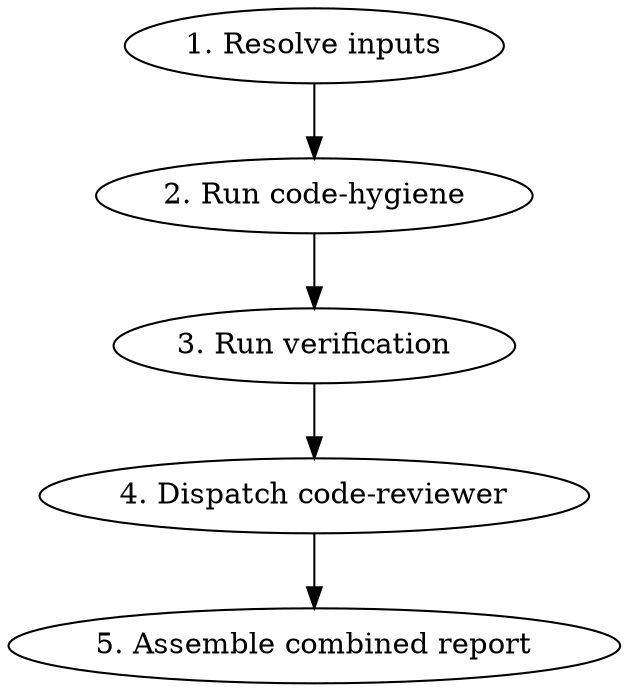

# Pre-PR Review

## Overview

Orchestrator skill that runs three review steps back-to-back before opening a PR: code hygiene cleanup, verification (typecheck/lint/tests), and code quality review. Produces a single combined report. No gates between steps — all run automatically.

## When to Use

- Before opening a pull request
- When you want a comprehensive branch review in one pass
- User says "review this branch", "is this ready for PR", "pre-pr check"

## When NOT to Use

- Mid-development cleanup only (use `code-hygiene` standalone)
- Quick verification only (just run typecheck/lint/test directly)

## Input Resolution

Resolve inputs **once** at the start — all three steps use the same context.

### Base Branch

```bash
BASE_BRANCH=$(git rev-parse --verify develop 2>/dev/null && echo develop || \
  git rev-parse --verify main 2>/dev/null && echo main || echo master)
MERGE_BASE=$(git merge-base $BASE_BRANCH HEAD)
```

### Scope Reference

Accept in priority order:
1. **Asana task ID/URL** — Pull description via Asana MCP (`get_task`)
2. **GitHub issue number** — Pull via `gh issue view <number>`
3. **Freeform text** — Engineer provides scope description inline
4. **None** — Ask. If still none, pass to code-hygiene without scope (it will skip scope compliance and note it)

### Empty Diff Guard

If `git diff --name-only $MERGE_BASE...HEAD` returns nothing, report "No changes found between HEAD and $BASE_BRANCH — nothing to review." and stop. Do not run any steps.

## Workflow



### Step 1 — Resolve Inputs

Detect base branch, compute merge base, resolve scope reference. These values are passed to all subsequent steps.

### Step 2 — Run Code Hygiene

Execute the full `code-hygiene` skill workflow:
- Phase 2: Auto-fix artifacts (console.*, debugger, commented-out code)
- Phase 3: Auto-add unit tests to existing suites
- Phase 4: Collect findings (scope compliance, TODOs, test suggestions, observations)

Capture the full report output (auto-fixed items + findings) for the combined report.

### Step 3 — Run Verification

Run after code-hygiene since it may have edited files.

```bash
# Typecheck
pnpm run typecheck

# Lint
pnpm run lint

# Tests
pnpm run test
```

If the project uses Turbo with change detection, scope to affected packages:

```bash
pnpm turbo typecheck --filter='...[{MERGE_BASE}]'
pnpm turbo lint --filter='...[{MERGE_BASE}]'
pnpm turbo test --filter='...[{MERGE_BASE}]'
```

Record pass/fail status and error counts. If auto-added tests from Step 2 fail, clearly attribute those failures separately from pre-existing test failures.

**Read the exit code from the command, never through a pipe.** `cmd | tail -15` reports `tail`'s status, which is always 0 — this has put a ✅ in a report for a check that was actually failing. Run the command bare and read its status, then pipe a separate invocation for readable output, or capture `${PIPESTATUS[0]}`. Record the raw exit code you observed next to each result.

**An unobserved result is ⚠️ unverified, not a pass.** Never infer a check passed because nothing looked wrong; report it as unverified and say why.

### Step 4 — Dispatch Code Reviewer

Dispatch the `superpowers:code-reviewer` agent using the existing `code-reviewer.md` template.

**Template values:**
- `{WHAT_WAS_IMPLEMENTED}` — derived from the scope reference (Asana task description, GH issue body, or freeform text)
- `{PLAN_OR_REQUIREMENTS}` — same scope reference, plus note any verification failures from Step 3
- `{BASE_SHA}` — the computed `MERGE_BASE`
- `{HEAD_SHA}` — current `HEAD`
- `{DESCRIPTION}` — one-line summary of the branch changes

The code reviewer operates on the branch **after** hygiene auto-fixes, so it won't flag artifacts that were already cleaned up.

**Append these focus areas to the reviewer prompt.** The default checklist reads files in isolation; these checks require reasoning across files and across time, and are exactly what single-file review misses:

- **Cross-component render ordering.** When an effect closes/dismisses an overlay, modal, or branch in response to a prop or hook return that changed elsewhere, trace what the render tree looks like *the frame after* the trigger flips but *before* the effect runs. Look for a gap where neither branch's guard holds (blank/placeholder render) or where a child fully remounts (expensive re-init, re-fetch, re-attach). Prefer `useLayoutEffect` or a combined guard over `useEffect` for synchronous close.
- **Sync vs. async / timing primitives.** Flag `setTimeout`/`requestAnimationFrame` used to wait for a platform transition (orientation change, layout settle, navigation animation). These are guesses against device-dependent durations. The correct fix is an event/callback (`addOrientationChangeListener`, `onLayout`, transition-end). When the diff offers a fixed-delay timer, treat it as a known-fragile fallback that needs human sign-off — do not bless it as equivalent to the event-driven approach.
- **Author hedge comments are unsolved problems, not design intent.** If a changed region carries a comment hedging about fragility/timing/races ("if QA reveals flicker…", "on slow devices…", "might need to bump this"), surface it verbatim as an Important issue. Do not adopt the comment's suggested workaround as the fix.
- **Comments are not evidence.** Label each load-bearing claim as *verified from executable code* (you read the statement that makes it true) or *taken from a comment/docstring/JSDoc* (prose that may be stale). Docstrings in this repo have been demonstrated out of date. Never let prose be the sole support for a Critical or Important finding — when it is the only source, mark the finding **requirements-dependent** and name who could confirm it.
- **A behavior that looks like a bug may be intended.** Before reporting two surfaces as inconsistent, ask whether they answer *different questions* rather than the same one inconsistently. Product and compliance rules are frequently absent from the repo entirely, so a confident "divergence" or "should fail open" finding is exactly the kind that domain knowledge overturns. State the assumption the finding rests on so it can be checked in one sentence.

### Step 5 — Assemble Combined Report

Combine all outputs into a single sequential report.

## Combined Report Format

```markdown
## Code Hygiene

### Auto-fixed
- Removed `console.log` at `src/lib/api/client.ts:47`
- Removed commented-out code block at `src/utils/format.ts:15-22`
- Added 2 unit tests to `src/lib/hooks/__tests__/useAuth.test.ts`

### Needs Your Review
- [Scope] `prisma/schema.prisma` was modified but not referenced in ticket scope
- [TODO] `src/components/FWButton.tsx:42` — `// TODO: add haptic feedback` — remove or keep?
- [Tests] No test file exists for `src/lib/utils/formatDate.ts` — consider creating one
- [Tests] Integration test suggestion: verify the full form submission flow

## Verification
Each row names the command and the exit code actually observed. ⚠️ unverified is a valid row.
- Typecheck: Pass (0 errors) — `pnpm turbo typecheck …`, exit 0
- Lint: Pass (2 warnings) — `pnpm turbo lint …`, exit 0
- Tests: 47/47 passing — `pnpm turbo test …`, exit 0
  - Auto-added tests: 2/2 passing, both fail against pre-fix code ✅

## Code Review

### Strengths
- ...

### Issues

#### Critical (Must Fix)
- ...

#### Important (Should Fix)
- ...

#### Minor (Nice to Have)
- ...

### Recommendations
- ...

### Assessment
**Ready to merge?** Yes / No / With fixes
**Reasoning:** ...
```

## Rules

- **No gates** — all steps run automatically without waiting for engineer approval between them
- **Single input resolution** — base branch, merge base, and scope reference are resolved once and shared across all steps
- **Verification runs after hygiene** — since hygiene may edit files, verification must reflect the post-cleanup state
- **Code reviewer runs last** — reviews the cleaned branch with verification results as context
- **Report clearly separates concerns** — engineer can scan each section independently
- **Auto-added test failures are attributed** — if tests from Step 2 fail in Step 3, call this out explicitly so the engineer knows which failures are new
- **Exit codes come from the command, not from a pipe** — `| tail`/`| head` always exit 0; an unobserved result is ⚠️ unverified, never a pass
- **Counts are re-derived, never relayed** — read test totals and error counts from the command output, not from a subagent's summary
