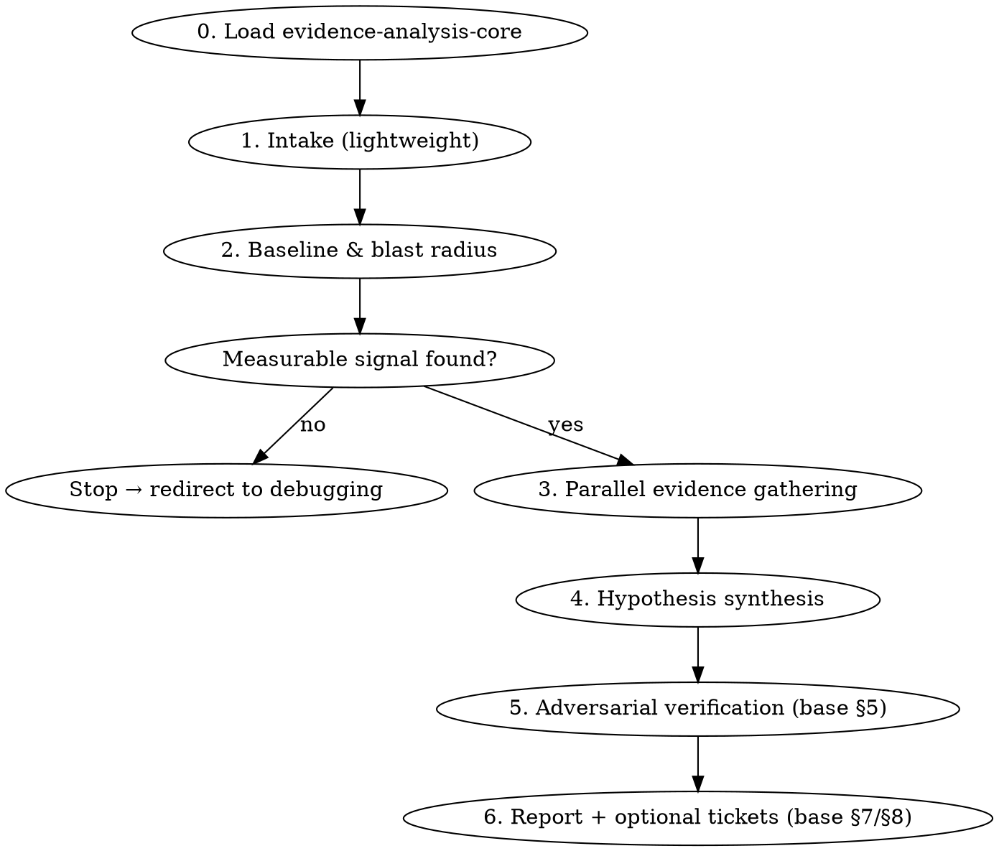

# Regression Analysis

## Overview

A disciplined deep-dive for **metric-grounded regressions** — something measurably got worse
(latency, error rate, throughput, saturation) and you want evidence-ranked hypotheses for *why*,
with each claim traceable to a concrete artifact (a metric value, a commit, a deploy, an error ID,
a code path). The deliverable is a research report that tells you **where to look next**, not a fix.

> **Load `evidence-analysis-core` via the Skill tool for the shared method (source discovery,
> evidence-vs-hypothesis standard, subagent digest schema, adversarial verification, app-version
> dimension, artifact + ticketing conventions), then apply the regression-specific workflow below.**

This skill is **read-only** — it reads the codebase and queries observability sources, but never
edits code, proposes a fix implementation, or opens PRs. The base carries the doctrine; this file
only adds what is regression-specific: the metric-grounded intake, the baseline/blast-radius
grounding step with its evidence-based exit, and causal-mechanism synthesis.

## When to Use

- A symptom + time window ("checkout p95 regressed over the last two weeks")
- A pointer to a regressing metric or dashboard
- An alert, incident, or error spike used as the seed

A general *prompt* is fine ("the app got slow lately"). What's required is that **observable data
exists to ground the investigation** — the skill goes and finds it (Phase 2). If it can't, it exits.

## When NOT to Use

- Proactively mining product analytics for friction with no measured signal → `analytics-friction-analysis`.
- Digesting an **error tracker** to cut noise and triage many issues → `error-triage`.
- A vague "feels slow" with nothing measured, or a "will this be fast enough?" concern during
  feature development — there is no baseline to anchor to.
- A known bug needing a fix → `investigate` / `superpowers:systematic-debugging`.

The distinction: this skill starts from **a signal that already got worse** and roots out why.
`analytics-friction-analysis` starts from no established signal; `error-triage` triages an error
tracker rather than root-causing one measured metric.

## Workflow



Source discovery is the base's capability-role method (§2): enumerate the in-session `mcp__*` tools
and bucket by role — metrics/telemetry, error tracking, product analytics, deploys/runtime logs,
change history (git, always present), and a ticketing role for Phase 6. Report covered vs. absent
roles in the artifact's Coverage section; nothing is hardcoded.

### Phase 1 — Intake (lightweight)

Accept the prompt as-is. Capture any pointers the user provided (a metric name, a time window, an
alert/issue ID). Do **not** gate on prompt specificity — the grounding happens in Phase 2. In
parallel, inspect deps/configs/instrumentation to infer the stack (RN/Expo, serverless functions, a
backend, a DB, queues) and what is actually instrumented, so Phase 3 routes to the right sources.

### Phase 2 — Baseline & blast radius (the grounding step)

Quantify the regression from real data:

- **Before/after windows** and the **onset** (when did it change?)
- **Magnitude** (p50/p95/p99, error rate, throughput — whichever applies)
- **Blast radius** — which endpoint / screen / route / job / cohort is affected

This produces the anchor every later claim must trace back to.

> **Evidence-based exit:** if no measurable signal can be established here, **stop** and redirect to
> `investigate` / `superpowers:systematic-debugging`. State plainly that there was nothing to ground
> the investigation in. Do not proceed to hypotheses without a baseline.

### Phase 3 — Parallel evidence gathering

Fan out per the base's subagent digest schema (§4) — **one focused sub-agent per relevant source**,
each returning a structured digest, not raw payloads. Hand each the same window, symptom, and the
Phase 2 baseline numbers. Always include the base-mandated **change-history** sub-agent over git
commits / PRs / merges intersecting the regression window.

Extend the base digest schema with a regression-specific **`window_alignment`** field — onset
coincidence is central here, so every finding states whether it aligns with the Phase 2 onset:

```
- source: <role or server>
- findings[]:
    - claim: one sentence
    - classification: evidence-based | hypothesis        # base §3
    - evidence: metric value + timestamp, commit SHA, deploy ID, error/issue ID,
                file:line — plus the EXACT query used                # base §4
    - window_alignment: does it coincide with the Phase 2 onset?     # regression-specific
    - strength: direct | suggestive | absent
```

### Phase 4 — Hypothesis synthesis

Correlate signals across sources into candidate causes. Per the base's evidence standard,
correlation ≠ causation: each hypothesis must name a **causal mechanism in the code/system**, not
just a coincidence. Example:

> "p95 step-change at 2026-06-20 14:20 UTC aligns with deploy `abc123`, which merged PR #841
> introducing an N+1 query in `orders.ts:88`."

Also segment by app version per the base's dimension (§6): a step-change **at a release** implies a
different cause than a regression **present across all versions**.

### Phase 5 — Adversarial verification

Run the base's skeptic pass (§5) on each candidate before ranking: is this causal or coincidental?
Could the evidence be explained another way (a deploy that aligns in time but only touched CSS)?
Survivors are ranked High / Medium / Low with reasoning; refuted candidates move to "Considered &
ruled out" with *why*. Ranking never precedes this pass.

## Phase 6 — Report + optional tickets

Write the report as local markdown per the base (§7) to `docs/local/regressions/YYYY-MM-DD-<slug>.md`,
using the base's standard skeleton. Regression-specific emphasis within it:

- **Summary** — the regression quantified (what, how much, since when).
- **Evidence-based findings (ranked)** — each with confidence tier, causal mechanism, cross-source
  evidence links, and **per-hypothesis suggested follow-ups** (e.g. "profile `getOrders` under
  load", "bisect deploys abc123..def456").

Offer tickets per the base's optional ticketing flow (§8) — confirmation-gated, one ticket per
selected finding, evidence and follow-ups inlined. Create no external artifacts without explicit
confirmation.
