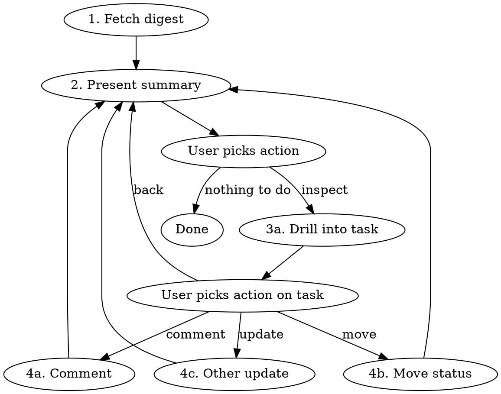

# Asana Review

## Overview

Terminal-based Asana inbox. Surfaces recently active tasks you're assigned to or following, with the ability to drill into details, comment, and move tasks between statuses.

## When to Use

- Morning triage / daily standup prep
- Checking what needs attention in Asana
- Reviewing recent activity on tasks you're involved in
- User says "check Asana", "what's new in Asana", "review my tasks"

## Workflow



### 1. Fetch Digest

Run two `search_tasks` queries **in parallel** with `completed: false` and `sort_by: "modified_at"`:

| Query | Parameters |
|---|---|
| Assigned to me | `assignee_any: "me"`, `modified_on_after: <cutoff>` |
| Following (not assigned) | `followers_any: "me"`, `modified_on_after: <cutoff>` |

**Default cutoff:** 36 hours (covers checking at different times on subsequent days). If the user specifies a timeframe (e.g., `/asana-review 3d`), parse and use that instead.

**Deduplication:** Tasks may appear in both queries (assigned + following). Deduplicate by task GID — prefer the "assigned" category.

Use `opt_fields: "name,assignee,due_on,modified_at,memberships.project.name,memberships.section.name"` to get project and status info in a single call.

### 2. Present Summary

Format as two tables. Only show sections with results.

**Assigned to Me:**

```
| # | Task                  | Project       | Status      | Due        | Modified   |
|---|-----------------------|---------------|-------------|------------|------------|
| 1 | Fix login redirect    | Auth Rewrite  | In Progress | 2026-04-16 | 2h ago     |
| 2 | Update API docs       | Platform      | Review      | 2026-04-18 | 5h ago     |
```

**Following / Mentioned:**

```
| # | Task                  | Project       | Status      | Due        | Modified   |
|---|-----------------------|---------------|-------------|------------|------------|
| 3 | Design system colors  | Frontend      | Blocked     | 2026-04-17 | 1h ago     |
| 4 | Release checklist     | Ops           | To Do       | 2026-04-20 | 3h ago     |
```

Then ask: **"Pick a number to drill in, or say 'done' to finish."**

### 3a. Drill Into Task

Use `get_task` with the task GID (include comments and subtasks by default).

Present:
- **Description** (truncated if long — first 500 chars with option to expand)
- **Recent comments** (last 5, with author and timestamp)
- **Subtasks** (if any, with completion status)
- **Current status** (section name within project)
- **Assignee, due date, followers**

Then present available actions:
- **Comment** — add a comment to this task
- **Move** — change the task's status (section)
- **Complete** — mark the task as done
- **Back** — return to the summary

### 4a. Comment

Ask the user what they want to say. Use `add_comment` with `text` for plain comments.

If the user wants to @-mention someone, use `html_text` with `<body>` wrapper and `<a data-asana-gid="GID"/>` tags. Look up user GIDs via `get_users` or `search_objects` if needed.

**Always confirm the comment text with the user before posting.**

### 4b. Move Status

To move a task to a different status:

1. Get the task's current project GID from its memberships
2. Fetch project sections: `get_project` with `include_sections: true`
3. Present available sections as numbered options:
   ```
   Current status: In Progress
   
   Available statuses:
   1. To Do
   2. In Progress (current)
   3. In Review
   4. Done
   
   Pick a number:
   ```
4. Use `update_tasks` with `add_projects: [{ project_id, section_id }]` to move

If the task is in multiple projects, ask which project's status to change.

### 4c. Other Updates

Support these on request:
- **Reassign** — `update_tasks` with `assignee`
- **Change due date** — `update_tasks` with `due_on`
- **Mark complete** — `update_tasks` with `completed: true`

## Argument Parsing

| Input | Cutoff |
|---|---|
| `/asana-review` | Last 36 hours |
| `/asana-review 3d` | Last 3 days |
| `/asana-review 1w` | Last 7 days |
| `/asana-review 12h` | Last 12 hours |

Calculate the ISO 8601 date from the current date and the offset for `modified_on_after`.

## Error Handling

- **No results:** Report "No recently modified tasks found in the last <window>. Try a wider window: `/asana-review 3d`"
- **No results at default:** If 36h returns nothing, automatically retry with 3d before reporting empty
- **Premium required:** `search_tasks` requires Premium. If it fails, fall back to `get_my_tasks` (assigned only, no follower search) and inform the user of the limitation.
- **Auth failure:** Tell the user to re-authenticate with `claude mcp add` (see CLAUDE.md for OAuth setup instructions).
