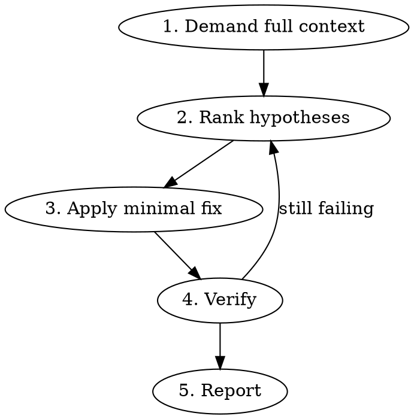

# Build Doctor

## Overview

Disciplined workflow for diagnosing build failures and dependency issues. Prevents the common failure mode of pursuing 2-3 wrong hypotheses before landing on the real cause. Forces full-context gathering and explicit hypothesis ranking before any edit.

## When to Use

- Build failures (Vercel, EAS, GitHub Actions, local)
- Dependency resolution errors (peer deps, version conflicts, missing native binaries)
- Postinstall script failures or silent empty output
- Module not found / interop errors (CJS/ESM, default exports)
- "Works locally, fails in CI" scenarios

## When NOT to Use

- Simple type errors with clear stack traces (just fix them)
- Lint failures
- Test logic failures unrelated to the build pipeline

## Workflow



### Phase 1 — Demand Full Context (NO EDITS)

Before forming any hypothesis, require all three:

1. **Full build log.** Not a snippet — the full output from the failing command. If only an error message was provided, ask:
   > Can you paste the full build log? Snippets often hide the real cause (e.g., a module-not-found upstream of the surface error).

2. **Package manager.** Check for `pnpm-lock.yaml`, `package-lock.json`, or `yarn.lock`. State which is in use.

3. **Prior failed attempts.** Check:
   - Recent commits on this branch: `git log --oneline -20`
   - PR description and comments if a PR exists: `gh pr view --json title,body,comments`
   - Recent CI runs: `gh run list --limit 10`

   List anything resembling a prior fix attempt for this same failure. **Do not re-suggest patterns that already failed.**

If any of these is missing, STOP and ask. Do not guess.

### Phase 2 — Rank Hypotheses (NO EDITS)

State **at least 3 hypotheses** ranked by likelihood. For each:

- One-line description
- Evidence from the log supporting it
- Smallest test that would confirm or reject it

Example:

```
Hypothesis 1 (most likely): prisma-zod-generator 1.32.2 silent empty output
- Evidence: schema.zod.ts is 0 bytes after postinstall; 1.32.1 → 1.32.2 bump in commit abc123
- Test: pin to 1.32.1, re-run `pnpm install`, check schema.zod.ts size

Hypothesis 2: postinstall script ordering
- Evidence: zod-generator runs before prisma generate
- Test: reorder scripts in package.json

Hypothesis 3: pnpm hoisting / .npmrc shamefully-hoist setting
- Evidence: schema generator may resolve a different prisma instance
- Test: add public-hoist-pattern[]=*prisma* and rerun
```

Then either:
- Wait for user confirmation on the top hypothesis, OR
- Proceed if it is overwhelmingly supported AND trivial to revert (e.g., a one-line version pin).

### Phase 3 — Apply Minimal Fix

- Smallest change that addresses the top-ranked hypothesis only
- No drive-by refactors, no "while I'm here" cleanup
- Do not bundle multiple hypothesis fixes — test one at a time

### Phase 4 — Verify

Run the same failing command (or its CI equivalent) to confirm the fix. Then run project-specific verification:

```bash
# Adjust commands per project conventions — check package.json scripts first.
# Common variants: `lint:ci` not `lint`, `test:ci` not `test`.
pnpm run typecheck
pnpm run lint:ci    # or whatever the project uses
pnpm run test:ci    # or whatever the project uses
```

If verification still fails, return to Phase 2 and re-rank with the new evidence. **Do not iterate fixes blindly.**

### Phase 5 — Report

```markdown
## Build Doctor Report

### Root Cause
<one paragraph explaining what was actually broken>

### Fix Applied
- <files changed>
- <one-line reason>

### Hypotheses Considered
1. ✅ <winner> — <why it was right>
2. ❌ <runner-up> — <why it was rejected>
3. ❌ <third> — <why it was rejected>

### Verification
- Build: ✅ / ❌
- Typecheck: ✅ / ❌
- Lint: ✅ / ❌
- Tests: ✅ / ❌

### Prior Attempts on This Branch
- <attempt>: <outcome>
```

## Rules

- **No edits in Phase 1 or 2.** Investigation only.
- **No re-trying patterns that already failed on this branch.** Phase 1 catches these.
- **Full logs, not snippets.** The cause often hides outside the highlighted error.
- **Hypotheses before edits, always.** Even when "obvious" — write 2 alternatives to avoid tunnel vision.
- **Migration context matters.** If the repo is mid-migration (npm→pnpm, Zod v3→v4, SDK upgrade), state this in Phase 1.
- **One hypothesis per fix attempt.** Bundling fixes makes it impossible to attribute success.
