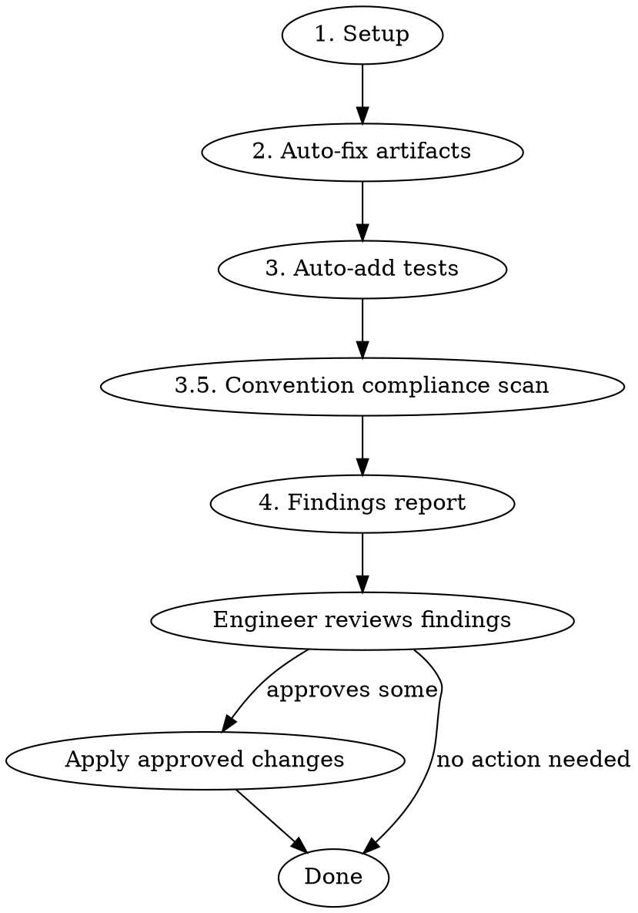

# Code Hygiene

## Overview

Branch cleanup and scope compliance tool. Removes development artifacts, verifies changes stay in scope, identifies test gaps, and auto-adds unit tests where patterns exist. Usable at any point during development — not just pre-PR.

## When to Use

- Before opening a PR
- Mid-development to clean up accumulated artifacts
- After a large implementation to verify scope compliance
- When invoked by the `pre-pr` orchestrator skill

## When NOT to Use

- On branches with no changes from the base (nothing to review)
- For deep code quality / architecture review (use `superpowers:requesting-code-review`)

## Input Resolution

### Base Branch

Auto-detect via merge base. Fallback order: `develop` → `main` → `master`.

```bash
# Detect base branch
BASE_BRANCH=$(git rev-parse --verify develop 2>/dev/null && echo develop || \
  git rev-parse --verify main 2>/dev/null && echo main || echo master)
MERGE_BASE=$(git merge-base $BASE_BRANCH HEAD)
```

### Scope Reference

Resolve in priority order. Use whichever the engineer provides:

1. **Asana task ID/URL** — Pull task name and description via Asana MCP (`get_task`)
2. **GitHub issue number** — Pull via `gh issue view <number>`
3. **Freeform text** — Engineer provides scope description inline
4. **None provided** — Ask the engineer. If still none, skip scope compliance (Phase 4) and note it in the report

## Workflow



### Phase 1 — Setup

Collect all data needed for subsequent phases:

```bash
# Changed files
git diff --name-only $MERGE_BASE...HEAD

# Full diff (for artifact detection)
git diff $MERGE_BASE...HEAD

# Diff of only added/modified lines (for precise artifact targeting)
git diff $MERGE_BASE...HEAD --diff-filter=AM
```

Parse the scope reference per the priority order above. If an Asana task ID is provided, fetch the task description. If a GH issue number, fetch the issue body.

**Empty diff guard:** If `git diff --name-only` returns nothing, report "No changes found between HEAD and $BASE_BRANCH — nothing to review." and stop.

**Load project convention docs.** Locate and read the project's own convention sources — this is what makes the Phase 3.5 scan project-specific instead of generic:

1. The nearest `CLAUDE.md` chain — repo root first, then any `CLAUDE.md` closer to the changed files (e.g. an app subdirectory). A root `CLAUDE.md` often `@`-imports a project doc (e.g. `@fwapp2proto/docs/CODE_CONVENTIONS.md`); follow those imports.
2. Any dedicated convention doc the `CLAUDE.md` points at or that sits beside the changed files: `CODE_CONVENTIONS.md`, `STYLE.md`, `CONTRIBUTING.md`, `docs/conventions*`.

From those docs, extract an explicit **documented-bans list** — the "never do X", "always use Y instead of X", banned-API, and banned-pattern rules. For each, record the rule text and its source `file:line` so findings can cite it. Examples of the *kind* of rule to capture (do not assume these exist — only capture what the docs actually state): banned logging calls, banned styling patterns (styled `Pressable` used as a button, hardcoded hex colors in `className` **or** in color props like `color="#fff"`, arbitrary-bracket Tailwind values), banned state/data-layer patterns, required wrappers. Also note any explicit **exceptions** the doc grants (e.g. "`bg-red-600` is allowed for destructive semantics") so the Phase 3.5 scan doesn't flag a sanctioned pattern.

If the project has no convention docs, record that and skip Phase 3.5 (note it in the report). **Never invent bans** — Phase 3.5 only enforces what a project doc explicitly states.

### Phase 2 — Auto-fix Artifacts

Remove development artifacts **only from lines introduced in the branch diff**. Never modify pre-existing code.

**Auto-removed (no approval needed):**

| Artifact | Detection |
|----------|-----------|
| `console.log` / `console.warn` / `console.error` | Statement on a diff-added line |
| `debugger` | Statement on a diff-added line |
| Commented-out code blocks | Multi-line `//` or `/* */` blocks on diff-added lines that contain code structure (function calls, variable assignments, JSX) — not prose comments |

**Safety rules:**
- **Logger files:** Skip auto-removal for `console.*` inside files whose path contains `logger`, `logging`, or `debug` in the name
- **Diff-only:** Only target lines that appear as additions in the branch diff. Use the diff hunks to identify exact line ranges.
- **Commented-out code vs. real comments:** Only remove comments that contain code patterns (e.g., `// const x = ...`, `// return <Foo />`). Preserve explanatory prose comments, TODOs, and documentation comments.

After applying removals, record what was removed (file, line, content) for the report.

### Phase 3 — Auto-add Tests

Identify new exports that lack test coverage and add unit tests where an existing test suite can be extended.

**Step 1 — Find new exports:**
Scan the diff for newly exported functions, hooks, constants, and types in:
- Utility files (`lib/`, `utils/`, `helpers/`)
- Custom hooks (`hooks/`, files matching `use*.ts`)
- Pure functions and data transforms

**Step 2 — Check for existing test files:**
For each new export, look for a corresponding test file:
- `*.test.ts` / `*.test.tsx` sibling
- `__tests__/` directory with matching name

**Step 3 — Auto-add or suggest:**

| Condition | Action |
|-----------|--------|
| Test file exists | Add unit tests matching the file's existing patterns (imports, describe blocks, naming) |
| No test file exists | **Do not create** — surface as a suggestion in Phase 4 |
| Complex logic where expected behavior is ambiguous | **Do not auto-add** — surface as a suggestion in Phase 4 |

**Scope:** Unit tests only — utilities, hooks, pure functions. Never auto-add integration or E2E tests.

### Phase 3.5 — Convention Compliance Scan

Mechanically check the branch diff against the **documented-bans list** captured in Phase 1. This catches convention violations that linters miss and that single-file review tends to overlook — the rules already exist in the project's docs; this step operationalizes them.

**Process:**

1. For each documented ban, derive a concrete search pattern and grep the **diff-added lines only** (`git diff $MERGE_BASE...HEAD --diff-filter=AM`). Examples of turning a doc rule into a pattern:
   - "never styled `Pressable` buttons" → flag `<Pressable` additions carrying both `className=` and `onPress=` (not wrapped in an allowed component)
   - "no hardcoded hex" → flag `text-[#`, `bg-[#`, `border-[#`, and color-prop literals like `color="#`, `color={'#`
   - "no arbitrary brackets" → flag `p-[`, `gap-[`, `text-[NNpx]`, etc. where a preset exists
   - "banned API X, use Y" → flag additions calling `X(`
2. Respect documented **exceptions** — if the doc sanctions a pattern (e.g. `bg-red-600` for destructive, `text-white` on dark backgrounds), do not flag it.
3. Scope to the projects the docs apply to. A convention doc under `fwapp2proto/` governs `fwapp2proto/**`; do not flag files in sibling projects against another project's rules.

**Output:** every violation becomes a Phase 4 finding under "Convention Violations", citing the offending `file:line`, the diff content, and the rule's source `file:line`.

**Do not auto-fix convention violations.** The correct replacement (which token? which Button variant?) requires judgment, and some are codebase-wide patterns the engineer may legitimately defer. Surface them; let the engineer decide.

### Phase 4 — Findings Report

Present all findings that require engineer judgment. **Do not act on any of these without explicit approval.**

#### Report Structure

```markdown
## Code Hygiene Report

### Auto-fixed
- Removed `console.log` at `src/lib/api/client.ts:47`
- Removed `console.log` at `src/components/ProfileScreen.tsx:23`
- Removed commented-out code block at `src/utils/format.ts:15-22`
- Added 2 unit tests to `src/lib/hooks/__tests__/useAuth.test.ts`

### Needs Your Review

#### Scope
- `prisma/schema.prisma` was modified but not referenced in ticket scope — intentional?
- `src/components/unrelated/Footer.tsx` changed but ticket describes header work

#### Convention Violations
- `components/video/ScreenshareLandscapeView.tsx:88` — styled `<Pressable>` used as a button (`className` + `onPress`) — rule: `docs/CODE_CONVENTIONS.md:117` "never create styled Pressable buttons — use Button/FWButton"
- `components/video/CallScreen.tsx:142` — hardcoded hex `color="#fff"` on icon — rule: `docs/CODE_CONVENTIONS.md:378` "no `text-[#...]`/color literals — use the matching token"

#### TODO/FIXME Comments
- `src/components/FWButton.tsx:42` — `// TODO: add haptic feedback` — remove or keep?
- `src/lib/api/client.ts:89` — `// FIXME: retry logic` — remove or keep?

#### Test Suggestions
- **New test file needed:** `src/lib/utils/formatDate.ts` has no test file — consider creating `src/lib/utils/__tests__/formatDate.test.ts`
- **Integration test:** The new form submission flow touches validation, API call, and navigation — consider an integration test
- **Edge case:** `parseUserInput` doesn't handle empty string input — worth a test case

#### Other Observations
- `calculateTotal` in `src/utils/pricing.ts:30` duplicates logic from `src/lib/cart/totals.ts:12` — consider reusing
- The new `UserCard` component is 180 lines — consider extracting the avatar section
```

## Rules

- **Never auto-fix anything in Phase 4** — all findings require explicit engineer approval before action
- **Convention checks come from the project's own docs, never hardcoded** — if a project documents no bans, skip Phase 3.5 and say so. Never auto-fix a convention violation; surface it with the rule citation and respect documented exceptions.
- **Never touch pre-existing code** — only lines introduced in the branch diff
- **Never create new test files** — only extend existing test suites
- **Never auto-add integration or E2E tests** — suggest only
- **Skip logger files** for console.* removal (path contains `logger`, `logging`, or `debug`)
- **Report what you did** — every auto-fix and auto-added test must appear in the report with file:line references
