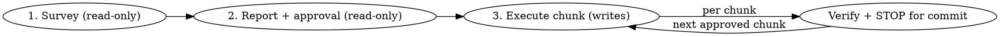

# Dead Code Survey

## Overview

Survey a TS/JS codebase for dead code and unused dependencies, produce a report that
separates **safe removals** from ones that **need confirmation**, then — on the user's
go-ahead — execute approved cleanups in commit-sized, verified chunks.

**Core principle:** static-analysis tools *detect*; the LLM *adjudicates the residue those
tools get wrong*. Never assert something is dead from a tool result alone — tools produce
false positives on exactly the cases that matter (dynamic dispatch, public API, config-only
deps). The expensive failure is a wrong "safe to delete," so bias toward "needs
confirmation" whenever a trap applies.

## When to Use

- Auditing a mature repo for removable code / dependencies.
- Cleaning up after a large feature lands or a module is deprecated.
- "What can we safely delete here?"

**When NOT to use:**
- Non-JS/TS ecosystems (this skill is TS/JS-only).
- Removing one specific known-dead symbol you've already verified — just delete it.
- A fully airgapped repo (relies on `dlx` fetching tools with network).

## Workflow

Three phases. Do not merge them — the survey and report are **read-only**; only the
execution phase writes.



## Model tiering

Set the model explicitly via the Agent tool's `model` param. Cheaper tiers *gather and
classify*; they never make the final safe/confirm call — that happens only after the Opus
adversarial pass.

| Step | Model | Why |
|---|---|---|
| Orchestration, synthesis, safe/confirm judgment, adversarial verification | **Opus** (main context) | Load-bearing reasoning; a wrong "safe to delete" is the expensive failure. |
| Per-track fan-out: run tools, trace references, build candidate digests | **sonnet** | Mechanical but needs classification judgment; high volume, keep off top tier. |
| Pure enumeration: list workspace packages, dump entry points, parse tool JSON | **haiku** | No judgment, just retrieval. |

## Phase 1 — Survey (read-only)

First discover the environment (do not guess): package manager from the lockfile, workspace
layout, and the project's typecheck/lint/test commands from `package.json`. These feed both
the tools and Phase 3 verification.

Run detection tools **ephemerally via the detected package manager's runner** with pinned
majors — no global install, zero footprint on the target repo:

| Tool | Command (pnpm shown) | Finds |
|---|---|---|
| **knip** | `pnpm dlx knip@5 --reporter json` | Unused files, exports, exported types, and deps (workspace-aware) — the backbone |
| **ts-prune** | `pnpm dlx ts-prune` | Cross-check for unused exports |
| **depcheck** | `pnpm dlx depcheck --json` | Cross-check for unused / missing deps |

Swap `pnpm dlx` for `npx`/`bunx` per the detected PM. Then **fan out two parallel tracks**
(Track A code, Track B deps) as `sonnet` subagents. Each subagent returns the digest schema
below — not raw tool output — so multi-thousand-line reporter dumps stay out of main context.

### Subagent digest schema (return verbatim)

```
- track: code | dependency
- candidates[]:
    - target: file path, `export name @ file:line`, or package name
    - kind: unused-file | dead-export | dead-type | unused-dep | phantom-dep
    - detected_by: [knip, ts-prune, depcheck]   # which tools agreed
    - references: N   # concrete count from rg over the symbol
    - added: YYYY-MM-DD | n/a   # git first-added date of the host file (n/a for deps)
    - trap: none | <named trap from the lists below>
    - note: one sentence (only if trap != none)
```

## Track A — dead code

Layer 1 (sonnet): knip + ts-prune, plus `rg` reference-counting on each flagged symbol.

Layer 2 traps — if a candidate hits any, it is **needs-confirmation**, never safe:

- **Dynamic access** — `require()`, dynamic `import()`, string-keyed lookups, `React.lazy`.
- **Framework entry points** — route files, config-convention files, decorators, DI registrations.
- **Reflection / metaprogramming** — anything reached by name at runtime.
- **Public API surface** — exports consumed *outside* the analyzed boundary (published
  package `main`/`exports`, a consumer app). knip flags these as unused; deleting breaks downstream.
- **Test-only usage** — used only by tests.
- **Type-only vs. value** — a type used only in type position vs. a runtime value.
- **Recently-added / in-flight code** — an unreferenced export in a subsystem added in the
  last few months is more likely *scaffolding not yet wired* than rot. Static tools cannot
  tell "no longer used" from "not yet used." Get the git first-added date of each Safe
  export-host (`git log --diff-filter=A --format=%ad --date=short -- <file> | tail -1`).
  Anything first-added within ~6 months → **needs-confirmation, and always defer to asking
  the engineer**, highlighting *when* the code was added. Give far more deference the more
  recent it is (last couple of months = strong presumption it's intentional). This trap
  applies to **exports/types**, not to structurally-dead file deletions (an empty barrel
  with 0 importers, a `@deprecated`/superseded component is safe regardless of age).

## Track B — unused dependencies

Layer 1 (sonnet): knip + depcheck. Agreement between the two is the strongest safe signal.
Respect workspace boundaries — a dep used only by a *sibling* package is not unused.

Layer 2 traps:

- **Config-only / implicit consumers** — ESLint plugins, Prettier, Babel/SWC presets,
  PostCSS, `@types/*`, `husky`, CI-only tooling. The classic depcheck false positives.
- **Peer-dependency chains** — a dep that a *retained* package expects the app to provide.
  **Verify every removal candidate systematically, not ad-hoc** (this is a repeat miss):
  scan the `peerDependencies` of all installed manifests and flag any candidate that appears
  — a required (non-optional) peer of a used package is **not** safe to drop. `peerDependencies`
  is the only field with "the app must provide X" semantics; a package's regular `dependencies`
  resolve from its own subtree and don't require an app-level declaration. So distinguish:
  (a) candidate is a *regular dependency* of a used package + the app never imports it directly
  → the app's direct declaration is a removable duplicate (e.g. a lib the used package
  re-exports); (b) candidate is a *required peer* of a used package → keep / treat as phantom.
- **Phantom (used-but-unlisted)** — imported directly but only present transitively. This is
  a bug to *fix* (add it), surfaced as a separate additive change — **never** a removal.
- **Runtime-only by string** — e.g. a DB driver named in an env var.
- **Dynamic-import-only** — a package pulled in *only* via `await import("pkg")` or
  `require("pkg")`, with no static `import … from "pkg"` anywhere. depcheck and some knip
  configs walk the **static** import graph and report such a package as unused when it is
  genuinely used at runtime. Always grep the bare package name as a string (see below) — that
  is the one signal that survives a dynamic import. This is the classic `@vercel/otel` miss.
- **Transitively-masked direct import** — a package that *is* imported directly in source but
  also happens to be hoisted into `node_modules` as a transitive dep of a retained package.
  Dropping its direct declaration turns it into a phantom that still resolves — until the
  transitive provider bumps or drops it, or a clean install hoists differently. **Rule: any
  package with ≥1 direct import (static _or_ dynamic) stays a direct dependency, full stop.**
  Transitive availability never justifies removing a direct declaration. This is the
  `@vercel/functions` miss.

Don't lean on the Phase-3 reinstall+typecheck to catch these — a dropped peer, a
transitively-masked direct dep, and (usually) a dynamic-import-only package all still
type-resolve transitively and only bite on a clean install, a provider bump, or at runtime.
The Vercel/CI build that does a clean install is where they surface, long after local
typecheck went green. Peer-chain, dynamic-import, and direct-import analysis are all Phase-1
survey steps, not validation backstops.

## Adversarial verification (Opus, before classifying anything safe)

For each non-trivial candidate, ask: could this be reached a way the tools can't see? Grep
the whole repo (and any monorepo siblings) for the symbol/package name as a *string*, not
just an import. For a **dependency** candidate this grep is mandatory and must cover the
dynamic forms too — `import("pkg")`, `require("pkg")`, and the bare name — since a
dynamic-import-only package is exactly what the static tools miss. A candidate reaches
**Safe** only if it: is flagged by ≥2 signals (or knip + depcheck for deps), has zero
references outside itself (including zero dynamic-import and zero direct-import hits for
deps), and clears every trap. Otherwise it is **Needs confirmation**. Refuted candidates go
to **Considered & ruled out** with the reason, so a re-run doesn't re-surface them.

**Run a recency pass over every Safe export-host before finalizing** (batch the git
first-added dates in one loop). Reclassify anything first-added within ~6 months to
"Needs confirmation → recency", grouped by subsystem, and defer to the engineer with the
date shown. This is not optional — utils are frequently built out ahead of the feature that
consumes them, and a wrong "safe to delete" on staged scaffolding is the expensive failure.

## Phase 2 — Report (read-only)

Write to `.claude/local-docs/dead-code/YYYY-MM-DD-survey.md` (local dev artifact, git-ignored via
`**/.claude/local-docs/` — the user owns version control; never `git add`/`commit` it).

1. **Summary** — counts: N unused files, N dead exports, N unused deps, est. LOC removable.
2. **Safe to remove** — grouped into proposed commit-sized chunks; each item with
   `file:line`, reference count, agreeing tools. Pre-selected for approval.
3. **Needs confirmation** — each item names the *trap it hit* and the *single decision* the
   developer must make. Nothing here proceeds without an explicit yes. Give recency its own
   subsection, grouped by subsystem, showing each area's first-added date — so the engineer
   can answer "staged for an upcoming feature, or abandoned?" at a glance.
4. **Considered & ruled out** — refuted candidates + why.
5. **Coverage notes** — tools run, which model tier ran the fan-out, what couldn't be
   resolved (e.g. cross-repo consumers not checked — no downstream access).

Then present the chunks and ask which to proceed on. Accept a free-form reply
("all of Safe, plus confirm items 3 and 7") — no rigid syntax.

## Phase 3 — Execute (writes, one chunk at a time)

**REQUIRED BACKGROUND:** honor the user's commit-boundary discipline — the commit is the
stop and the user owns it.

- One approved chunk at a time. Dependency removals and code removals are **separate chunks**
  (a dep chunk = edit `package.json` → reinstall → verify).
- After each chunk, run the **discovered** typecheck / lint / test commands — never guessed.
- Report files changed + pass/fail per check, then **STOP.** The user reviews and commits.
  Only then start the next chunk.
- If verification fails, revert/pause that chunk and report — **never** stack it onto an
  uncommitted change.

## Common Mistakes

| Mistake | Fix |
|---|---|
| Trusting a single tool's "unused" as ground truth | Require ≥2 signals + trap-clear before "Safe." |
| Calling a recently-added unreferenced export dead | Recency trap — check git first-added date; <~6mo defers to the engineer with the date shown, scaffolding for upcoming features is common. |
| Deleting a public API export knip flagged | Public-API trap → needs confirmation; check `exports`/consumers. |
| Bundling a phantom-dep fix into a removal chunk | Phantom deps are additive fixes, surfaced separately. |
| Calling a dep unused without a peer-chain check | Scan all manifests' `peerDependencies` for every candidate; a required peer of a used package isn't safe. Don't defer to Phase-3 typecheck — dropped peers resolve transitively and won't fail it. |
| Removing a dep used only via `await import("pkg")` | Dynamic-import-only trap — static tools miss it. Grep the bare package name including `import(...)`/`require(...)` forms before calling any dep unused. |
| Removing a directly-imported dep because it "also resolves transitively" | Transitively-masked-direct-import trap — any package with ≥1 direct import stays a direct dependency. Local typecheck stays green off the hoisted copy; the clean-install CI/Vercel build is where it breaks. |
| Running detection tools on the top model tier | Fan-out is sonnet; only synthesis/adjudication is Opus. |
| Installing knip/depcheck globally | Use `dlx`/`npx` with pinned majors — zero repo footprint. |
| Stacking multiple chunks before a commit | One chunk → verify → STOP. The commit is the boundary. |
| Committing the report artifact | It's local and uncommitted; version control is the user's call. |
