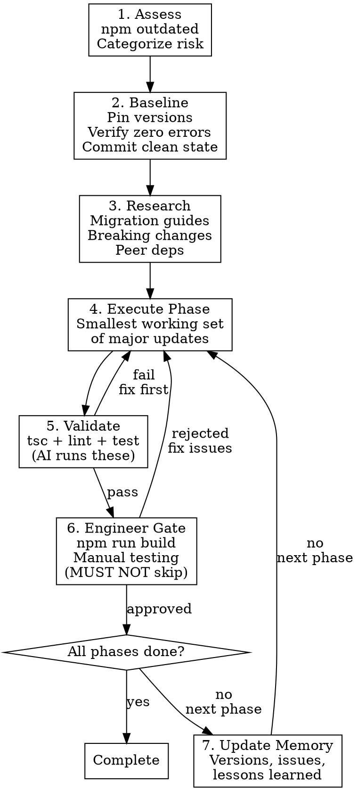

# Dependency Upgrades

## Overview

Systematic, phased approach to npm dependency upgrades with validation gates between each phase. Core principle: **one major version bump at a time, fully validated before proceeding.**

## When to Use

- Upgrading outdated npm dependencies (especially major versions)
- Planning a multi-package upgrade strategy
- Resolving peer dependency conflicts
- Any `npm outdated` showing multiple major bumps

**Not for:** Single patch/minor bumps, adding new dependencies, or non-npm ecosystems.

## Workflow

## Quick Reference

| Rule | Detail |
|------|--------|
| **Phase order** | Dev tools -> TypeScript -> Core framework -> Data layer -> UI libs -> External services |
| **Coupled packages** | Update together: React+ReactDOM+types, Prisma client+CLI, MUI suite, tRPC stack, TS+eslint-typescript |
| **Version jumps** | One major at a time (v5->v6->v7, never v5->v7) |
| **Validation** | Zero TS errors, zero lint errors, all tests pass, build succeeds - after EVERY phase |
| **Never do** | Delete package-lock.json, skip build step, proceed with broken state, rollback without approval |
| **AI boundary** | Run tsc/lint/test. NEVER run build, commit, push, or rollback without explicit engineer approval |

## Peer Dependency Conflicts

Resolution order of preference:
1. Align versions (upgrade/downgrade to compatible range)
2. Check for newer versions of conflicting packages
3. `overrides` in package.json (last resort, document why)
4. Consider alternative packages

## Migration Research (Before ANY Major Bump)

1. Read official migration guide and CHANGELOG
2. Identify removed/deprecated APIs and new peer deps
3. Check for codemods or migration CLI tools
4. Verify downstream packages support the new version

## Memory File for Multi-Session Upgrades

For upgrades spanning multiple sessions, create a progress file in `.claude/` tracking: current phase, completed phases with exact versions, validation results, issues/lessons, remaining phases, and next actions. See `detailed-guide.md` in this skill directory for the full template.

## Anti-Patterns

- Updating unrelated major packages simultaneously
- Skipping `npm run build` (dev success != build success)
- Deleting package-lock.json instead of using `npm ci`
- Ignoring peer dependency warnings
- Committing a state that requires `--legacy-peer-deps`

## Communication Protocol

After each phase, report: validation results, packages updated (old -> new), issues encountered, and next phase plan. Always remind engineer to run `npm run build` before approving.

## Full Reference

See `detailed-guide.md` in this skill directory for complete phase-by-phase instructions, memory file templates, responsibility matrix, recovery procedures, and common issues reference.
