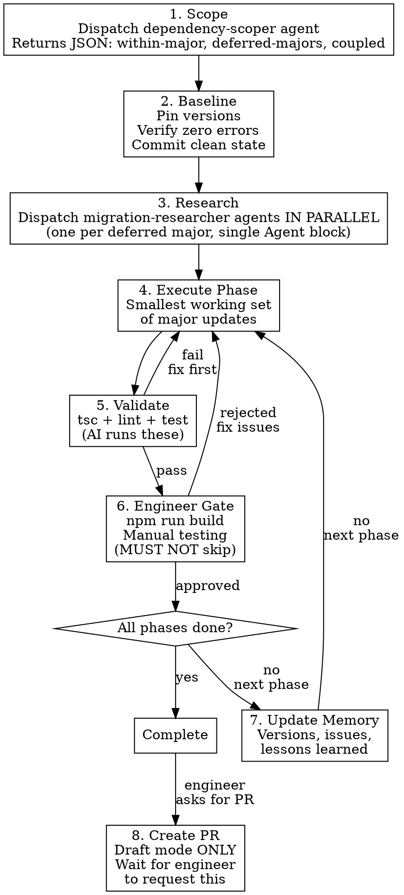

# Dependency Upgrades

## Overview

Systematic, phased approach to npm dependency upgrades with validation gates between each phase. Core principle: **one major version bump at a time, fully validated before proceeding.**

## When to Use

- Upgrading outdated npm dependencies (especially major versions)
- Planning a multi-package upgrade strategy
- Resolving peer dependency conflicts
- Any `npm outdated` showing multiple major bumps

**Not for:** Single patch/minor bumps, adding new dependencies, or non-npm ecosystems.

## Workflow



## Subagent Orchestration (required)

This skill is parallelizable and **must** use subagents to keep registry/web chatter out of the main conversation:

- **Scoping** — dispatch the `dependency-scoper` agent once. It returns the structured upgrade plan. Do not run `npm outdated` or per-package `npm view` loops in the main thread.
- **Migration research** — for each entry in `deferredMajors` from the scoper output, dispatch a `migration-researcher` agent. **Send them in a single message** so they run concurrently. Aggregate the briefs into the phase plan you present to the engineer.

Inline (non-agent) work in the main thread is limited to: presenting plans, editing package.json, running validation (`tsc`/`lint`/`test`), and creating commits/PRs when the engineer asks.

### Sandbox notes (do not invent workarounds)

Registry-metadata queries (`npm outdated`, `npm view`, `npx npm-check-updates`, `pnpm outdated`, `pnpm dlx ncu`, etc.) are listed in `sandbox.excludedCommands` and run **outside** the sandbox. They use the user's real `~/.npm` / pnpm caches directly — no `--cache /tmp/...` flag, no `HTTP_PROXY=...` prelude, no `--registry=...` overrides are needed. If one of these commands fails, the failure is the real failure — debug it, don't paper over it with per-command sandbox workarounds.

Installs and mutating commands (`npm install`, `pnpm install`, `pnpm add`, builds, tests) still run inside the sandbox. The `NODE_OPTIONS=--dns-result-order=ipv4first` env var is already set globally for those.

## Quick Reference

| Rule | Detail |
|------|--------|
| **Phase order** | Dev tools -> TypeScript -> Core framework -> Data layer -> UI libs -> External services |
| **Coupled packages** | Update together: React+ReactDOM+types, Prisma client+CLI, MUI suite, tRPC stack, TS+eslint-typescript |
| **Version jumps** | One major at a time (v5->v6->v7, never v5->v7) |
| **Phase 1 completeness** | Bump every package to its latest within-current-major. Don't trust `npm outdated` alone — see below |
| **Validation** | Zero TS errors, zero lint errors, all tests pass, build succeeds - after EVERY phase |
| **Never do** | Delete package-lock.json, skip build step, proceed with broken state, rollback without approval |
| **AI boundary** | Run tsc/lint/test. NEVER run build, commit, push, or rollback without explicit engineer approval |
| **Commit scope** | Don't bump packages unprompted between explicit phases. Each commit/phase covers only what the engineer approved |
| **PR creation** | NEVER auto-create. Wait for engineer to ask. Always use `--draft` mode |

## Phase 1 Completeness: Latest Within-Major

The `dependency-scoper` agent's `withinMajor` output already covers this — it uses `npm-check-updates --target minor`, which finds the highest version in each package's current major (the most frequent miss when relying on `npm outdated` alone).

Bundle every entry from `withinMajor` into Phase 1 unless the engineer explicitly defers one.

## Peer Dependency Conflicts

Resolution order of preference:
1. Align versions (upgrade/downgrade to compatible range)
2. Check for newer versions of conflicting packages
3. `overrides` in package.json (last resort, document why)
4. Consider alternative packages

## Migration Research (Before ANY Major Bump)

Dispatch one `migration-researcher` agent per deferred major from the scoper output. **Send them all in a single message** so they run concurrently — sequential dispatch defeats the purpose.

Each agent returns a brief covering: risk rating, breaking changes filtered to actual codebase usage, codemods, coupled upgrades, and verification steps. Aggregate these into the phase plan presented to the engineer.

Only do this research inline in the main thread if a single ad-hoc bump is being assessed and dispatching an agent would be overkill.

## Memory File for Multi-Session Upgrades

For upgrades spanning multiple sessions, create a progress file in `.claude/` tracking: current phase, completed phases with exact versions, validation results, issues/lessons, remaining phases, and next actions. See `detailed-guide.md` in this skill directory for the full template.

## Anti-Patterns

- Updating unrelated major packages simultaneously
- Skipping `npm run build` (dev success != build success)
- Deleting package-lock.json instead of using `npm ci`
- Ignoring peer dependency warnings
- Committing a state that requires `--legacy-peer-deps`

## Communication Protocol

After each phase, report: validation results, packages updated (old -> new), issues encountered, and next phase plan. Always remind engineer to run `npm run build` before approving.

## Pull Request Creation

**NEVER auto-create a PR.** Wait for the engineer to explicitly ask you to create one. When asked:

- Always create in **draft** mode (`--draft`)
- Use the PR template below

### PR Template

```markdown
## Summary

{1-2 sentence overview: what this PR covers and how it fits into the larger upgrade effort.}

### Phase 1: Minor & Patch Updates ({count} packages)

**Phase 1a — {description} ({count} packages):**
{comma-separated list of package names}

**Phase 1b — {description} ({count} packages):**
{comma-separated list with notable version jumps called out, e.g. "@aws-sdk/client-s3 (3.629→3.1034)"}

### Phase 2: Major Version Bumps ({count} packages)

| Package | From | To | Risk | Blast Radius |
|---------|------|----|------|-------------|
| `{package}` | {old} | {new} | {Very Low/Low/Medium} | {N files — brief justification} |

### Code Changes (beyond package.json)

- **`{file path}`** — {what changed and why}

### Other

- {Deferred upgrades with reasons}
- {Removed unused packages with justification}
- {Notable peer dep resolutions}

## Test plan

- [x] `npm run tsc` — {result}
- [x] `npm run test` — {result}
- [x] `npm run build` — verified by engineer
- [ ] Verify dev server starts cleanly
- [ ] Smoke test critical paths (auth, navigation, data tables)

🤖 Generated with [Claude Code](https://claude.com/claude-code)
```

### Key Principles

- **Risk column**: Rate each major bump (Very Low / Low / Medium) based on blast radius and API surface change
- **Blast radius**: State file count and why it's safe (e.g., "1 file — dev dep for test data only", "0 files — CLI-only usage")
- **Deferred section**: Document what was intentionally skipped and why (peer dep blockers, resolution conflicts, risk too high for this batch)
- **Code changes section**: Only list changes beyond package.json/lock — import path fixes, API adaptations, test updates, snapshot refreshes

## Full Reference

See `detailed-guide.md` in this skill directory for complete phase-by-phase instructions, memory file templates, responsibility matrix, recovery procedures, and common issues reference.
