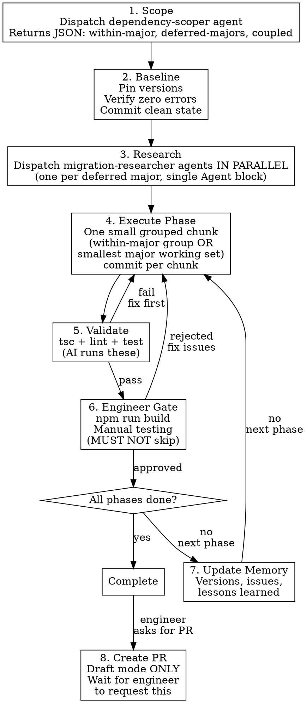

# Dependency Upgrades

## Overview

Systematic, phased approach to npm dependency upgrades with validation gates between each phase. Core principles: **one major version bump at a time**, and **within-major bumps ship as small grouped chunks — never one giant batch** — each fully validated and committed before the next. "It's only a patch/minor" is not a safety guarantee (see [Within-Major Isn't Automatically Safe](#within-major-updates-chunk-dont-batch)).

## When to Use

- Upgrading outdated npm dependencies (especially major versions)
- Planning a multi-package upgrade strategy
- Resolving peer dependency conflicts
- Any `npm outdated` showing multiple major bumps

**Not for:** Single patch/minor bumps, adding new dependencies, or non-npm ecosystems.

## Workflow


```dot
digraph upgrade_flow {
    rankdir=TB;
    node [shape=box];

    scope [label="1. Scope\nDispatch dependency-scoper agent\nReturns JSON: within-major, deferred-majors, coupled"];
    baseline [label="2. Baseline\nPin versions\nVerify zero errors\nCommit clean state"];
    research [label="3. Research\nDispatch migration-researcher agents IN PARALLEL\n(one per deferred major, single Agent block)"];
    phase [label="4. Execute Phase\nOne small grouped chunk\n(within-major group OR\nsmallest major working set)\ncommit per chunk"];
    validate [label="5. Validate\ntsc + lint + test\n(AI runs these)"];
    engineer [label="6. Engineer Gate\nnpm run build\nManual testing\n(MUST NOT skip)"];
    done [label="All phases done?" shape=diamond];
    memory [label="7. Update Memory\nVersions, issues,\nlessons learned"];
    complete [label="Complete"];

    scope -> baseline -> research -> phase -> validate;
    validate -> engineer [label="pass"];
    validate -> phase [label="fail\nfix first"];
    engineer -> done [label="approved"];
    engineer -> phase [label="rejected\nfix issues"];
    done -> memory -> phase [label="no\nnext phase"];
    done -> complete [label="yes"];
    complete -> pr [label="engineer\nasks for PR"];
    pr [label="8. Create PR\nDraft mode ONLY\nWait for engineer\nto request this"];
}
```

## Subagent Orchestration (required)

This skill is parallelizable and **must** use subagents to keep registry/web chatter out of the main conversation:

- **Scoping** — dispatch the `dependency-scoper` agent once. It returns the structured upgrade plan. Do not run `npm outdated` or per-package `npm view` loops in the main thread.
- **Migration research** — for each entry in `deferredMajors` from the scoper output, dispatch a `migration-researcher` agent. **Send them in a single message** so they run concurrently. Aggregate the briefs into the phase plan you present to the engineer.

Inline (non-agent) work in the main thread is limited to: presenting plans, editing package.json, running validation (`tsc`/`lint`/`test`), and creating commits/PRs when the engineer asks.

### Sandbox notes (do not invent workarounds)

Registry-metadata queries (`npm outdated`, `npm view`, `npx npm-check-updates`, `pnpm outdated`, `pnpm dlx ncu`, etc.) are listed in `sandbox.excludedCommands` and run **outside** the sandbox. They use the user's real `~/.npm` / pnpm caches directly — no `--cache /tmp/...` flag, no `HTTP_PROXY=...` prelude, no `--registry=...` overrides are needed. If one of these commands fails, the failure is the real failure — debug it, don't paper over it with per-command sandbox workarounds.

Installs and mutating commands (`npm install`, `pnpm install`, `pnpm add`, builds, tests) still run inside the sandbox. The `NODE_OPTIONS=--dns-result-order=ipv4first` env var is already set globally for those.

## Quick Reference

| Rule | Detail |
|------|--------|
| **Phase order** | Dev tools -> TypeScript -> Core framework -> Data layer -> UI libs -> External services |
| **Coupled packages** | Update together: React+ReactDOM+types, Prisma client+CLI, MUI suite, tRPC stack, TS+eslint-typescript, vite+@vitejs/plugin-react+vitest+coverage. Also watch **transitive hard-pins** (a wrapper pins an exact core version as a direct dep — bump both or neither) |
| **Version jumps** | One major at a time (v5->v6->v7, never v5->v7) |
| **Within-major chunking** | Do NOT batch all within-major bumps into one commit. Split into small grouped chunks (by ecosystem/coupling), validate + commit each. Patch/minor ≠ safe — see below |
| **Validation** | Zero TS errors, zero lint errors, all tests pass, build succeeds - after EVERY phase. In a workspace, run each tool via the package's OWN binary (`pnpm --filter <pkg>`), never root-hoisted — see Validation section |
| **Never do** | Delete package-lock.json, skip build step, proceed with broken state, rollback without approval |
| **AI boundary** | Run tsc/lint/test. NEVER run build, commit, push, or rollback without explicit engineer approval |
| **Commit scope** | Don't bump packages unprompted between explicit phases. Each commit/phase covers only what the engineer approved |
| **PR creation** | NEVER auto-create. Wait for engineer to ask. Always use `--draft` mode |

## Within-Major Updates: Chunk, Don't Batch

The `dependency-scoper` agent's `withinMajor` output finds the highest version in each package's current major (`npm-check-updates --target minor`) — the most frequent miss when relying on `npm outdated` alone. Use it as the **inventory**, not as a single commit.

**Do NOT bundle all `withinMajor` entries into one giant Phase 1.** A patch/minor bump is *not* automatically safe — batching them buries a single bad bump inside dozens of good ones, forcing an expensive bisect and repeated full reinstalls (churn) to find it. Instead, split `withinMajor` into **small grouped chunks and validate + commit each independently**, so blast radius stays small and any breakage is trivially attributable to the chunk that introduced it.

### Chunking strategy

Group the `withinMajor` inventory into commit-sized chunks, roughly:

1. **Pure leaf utilities / SDKs** (AWS SDK, google-*, axios, dayjs, ioredis, mysql2, svix, contentful, etc.) — lowest risk, can be a larger chunk.
2. **Framework-adjacent runtime** (next+eslint-config-next, tRPC stack, TanStack, Radix, MUI, stream-*) — one chunk per ecosystem.
3. **Type packages** (`@types/*`) — separate chunk; these fracture the type graph (see below).
4. **Test/build toolchain** (vite, @vitejs/plugin-react, vitest, coverage, eslint tooling) — separate chunk; regressions here mass-fail tests, not prod.
5. **Anything the scoper flagged as coupled or transitively pinned** — its own chunk.

Present the chunk plan to the engineer and land one chunk per commit. If a chunk needs `> ~15` packages, the engineer can opt to combine, but default to smaller.

### Within-major isn't automatically safe — failure modes seen in the wild

Validate every chunk with the full gate (tsc + lint + **test**) before committing. These are real regressions caused by *patch/minor* bumps:

- **Peer-dependency version splits.** Bumping a widely-depended type package (e.g. `@types/react`) to a version transitive deps don't yet resolve to leaves **two copies** in the tree. That fractures the type graph and silently breaks `declare module` **augmentations** (they merge into the wrong copy) → cascades of "property X does not exist" / implicit-any errors far from the bump. Fix: hold the type package at the version the tree already dedupes on, or force a single version.
- **Transitive hard-pins.** A wrapper package pins an **exact** version of a shared core as a direct *dependency* (not a peer) — e.g. a table/UI wrapper pinning its `-core`. Bumping your direct dep ahead of it creates a duplicate with distinct type identity → augmentations/types break. Fix: keep the shared dep at the version the wrapper pins until the wrapper updates.
- **Type-inference perf regressions.** A schema/validation library minor bump can balloon `tsc` memory/time (e.g. a `z.object` taking tens of seconds each), OOM-ing the typecheck. Diagnose with `tsc --generateTrace <dir>` + `npx @typescript/analyze-trace <dir>` (hot-spot files/expressions), not by throwing more heap at it. Fix: hold the library back.
- **Test-toolchain transform regressions.** A `vite`/`@vitejs/plugin-react`/`vitest` patch can change the JSX runtime (automatic → classic) → mass `ReferenceError: React is not defined` across every render test. Fix: keep the vite+plugin-react+vitest+coverage set on the versions that pass, as a coupled group.

**Diagnosing a bad chunk.** If a chunk fails validation, don't bisect the whole batch — the chunk is already small. Check for **duplicate installs first** (`find node_modules -type d -name <pkg>`, lockfile `grep`, `.pnpm` virtual keys), compare resolved versions against the last-good branch, and revert the single offending package (hold it back with a documented reason). Duplicate/split resolutions are the leading cause and are invisible in `package.json` — they only show in the installed tree.

## Validation: Run the Package's OWN Toolchain

After each chunk, run the full gate — `tsc`, lint, **test** — on a clean install. In a **monorepo/workspace, this must run through the target package's own binary, never the root-hoisted one.**

- Run via `pnpm --filter <pkg> <script>` (or `<pkg>/node_modules/.bin/<tool>`), matching how CI invokes it. Do **not** shortcut to `<root>/node_modules/.bin/<tool>`.
- **Why:** the root `node_modules/.bin` hoists whichever version of a multi-version tool won hoisting — often an *older* one belonging to a sibling package. Running that against your package silently uses the wrong toolchain. Real example: root hoisted `vitest@3 / vite@6 / @vitejs/plugin-react@4` (from other workspaces) while the target declared `vitest@4 / vite@8`; running the root vitest emitted classic JSX and produced **1394 bogus `ReferenceError: React is not defined`** failures — pure harness artifact, zero real breakage.
- **Before trusting a mass failure, confirm the runner.** A sudden flood of identical, fundamental errors (JSX runtime, module-not-found, "X is not defined" everywhere) is more likely a wrong-binary/duplicate-toolchain artifact than a real regression. Check the resolved tool version (`<pkg>/node_modules/.bin/<tool> --version`, or the lockfile importer block) against what the package declares.
- Single-version tools hoisted at root (typically `tsc`/`typescript`, `next`) are safe to run from root — but verify the version is single before assuming it.
- **Snapshot churn** from UI-lib bumps (class-name reordering, icon markup) is expected; confirm the diff is cosmetic, then regenerate with `-u`. Don't `-u` blindly — a structural/logic diff hiding among cosmetic ones is a real regression.

## Peer Dependency Conflicts

Resolution order of preference:
1. Align versions (upgrade/downgrade to compatible range)
2. Check for newer versions of conflicting packages
3. `overrides` in package.json (last resort, document why)
4. Consider alternative packages

## Migration Research (Before ANY Major Bump)

Dispatch one `migration-researcher` agent per deferred major from the scoper output. **Send them all in a single message** so they run concurrently — sequential dispatch defeats the purpose.

Each agent returns a brief covering: risk rating, breaking changes filtered to actual codebase usage, codemods, coupled upgrades, and verification steps. Aggregate these into the phase plan presented to the engineer.

Only do this research inline in the main thread if a single ad-hoc bump is being assessed and dispatching an agent would be overkill.

## Memory File for Multi-Session Upgrades

For upgrades spanning multiple sessions, create a progress file in `.claude/` tracking: current phase, completed phases with exact versions, validation results, issues/lessons, remaining phases, and next actions. See `detailed-guide.md` in this skill directory for the full template.

## Anti-Patterns

- **Batching all within-major (patch/minor) bumps into one commit on the assumption they're safe.** They cause version splits, transitive-pin duplicates, perf regressions, and toolchain breaks just like majors — and a mega-batch turns one bad bump into a costly bisect + repeated reinstalls. Chunk and commit incrementally.
- **Treating a green `package.json` as a green tree.** Version mismatches live in the *installed* tree (duplicate copies, split peers), not in `package.json`. Verify with the full validation gate on a clean install, not by eyeballing declared versions.
- Updating unrelated major packages simultaneously
- Skipping `npm run build` (dev success != build success)
- Deleting package-lock.json instead of using `npm ci`
- Ignoring peer dependency warnings
- Committing a state that requires `--legacy-peer-deps`

## Communication Protocol

After each phase, report: validation results, packages updated (old -> new), issues encountered, and next phase plan. Always remind engineer to run `npm run build` before approving.

## Pull Request Creation

**NEVER auto-create a PR.** Wait for the engineer to explicitly ask you to create one. When asked:

- Always create in **draft** mode (`--draft`)
- Use the PR template below

### PR Template

```markdown
## Summary

{1-2 sentence overview: what this PR covers and how it fits into the larger upgrade effort.}

### Within-major chunks ({count} packages across {N} commits)

One row per committed chunk (leaf utils, per-ecosystem, types, test-infra, …):

- **{chunk name} ({count}):** {comma-separated packages, notable jumps called out, e.g. "@aws-sdk/client-s3 (3.629→3.1034)"}

### Major version bumps ({count} packages)

| Package | From | To | Risk | Blast Radius |
|---------|------|----|------|-------------|
| `{package}` | {old} | {new} | {Very Low/Low/Medium} | {N files — brief justification} |

### Held back (with reason)

Packages intentionally NOT bumped this round — record so the next session doesn't retry them blindly:

| Package | Available | Held at | Reason |
|---------|-----------|---------|--------|
| `{package}` | {latest} | {pinned} | {peer split / transitive pin / perf regression / toolchain break / major deferred} |

### Code Changes (beyond package.json)

- **`{file path}`** — {what changed and why}

### Other

- {Deferred upgrades with reasons}
- {Removed unused packages with justification}
- {Notable peer dep resolutions}

## Test plan

- [x] `npm run tsc` — {result}
- [x] `npm run test` — {result}
- [x] `npm run build` — verified by engineer
- [ ] Verify dev server starts cleanly
- [ ] Smoke test critical paths (auth, navigation, data tables)

🤖 Generated with [Claude Code](https://claude.com/claude-code)
```

### Key Principles

- **Risk column**: Rate each major bump (Very Low / Low / Medium) based on blast radius and API surface change
- **Blast radius**: State file count and why it's safe (e.g., "1 file — dev dep for test data only", "0 files — CLI-only usage")
- **Deferred section**: Document what was intentionally skipped and why (peer dep blockers, resolution conflicts, risk too high for this batch)
- **Code changes section**: Only list changes beyond package.json/lock — import path fixes, API adaptations, test updates, snapshot refreshes

## Full Reference

See `detailed-guide.md` in this skill directory for complete phase-by-phase instructions, memory file templates, responsibility matrix, recovery procedures, and common issues reference.
