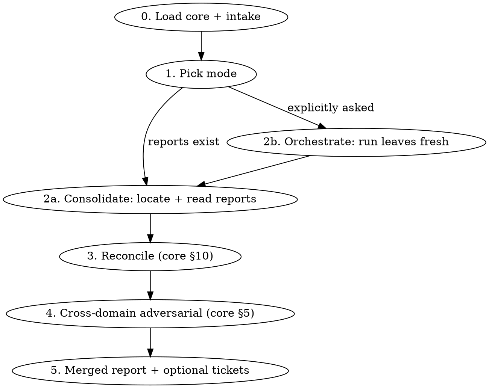

# Evidence Consolidation

## Overview

An aggregator over the evidence-analysis family. The leaves — `analytics-friction-analysis`,
`error-triage`, `regression-analysis` — each reconcile only **their own** evidence. This skill runs
the reconciliation *across* them: it takes two or more of their reports, merges findings that name
the same underlying cause, and runs a **cross-domain skeptic pass** so a concern one domain raises
can be raised or ruled out by another domain's evidence. The deliverable is one consolidated report
with a single ranking and a single merged "Considered & ruled out."

> **Load `evidence-analysis-core` via the Skill tool for the shared method — this skill leans
> especially on §9 (model tiering), §10 (cross-domain reconciliation), §5 (adversarial
> verification), §3 (evidence standard), and §7 (artifact convention). Apply the consolidation
> workflow below on top of it.**

This skill is **read-only** except for the local artifact and (confirmed) tickets — the same
guarantee as the leaves (core §1). It reads report artifacts and the codebase freely; it never edits
code or opens PRs.

## When to Use

- "Both the analytics report and the error-triage report flagged this — which is right?"
- "Merge the analytics and error-triage findings into one list."
- "I've run a couple of these investigations; give me one consolidated picture."
- Any time overlapping findings across domains need one reconciled ranking instead of two lists that
  quietly disagree.

## When NOT to Use

- A single-domain pass (only analytics, only the error tracker, only a metric regression) → invoke
  the relevant **leaf** directly. There is nothing to reconcile with one evidence set.
- A known bug needing a fix → `investigate` / `superpowers:systematic-debugging`.

The tell: **more than one domain's evidence is in play** and the goal is one merged, deduped,
cross-checked report — not producing a fresh single-domain analysis.

## Workflow



## Intake — pick the mode

**Default to Consolidate.** It is the cheap path and the common case: the leaf reports already
exist, and merging them adds no fan-out cost beyond the reconciliation pass itself.

- **Consolidate (default)** — read the existing report artifacts and merge them. Choose this
  whenever fresh-enough reports exist under the leaves' `.claude/local-docs/` areas (below). No leaf re-run.
- **Orchestrate (opt-in, expensive)** — only when the user explicitly asks to run the analyses
  fresh, or when no usable report exists for a domain they want included. Invoke the relevant leaf
  skills first (each writes its own artifact), then fall through to Consolidate over the results.
  This pays ~2× the leaves' fan-out cost — **confirm before choosing it**, and state the cost.

If reports exist but are stale (older than the window the user cares about, or predating a release
that matters), say so and offer Orchestrate rather than silently merging outdated evidence.

## Locating input reports

The leaves write to `.claude/local-docs/<area>/YYYY-MM-DD-slug.md` (core §7):

| Domain | Area path |
|---|---|
| Analytics friction | `.claude/local-docs/analytics/` |
| Error triage | `.claude/local-docs/error-triage/` |
| Regression analysis | `.claude/local-docs/regressions/` |

Discover which reports exist (glob these directories), take the most recent per domain unless the
user names specific files, and **state exactly which artifacts you are merging** (path + date) up
front. A domain with no report is a named gap in Coverage — never a silent omission.

## Reconciliation

Apply **core §10 verbatim** — this skill adds no new reconciliation rules, it *is* the caller of
that doctrine. In brief, per §10: dedup by mechanism (`file:line` / issue ID / event / release, not
wording); run the cross-domain skeptic pass so each domain's evidence can raise or lower the other's
confidence; produce one merged ranking and one merged ruled-out list; attribute every finding back
to its source report(s) (see Artifact for the provenance convention).

**Breaking a factual conflict — re-query the source, don't just reason over the artifacts.** When
two reports disagree on a *fact* (not an interpretation) — a version split, a count, whether an
error is new — the decisive move is usually to re-run the *minimal* query against the original
source (the analytics / error-tracker / metrics MCP) and let ground truth settle it. This is the one
place Consolidate mode legitimately touches a live source: it is bounded (one or two targeted
queries, not a fresh fan-out) and read-only. Record the query and its result as a finding tagged
`[verified during consolidation]`, and cite it in "Considered & ruled out" as the evidence that
broke the tie. A conflict resolved by fresh data beats one resolved by whichever report sounded more
confident.

Run the reconciliation and the adversarial pass on `opus` (core §9); reading the reports needs no
fan-out, and a tie-breaking re-query is a single query, not a partition sweep.

## Model tiering (this skill)

- **Consolidate mode** does almost no fan-out — reading a handful of markdown reports is light. Keep
  the reconciliation in the main (`opus`) context; reach past it only to break a tie — a bounded
  re-query against the original source (see Reconciliation) or a subagent to re-check the codebase,
  tiered per core §9.
- **Orchestrate mode** inherits the leaves' own fan-out, which already tiers per core §9 (`haiku`
  enumeration, `sonnet` per-source, `opus` synthesis). The consolidation pass on top stays `opus`.

## Artifact

Write the consolidated report to:

```
.claude/local-docs/consolidated/YYYY-MM-DD-slug.md
```

Follow the core §7 skeleton, with these consolidation-specific requirements:

- **Summary** names the source analyses merged and the headline reconciled answer.
- **Tickets** *(consolidation-only; place it immediately after Summary, not at the end)* — once
  tickets are filed (Terminal Prompts), record them at the **top** of the report: a small table of
  `ticket → findings covered → link`, plus a short "not ticketed, by design" list (deferred /
  owned-directly / watch-only). This is the first thing a reader acts on, so it leads. Before tickets
  exist, leave the link cells as `_(add link)_` placeholders.
- **Evidence-based findings (ranked)** — the merged, deduped, re-ranked list. Each finding cites
  every source it draws on and carries the combined evidence artifacts.
- **Considered & ruled out** — the merged ruled-out list; each item records **which source's
  evidence** refuted it and why (this captures the core scenario — a concern one report raised that
  another ruled out), including any tie broken by a `[verified during consolidation]` re-query.
- **For engineering discussion** (core §7.5) — genuine cross-domain conflicts where neither
  evidence set dominates, surfaced rather than silently resolved.
- **Coverage notes** — which domains had reports, which were absent/stale, and (per core §9) which
  tier ran any fan-out or tie-breaking re-query.

**Provenance must be self-contained.** Unlike the leaf reports (which stay in-repo), the
consolidated report is frequently the *only* artifact that travels — exported to a Google Doc,
pasted into a ticket, read by someone without repo access. So:

- Attribute per finding with a short italic *Sources:* line in **plain language** ("the friction
  sweep," "the error triage," "verified during consolidation") — not inline `[A]`/`[E]` sigils,
  which are noise to a human reader and meaningless out of context.
- Put the repo paths of the merged reports in **one "inputs" line under the title** for auditors,
  not sprinkled through the body. A reader holding only this document should still understand where
  every claim came from.

The artifact is local and **uncommitted** (core §7) — never stage or commit it.

## Terminal Prompts

Ticketing follows core §8 — offer tickets only after the user engages with the merged findings,
confirmation-gated, each carrying the reconciled evidence and links back to the contributing
reports. Create nothing external without explicit confirmation.

Because consolidation makes root-cause relationships visible across domains, **group** per core §8:
findings that share a root cause, owner, or single investigation become **one** ticket, not one per
finding. State plainly what is *not* ticketed and why (deferred / owned-directly / watch-only) so a
pared-down slate never hides a dropped finding — expect the user to ask "does anything important get
lost?", and answer it before they do.

**Publish-then-ticket ordering (avoid URL churn).** When the user wants both a published report
(e.g. exported to Docs) *and* tickets that link to it: finalize and publish the report **first** so
its URL is stable, embed that URL in the ticket bodies, then backfill the ticket URLs into the
report's source-of-truth (the local markdown; the user syncs any external copy). Re-publishing the
report *after* tickets exist mints a new URL and strands every ticket's link — so lock the report's
location before creating tickets.
