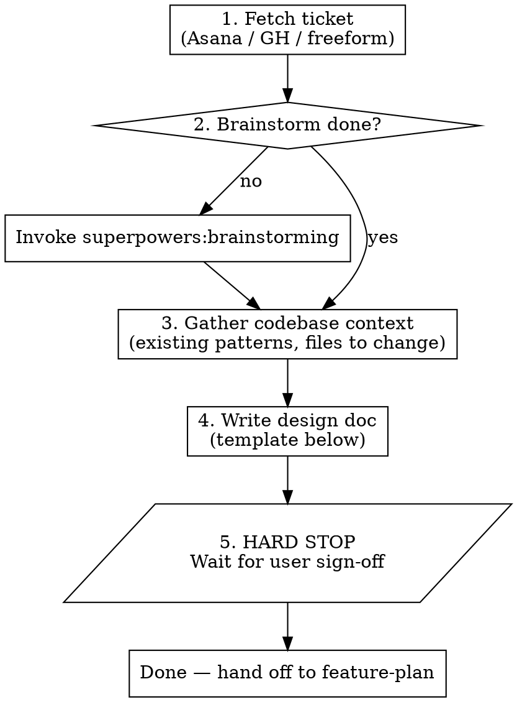

# Feature Design Doc

## Overview

Produce a self-contained technical design document for a new feature, written to `<project>/docs/plans/YYYY-MM-DD-<slug>.md`. The design doc is the **authoritative spec** — every later artifact (implementation plan, QA checklist, PR description) references it.

This skill writes the design only. It does **not** produce an implementation plan or QA checklist — those come from `feature-plan`. For the full ticket-to-plan flow, use `feature-spec` instead.

## When to Use

- New feature work that originated from a ticket (Asana, GitHub issue, Linear)
- A non-trivial refactor or architectural change that needs design alignment before code
- User asks: "write a design doc", "write the TDD", "design this", "let's plan this feature"

## When NOT to Use

- Small bug fixes — go straight to a PR
- One-off scripts or chore work
- Pure documentation updates
- Anything where the implementation is obvious from the ticket

## Required Background

**REQUIRED SUB-SKILL:** Use `superpowers:brainstorming` first. The design doc captures the *output* of a brainstorm — alternatives considered and rejected, structural facts that shape the fix, edge cases. If you haven't brainstormed yet, do that first; this skill assumes those decisions exist.

## Workflow



## Inputs

Resolve before writing:

1. **Ticket reference** — Asana task ID/URL, GitHub issue number, or freeform description. Fetch it via the relevant MCP / `gh` command. If no reference, ask.
2. **Target file path** — default `<project>/docs/plans/YYYY-MM-DD-<slug>.md`. Use today's date and a kebab-case slug from the ticket title (e.g. `2026-05-20-stream-screenshare-landscape.md`).
3. **Branch + base branch** — capture from `git status` / `git remote`. Goes in the header.
4. **Existing patterns to mirror** — `grep` for similar features that already exist in the codebase. The design's strongest move is "we already do X for Y, mirror that here."

## Template

The design doc MUST include these sections, in this order. Skip a section only if it genuinely doesn't apply (rare).

````markdown
# <Feature Title>

**Repo:** <repo name>
**Branch:** `<branch>` (in progress)
**Base branch:** `<base>`
**Ticket:** <Asana/GH link>
**Last updated:** YYYY-MM-DD

> This plan is self-contained. The brainstorming conversation that produced it
> is not available in the worktree where you'll execute it.

## Background

Two paragraphs max. Describe the *structural facts that shape the fix* — not the bug. Identify any existing pattern in the codebase that this work should mirror (link to the file).

## Approach

One paragraph: the chosen approach.

### Alternatives considered and rejected

- **<alternative 1>** — one-line reason for rejection.
- **<alternative 2>** — one-line reason for rejection.

### User flow (if user-facing)

Numbered list, 4-8 steps, from user perspective.

## File layout

Two new files; one modified. (Or whatever the actual scope is — table MUST match the entire change.)

| Path | State | Purpose |
|---|---|---|
| `path/a` | new | What it does |
| `path/b` | modified | What changes |

No other files change.

## <Per-component design sections>

One subsection per file in the table. Show interface boundaries (TypeScript `interface`, function signatures, JSX shape) — NOT full implementations.

## <Lifecycle / contract section if applicable>

Code snippet for any non-obvious lifecycle: orientation, cleanup, subscription, etc.

### Edge cases

Bulleted list. Each entry: one sentence describing the case + one sentence on the handling.

### Why we are not handling <X> in v1

If there's a deferred-but-tempting feature, give it its own subsection with the cost/benefit. Distinct from "Out of scope."

## Telemetry (if observability matters)

Event names + sample payloads. Observability is part of the design, not an afterthought.

## Testing

Split into:
- **Manual matrix** — what device/platform combinations need real-device testing
- **Automated tests worth writing** — bullets, by file

## Out of scope

Explicit non-goals. Bulleted list.

## Open questions to resolve at implementation time

Deliberately deferred from design. Each question has a known fallback so a "wrong" answer doesn't block execution.

1. **<question>** — fallback if unclear.

## Suggested commit / PR shape

Numbered commit sequence (3-5 commits typically; see commit cadence rules in `feature-plan`).

## Post-implementation QA findings

> Fill in after the manual QA pass. Use this section to capture anything that *deviated from this design* during real-device testing.

(empty until QA runs)
````

## Quality Bar

| Section | Quality bar |
|---|---|
| Background | Must name an existing pattern to mirror, OR state explicitly there isn't one |
| Alternatives considered | At least 2 alternatives, each with a one-line rejection reason |
| File layout | Table must match the *entire* code change — if implementation deviates, the design needs revising, not silent expansion |
| Edge cases | Cover: feature ends mid-flight, app backgrounded, network blip, parent unmount, state-rollback during transients |
| Out of scope | Explicit list. If a follow-up reviewer could ask "why didn't you do X?", X belongs here OR in "Why we are not handling X in v1" |
| Open questions | Each one MUST have a known fallback; otherwise it's not a design doc, it's a research request |

## Hard Stops

After writing the design doc:

1. **Print the file path** so the user can open it.
2. **Print a 3-5 bullet summary** of what the design says: chosen approach, files affected, key edge cases.
3. **Stop the turn.** Do NOT continue to `feature-plan` or any other follow-up work. Wait for explicit user sign-off ("design looks good", "proceed to plan", etc.).
4. If the user requests changes, edit and re-print. Do not invoke `feature-plan` until they say so.

## Common Mistakes

- **Writing the design *during* implementation instead of before.** The whole point is to lock in scope before code. If implementation has started, you're writing a postmortem, not a design.
- **Skipping Alternatives Considered.** Locks in the decision against future second-guessing. Always include 2+.
- **File layout table that "covers most files."** Either the table is exhaustive or it's wrong. Implementation that touches files outside the table = stop and revise.
- **Open questions with no fallback.** A design doc punts cleanly; a research request blocks.
- **Letting the doc become a narrative.** It's a reference, not a story. Future-you should be able to read any one section without reading the rest.

## Reference Example

See `fwapp2proto/docs/plans/2026-05-20-stream-screenshare-landscape.md` in the fw_monorepo for a production-quality example of this template applied to a real feature.
