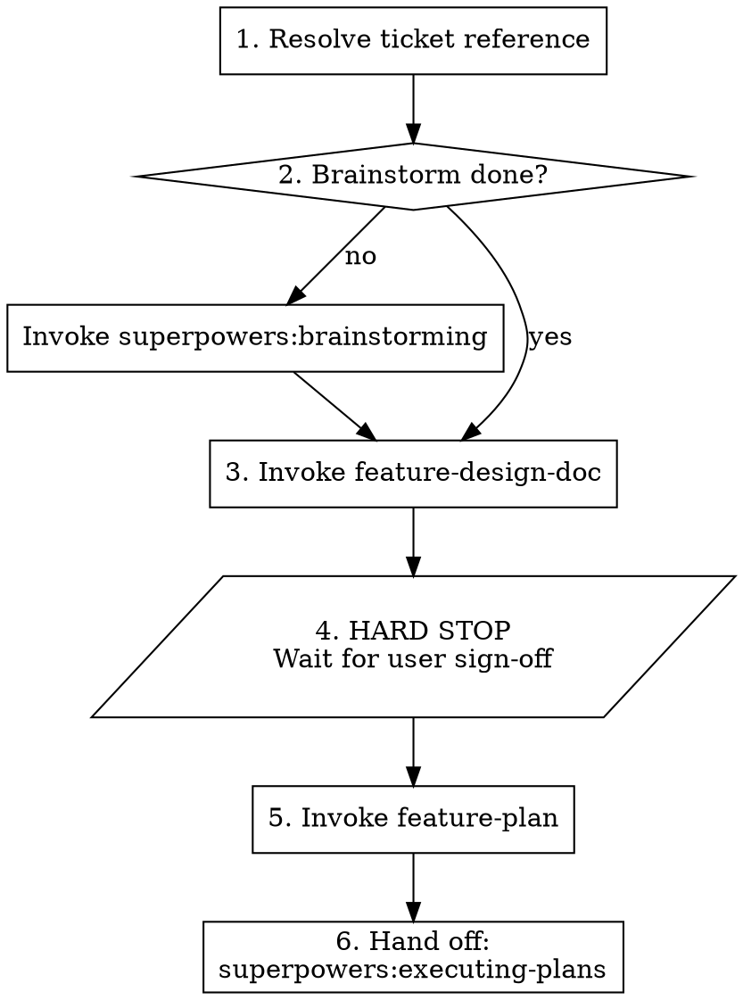

# Feature Spec (orchestrator)

## Overview

End-to-end ticket-to-plan orchestrator. Combines three steps into one workflow:

1. `superpowers:brainstorming` — establish requirements and alternatives
2. `feature-design-doc` — write the authoritative design doc
3. **HARD STOP** — wait for user sign-off on the design
4. `feature-plan` — write the phased implementation plan + QA checklist

After this skill completes, the next step is `superpowers:executing-plans` (or `superpowers:subagent-driven-development` for parallelizable phases) to actually build the feature.

## When to Use

- Starting net-new feature work from a ticket (Asana, GitHub issue, Linear)
- User says: "let's start on <ticket>", "design and plan this feature", "build me a spec for <X>"

## When NOT to Use

- Bug fixes — use `superpowers:systematic-debugging` or `investigate`
- Refactors with no behavior change — `superpowers:writing-plans` is sufficient
- Dependency upgrades — use `dependency-upgrades`
- Quick chores

## Workflow

## Steps

### Step 1: Resolve ticket reference

Accept in priority order:

1. **Asana task ID/URL** — fetch via `mcp__asana__get_task`
2. **GitHub issue number** — fetch via `gh api repos/<owner>/<repo>/issues/<number>` or `gh issue view <number>`
3. **Linear issue / freeform** — accept the text as-is
4. **None** — ask the user

Capture the full ticket description into context. Note the slug for filenames (kebab-case from the title).

### Step 2: Brainstorm gate

If the conversation has NOT already produced a clear set of:

- Chosen approach
- Alternatives considered + rejected
- Edge cases
- Out-of-scope items

…then invoke `superpowers:brainstorming`. The brainstorm output feeds directly into the design doc.

If the user explicitly says "skip brainstorm, I've already thought this through", proceed — but verify they've named the alternatives they considered. The design doc *requires* an "Alternatives considered and rejected" section.

### Step 3: Write the design doc

Invoke `feature-design-doc`. Pass the ticket details and brainstorm outcomes as context.

### Step 4: HARD STOP — design sign-off

This is the single most important gate in the flow.

1. Print the design doc path.
2. Print a short summary (3-5 bullets) of what the design says: chosen approach, files affected, key edge cases.
3. **End the turn.** Do NOT proceed to `feature-plan` in the same turn, even if the design looks solid.
4. Wait for the user to say "looks good", "proceed", "write the plan", or to request changes. If they request changes, edit the design doc and re-print. Loop until approval.

### Step 5: Write the plan + QA

After explicit sign-off, invoke `feature-plan`. The plan references the design doc as its source of truth.

### Step 6: Hand off

After the plan + QA are written:

1. Print both file paths.
2. Tell the user the next step is execution via `superpowers:executing-plans` (or `superpowers:subagent-driven-development` if phases parallelize).
3. **Do not auto-execute.** Wait for explicit instruction.

## Hard Stops Summary

| Step | Stop type | Why |
|---|---|---|
| 4 (post-design) | Hard stop, full turn end | Design is the high-leverage artifact; fix it before building a plan on top |
| 6 (post-plan) | Hard stop, full turn end | Execution is a multi-commit operation that needs explicit start signal |

Between phases of execution, commits happen — those gates live in `feature-plan`'s output (the `-- MANUAL REVIEW CHECKPOINT --` markers).

## Common Mistakes

- **Skipping the design sign-off gate.** Even if the design seems obvious, the user might catch a scope issue. Always stop.
- **Auto-invoking executing-plans.** This is a separate decision; the user may want to review the plan first, sleep on it, or hand it to a fresh session.
- **Treating brainstorm as optional.** It isn't — the design's "Alternatives considered" section requires its output. The shortcut is to invoke brainstorming *inside* this flow rather than skipping it.
- **Generating the plan before the design is signed off.** Once the plan is written, you've baked in design assumptions. Re-doing both is more work than waiting.
