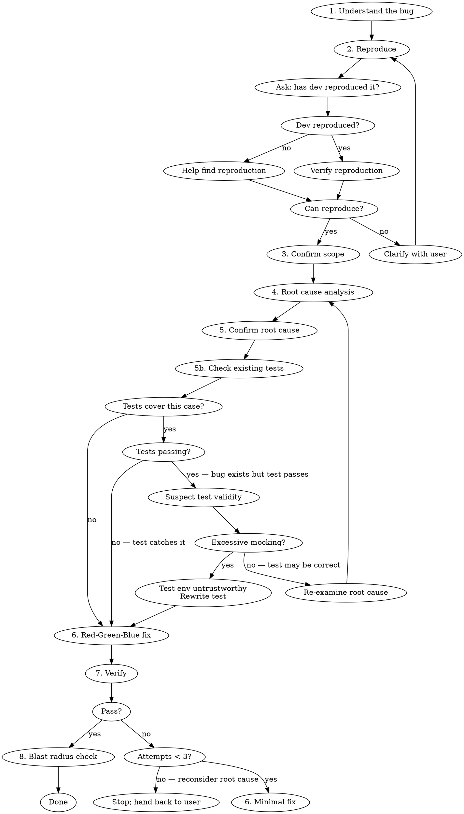

# Debug Workflow

## Overview

Disciplined debugging workflow for TypeScript projects. Enforces reproduction-first investigation, root cause confirmation before fixing, and full verification gates. Complements `superpowers:systematic-debugging` which covers root cause analysis methodology — this skill focuses on workflow discipline and TypeScript-specific guardrails.

## When to Use

- Bug report or ticket needs investigation
- Test failure needs diagnosis
- Unexpected runtime behavior

## When NOT to Use

- Greenfield feature work (use brainstorming/TDD skills instead)
- Refactoring without a known bug

## Workflow



### 1. Understand the Bug

Read the ticket, error message, or user description. Identify:
- Expected vs actual behavior
- Affected code area (file, module, endpoint)
- Any provided reproduction steps

### 2. Reproduce

**First, ask the developer:** "Have you been able to reproduce this bug?" This determines the next step:

- **If yes:** Have them share their reproduction steps, then verify you can trigger it the same way.
- **If no:** Offer to help find a reproduction path. Use the bug description, logs, and affected code area to construct likely scenarios:
  - Identify the input conditions and state that could trigger the behavior
  - Check for environment-specific factors (data, config, feature flags, race conditions)
  - Propose concrete steps and try them together
  - If error logging references Sentry or Posthog, check for available MCP tools (see "External Observability Tools" below)

**For "it reverts / changes on refresh" bugs, localize the layer first.** Determine whether the value actually changed in the datastore (persisted) or only in the response/cache/serialization. A refresh that re-reads the source of truth distinguishes a real write from a cache/read artifact. **Inspect the actual request payload and response body** (network tab, server logs): the gap between *what the client sent* and *what came back* often names the responsible layer directly. (In this kind of bug, a request carrying only field A coming back with field B changed points away from the form/client and toward server-side validation, an ORM/serialization layer, or a trigger.)

Confirm the issue exists before touching any code. Run the failing test, hit the endpoint, or trigger the UI flow. If you cannot reproduce after exhausting these approaches, clarify with the user — do not guess at fixes.

### 3. Confirm Scope with User

Before making changes, state:
- What you believe the bug is
- Where you plan to make changes
- What you will NOT change

Get explicit confirmation. Do not expand scope beyond the confirmed bug.

### 4. Root Cause Analysis

Identify the correct abstraction layer for the fix. Use `superpowers:systematic-debugging` for complex investigations.

Ask: **"Why does this happen?"** not just **"Where does it break?"**

- **Search for prior art of the same bug class.** Grep the codebase and git history (`git log -S '<symbol>'`, `--diff-filter=A`) for the same symptom or an existing fix elsewhere. The same class fixed in one place but not another both confirms the mechanism and exposes the blast radius.
- **Date regressions via provenance.** If the bug appeared after an upgrade or integration, use git history and lockfile/dependency diffs to pin the behavior change to a specific dependency version or migration. "It started after we pulled in X" is a testable claim, not a hunch.
- **Fix the class, not the instance.** Decide whether the bug is one reachable instance of a shared root cause. Prefer a fix at the altitude that eliminates the whole class (e.g. a generation/serialization chokepoint) over a per-site patch, and state the blast radius to the user before choosing.

### 5. Confirm Root Cause

Before writing any fix, articulate the root cause — not the symptom. If you can only describe the symptom, you haven't found the root cause yet.

**Prove the mechanism in isolation.** Reproduce the suspected mechanism in the smallest possible standalone form — a few-line script or a focused unit test — using the project's *actual* dependency versions. A theory you can describe but cannot reproduce in isolation is still a hypothesis. When the evidence is "the response shows X," reproduce X from the raw inputs rather than inferring it; the isolated repro is what turns a plausible story into a confirmed root cause (and it usually becomes the Red test in step 6).

### 5b. Check Existing Tests

After confirming root cause and before writing any fix, check if tests already cover the affected code path.

**If tests exist for this case and are passing** — this is a red flag. The bug is real but the tests don't catch it. Investigate why:
- **Excessive mocking** — if the test mocks away the layer where the bug lives, the test environment is untrustworthy. The test needs to be rewritten with realistic dependencies before proceeding.
- **No excessive mocking** — the test may be validating correctly, which means your suspected root cause may not be the actual issue. Return to step 4 and re-examine.

**If tests exist and are failing** — good, the test already catches the bug. Proceed to the fix.

**If no tests cover this case** — proceed to the fix, using a test-driven approach to add coverage.

**A passing test may encode the buggy behavior as "expected."** If you find a test asserting the wrong outcome (e.g. asserting the very value the bug produces), that is a signal the bug is systemic — not evidence the code is correct. Flipping that assertion is part of the fix, not a regression; call it out explicitly when you do.

### 6. Red-Green-Blue Fix

Use a **Red-Green-Blue (TDD)** approach when fixing bugs. This increases long-term code quality by ensuring the bug has a regression test.

1. **Red** — Write a test that reproduces the bug and fails. This proves the test captures the defect.
2. **Green** — Make the smallest targeted change that makes the test pass.
3. **Blue (Refactor)** — Clean up only the code you touched, only if needed for clarity. No scope creep.

If TDD is not practical for this fix (e.g., the bug is in infrastructure, config, or a layer that resists unit testing), document why and ensure the fix is still verified manually.

**Do NOT:**
- Refactor surrounding code
- Add unrelated improvements
- Expand scope beyond the confirmed fix
- Add speculative error handling

### 7. Verify

Run the full verification gate on affected files:

```bash
# Typecheck
npx tsc --noEmit

# Lint
npx eslint <affected-files>

# Tests
npm test -- <affected-test-files>
```

Also manually confirm the original reproduction case no longer triggers the bug.

#### Verification via subagent (when context is precious)

If the fix is in a context-heavy session — long debug trace, many files already read, large diffs — dispatch the verification run as a Task subagent instead of running it inline. The subagent returns a structured pass/fail report with the relevant failure excerpts, keeping the main thread focused on the fix itself.

Use this when **any** of the following are true:
- The verification suite is slow or produces a lot of output
- The main thread is already heavily loaded with investigation context
- You expect to iterate on the fix more than once

The subagent's charter: run the three commands above on the affected files, return a structured report (pass/fail per check + failure excerpts + the specific assertions or types that broke). Do not modify code.

#### Iteration cap

If verification fails, return to step 6 and apply a minimal targeted fix based on the failure. **Cap the loop at 3 fix attempts.** If still failing after 3 attempts, stop and hand back to the user with:
- What each attempt changed
- What each attempt's verification produced
- Your current best hypothesis for why the fix isn't landing

Repeated failures usually mean the root cause from step 4 is wrong, not that the fix needs more iteration — returning to step 4 with fresh eyes is usually more productive than a 4th attempt.

### 8. Blast Radius Check

If the fix touches shared code (utilities, types, base classes), run the broader test suite to verify nothing outside the intended scope broke:

```bash
npm test
```

Report what files changed. Do NOT run git add, commit, or any staging commands.

## TypeScript Rules

### No Typecasting to `any`

**Never use `as any`.** This hides bugs rather than fixing them.

| Instead of | Use |
|---|---|
| `value as any` | Proper type narrowing or generics |
| `(obj as any).prop` | Type guard: `if ('prop' in obj)` |
| `fn(x as any)` | Fix the type mismatch at its source |

### Minimize All Typecasting

Typecasts (`as Type`) bypass the compiler's safety checks. Every cast is a potential bug hiding spot — the exact opposite of what debugging should produce.

**Acceptable:** `as const`, `as unknown as Type` only when interfacing with untyped third-party code (and add a comment explaining why).

**Preferred alternatives:**

```typescript
// BAD: casting to silence a type error
const result = response.data as UserProfile;

// GOOD: type guard with runtime check
function isUserProfile(data: unknown): data is UserProfile {
  return typeof data === 'object' && data !== null && 'id' in data && 'email' in data;
}
if (isUserProfile(response.data)) {
  // response.data is now UserProfile
}

// GOOD: generic function that preserves types
async function fetchJson<T>(url: string, guard: (d: unknown) => d is T): Promise<T> {
  const res = await fetch(url);
  const data: unknown = await res.json();
  if (!guard(data)) throw new Error('Unexpected response shape');
  return data;
}
```

If a fix requires a typecast, that's a signal the root cause may be a type design issue — investigate before casting.

## External Observability Tools

When investigating code that logs errors to **Sentry** or **Posthog**, check whether a corresponding MCP server is configured. If available, use it to:

- **Pull error details** — stack traces, breadcrumbs, affected users, frequency
- **Correlate with reproduction** — match the reported error signature to your local reproduction attempt
- **Identify patterns** — check if the error is intermittent, environment-specific, or tied to a recent deploy

These tools are especially valuable when the developer has not been able to reproduce the bug locally — production error data can reveal the conditions needed for reproduction.

## Common TypeScript Bug Patterns

| Pattern | Symptom | Fix approach |
|---|---|---|
| Missing `null`/`undefined` check | Runtime `TypeError: Cannot read property` | Enable `strictNullChecks`, add narrowing |
| Unhandled promise rejection | Silent failure, missing data | Add `catch` or use `await` with try/catch |
| Type widening | Union type accepted where specific type expected | Use `as const` or explicit annotation |
| Stale closure | Callback uses outdated variable value | Move variable into closure scope or use ref |
| Index signature misuse | `obj[key]` returns `any` implicitly | Use `Record<K, V>` with proper key types |

## Quick Reference

| Step | Gate |
|---|---|
| Reproduce | Asked dev; can trigger the bug on demand |
| Localize layer | Decided persisted vs cache/serialization; inspected request/response payloads |
| Scope | User confirmed fix boundary |
| Root cause | Can explain WHY, not just WHERE |
| Mechanism proof | Reproduced the root cause in isolation with the real dependency versions |
| Prior art | Grepped code + git history for the same class; blast radius stated |
| Existing tests | Checked; passing tests on buggy code investigated; bug-encoding tests flipped |
| Fix | Red-Green-Blue TDD; minimal, no scope creep |
| Typecheck | `tsc --noEmit` passes |
| Lint | `eslint` clean on affected files |
| Tests | All affected tests pass |
| Fix iteration | Capped at 3 attempts; revisit root cause if still failing |
| Blast radius | Broader suite passes if shared code touched |
