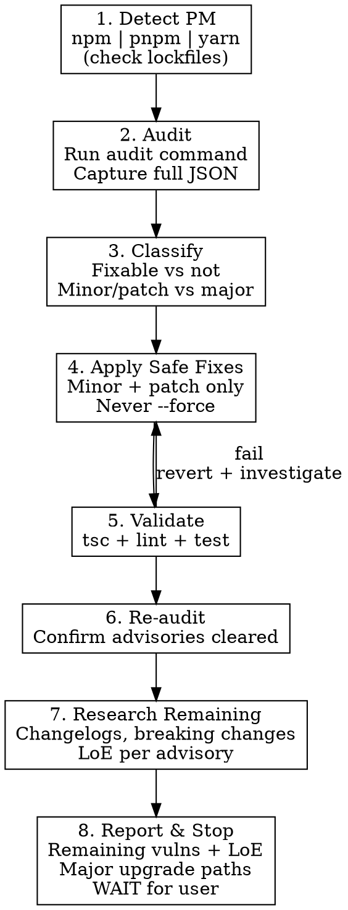

# npm CVE Remediation

## Overview

Systematic, two-stage approach to resolving npm/pnpm security vulnerabilities: **apply all safe (minor/patch) fixes first, then stop and report**. Major version bumps require explicit user approval — never apply them automatically, even when `npm audit fix --force` would resolve more advisories.

Core principle: **maximize fixes that cannot break the build before involving the user; never trade an advisory for a behavior change without consent.**

## When to Use

- After running `npm audit` / `pnpm audit` and seeing vulnerabilities
- Triaging Dependabot, Renovate, or GitHub security advisory alerts
- Investigating a published CVE that may affect the project
- Before a release, as part of a security gate

**Not for:** General dependency upgrades (use `dependency-upgrades` skill), adding new dependencies, or vulnerabilities in non-npm ecosystems.

## Workflow



## Quick Reference

| Rule | Detail |
|------|--------|
| **Detect first** | Look for `pnpm-lock.yaml`, `yarn.lock`, or `package-lock.json` before running any audit command |
| **Capture JSON** | Always run audit with `--json` and save the output — needed for downstream parsing and reporting |
| **Safe fixes only** | Apply minor/patch upgrades automatically; **never** run `npm audit fix --force` or `pnpm update --latest` without approval |
| **Validate after fixes** | Zero TS errors, zero lint errors, all tests pass — after the safe-fix batch |
| **Stop before majors** | Hard stop after safe fixes. Report remaining advisories + proposed major paths. Wait for explicit "go ahead". |
| **Research before reporting** | For every remaining advisory, read changelogs/migration guides and produce a level-of-effort estimate before stopping |
| **Never do** | Auto-apply majors, run `--force`, suppress advisories via overrides without user approval, delete the lockfile |
| **Severity prioritization** | Surface critical/high in the report first; low/moderate listed but de-emphasized |

## Step-by-step

### 1. Detect package manager

| Lockfile present | Use |
|------------------|-----|
| `pnpm-lock.yaml` | `pnpm` |
| `yarn.lock` | `yarn` (note: `yarn audit` differs across v1 vs Berry) |
| `package-lock.json` | `npm` |

If multiple lockfiles exist, flag this to the user — it's a misconfiguration that should be resolved before remediation.

### 2. Audit

```bash
# npm
npm audit --json > /tmp/audit.json
npm audit                              # human-readable summary

# pnpm
pnpm audit --json > /tmp/audit.json
pnpm audit                             # human-readable summary
```

Capture the full JSON output. The summary view hides advisory IDs, paths, and fix availability that you need later.

### 3. Classify advisories

For each advisory, determine:

- **Severity** — critical / high / moderate / low
- **Direct vs transitive** — is the vulnerable package a direct dependency or pulled in by another package?
- **Fix availability**:
  - **Safe**: a minor or patch version of a direct dep resolves it, OR a transitive bump is available within existing semver ranges
  - **Major**: only resolvable by a major bump of a direct dep (or its parent)
  - **No fix**: no patched version published yet — note the advisory and skip
- **Coupled packages** — if the fix touches a package in a known group (React, MUI, Prisma, tRPC, TS tooling), update the whole group together

### 4. Apply safe fixes

Prefer the package manager's targeted commands over blanket `audit fix`:

```bash
# npm — targeted minor/patch bump
npm install <pkg>@<safe-version>

# npm — let audit fix handle the easy case (no --force)
npm audit fix

# pnpm — targeted bump
pnpm update <pkg>@<safe-version>

# pnpm — restricted to safe ranges
pnpm audit --fix
```

**Forbidden without explicit user approval:**

- `npm audit fix --force`
- `pnpm update --latest`
- Editing `overrides` / `resolutions` / `pnpm.overrides` to pin a transitive
- Deleting the lockfile and reinstalling

### 5. Validate

After the safe-fix batch, run the AI validation suite:

```bash
npm run tsc       # or pnpm tsc
npm run lint      # or pnpm lint
npm run test      # or pnpm test
```

Zero TS errors, zero lint errors, all tests pass. If anything fails, revert the offending change and investigate before proceeding — do **not** suppress or `--force` past the issue.

Remind the user to run `npm run build` (or `pnpm build`) themselves — dev/test success ≠ build success.

### 6. Re-audit

Re-run `npm audit` / `pnpm audit` to confirm which advisories cleared and exactly what remains. Diff against the initial audit so the report is accurate.

### 7. Research remaining advisories

For every advisory that survived the safe-fix pass, do the legwork the user would otherwise have to do themselves. The goal: turn each remaining vulnerability from "unknown unknown" into a costed decision.

For each remaining advisory, gather:

- **Fix path** — the minimum upgrade(s) that resolve it. If the vuln is transitive, identify the direct dep that owns the dependency line and what version of that direct dep first pulls in a patched transitive.
- **Breaking changes** — read the target version's changelog / migration guide / release notes. Pull out the breaking changes that actually affect this codebase (search for the relevant APIs in `src/`).
- **Coupled upgrades** — peer dep constraints, plugin compatibility, ecosystem coupling (e.g., bumping `react` forces `react-dom`, `@types/react`, `@testing-library/react`; bumping `eslint` forces config + plugin updates).
- **Codemods / automated migrations** — note if the maintainer ships one (e.g., `npx @next/codemod`, `react-codemod`, `@mui/codemod`). Codemods drop LoE substantially.
- **Call-site footprint** — `rg` for the affected APIs in this codebase. "Used in 3 files" vs "used in 200 files" is the difference between S and L.
- **Exploitability in this codebase** — is the vulnerable code path actually reachable? A prototype-pollution CVE in a build-time-only dep is materially different from one in a runtime request handler. Note when severity overstates real risk.

#### Level-of-effort rubric

Estimate each remaining advisory (and each proposed major upgrade path) using this scale. Time estimates assume one engineer familiar with the codebase, including validation:

| LoE | Time | Looks like |
|-----|------|------------|
| **XS** | < 30 min | Patch a leaf dep, no API changes, no call-site edits |
| **S** | < 2 hrs | One major bump with codemod or trivial rename; < 10 call-site touches |
| **M** | half-day to 1 day | One major across a coupled group (peers + types); manual edits across 10–50 call sites; predictable migration guide |
| **L** | 1–3 days | Multi-package coordinated bump; behavior changes (not just API renames); 50+ call sites; new test coverage required |
| **XL** | multi-day to weeks | Framework/runtime swap, API redesign required, tests need substantial rewrites, or no clean migration path (replacement or fork needed) |

When in doubt, round up — surprise breakage is more expensive than a conservative estimate.

#### Use a subagent for research

Remaining-advisory research is parallelizable and context-heavy (changelogs, migration guides, release notes, web searches). Dispatch one Explore-type subagent per advisory or per coupled group, with the gathered output, then synthesize into the report. Do not pull all the changelogs into the main conversation.

### 8. Report and stop

Stop here. Do not proceed to majors without explicit user approval. Use the report template below — every remaining advisory and every proposed major upgrade path must carry an LoE estimate.

## Report Template

```markdown
## CVE Audit Report

**Package manager:** {npm|pnpm|yarn}
**Initial advisories:** {N} ({critical}/{high}/{moderate}/{low})
**Resolved by safe fixes:** {N}
**Remaining:** {N} ({critical}/{high}/{moderate}/{low})

### Safe fixes applied ({count})

| Package | From | To | Advisories cleared |
|---------|------|----|--------------------|
| `{pkg}` | {old} | {new} | GHSA-xxxx-xxxx-xxxx (high) |

Validation: tsc {pass/fail}, lint {pass/fail}, test {pass/fail}.
Engineer must run `{npm|pnpm} run build` to confirm.

### Remaining vulnerabilities

#### Critical / High

- **`{pkg}@{current}`** — {GHSA-id}, {short title}
  - Path: `{direct-pkg} > ... > {vuln-pkg}` (or "direct dependency")
  - Fix requires: `{pkg}` major bump `{current-major}` -> `{target-major}`
  - **LoE: {XS|S|M|L|XL}** ({estimate, e.g. "~4 hrs"}) — {one-line justification}
  - Breaking changes that hit this codebase: {bullet list, or "none"}
  - Coupled upgrades required: {peer deps / plugins / types, or "none"}
  - Codemod available: {yes — `<command>` / no}
  - Call-site footprint: {N files, M call sites — based on rg of affected APIs}
  - Exploitability in this codebase: {reachable runtime / build-time only / dev-only / unclear}
  - Migration notes: {1-2 lines, link to migration guide}

#### Moderate / Low

(condensed list, but still LoE-tagged)

| Package | Advisory | Severity | Fix | LoE |
|---------|----------|----------|-----|-----|
| `{pkg}` | GHSA-... | moderate | major `{current}->{target}` | S |

### Proposed major upgrade paths

Ordered by recommended sequencing (lowest LoE / highest advisory clearance first):

| # | Package(s) | Bump | Advisories cleared | LoE | Risk | Notes |
|---|-----------|------|--------------------|-----|------|-------|
| 1 | `{pkg}` (+ peers) | {current}->{target} | {N} ({crit}/{high}) | M (~1 day) | medium | Codemod available; touches {N} files |
| 2 | ... | | | | | |

### No-fix-available advisories

- **`{pkg}@{version}`** — {GHSA-id}. No patched version published. {Optional: workaround / mitigation if known.}

### Total outstanding effort

- Critical/High: {sum of LoE estimates, e.g. "~2 days"}
- Moderate/Low: {sum, e.g. "~4 hrs"}
- **Total: {range, e.g. "2.5–3 days"}** — assumes one engineer, sequential execution; parallel work or unfamiliarity with affected areas will shift this.

---

**Awaiting your decision:** which (if any) major upgrades should I proceed with? Recommended starting point: {#N from table above} — {one-line reason}.
```

## Anti-patterns

- Running `npm audit fix --force` to drive the count to zero
- Treating moderate/low advisories with the same urgency as critical/high without weighing exploitability
- Adding `overrides`/`resolutions` to mask a transitive without surfacing the trade-off
- Suppressing advisories (`audit-ci` config, `.npmrc audit=false`) instead of fixing
- Skipping validation between the safe-fix batch and the report
- Bundling a major bump into the "safe" batch because it "looked simple"
- Deleting the lockfile and reinstalling to "clean up" — destroys the audit baseline
- Reporting remaining advisories as a bare list ("here's what's left, what do you want to do?") without LoE estimates or breaking-change analysis — pushes the research cost back onto the user
- Producing LoE estimates without grounding them in actual changelog reading and call-site `rg` counts (gut-feel estimates are worse than none)

## Coordination with other skills

- For non-security major bumps that come up during remediation, hand off to `dependency-upgrades` (phased upgrade workflow, validation gates, PR template).
- For complex root-cause investigation of a CVE's actual exploitability in this codebase, use `investigate`.

## Pull request creation

Same rule as `dependency-upgrades`: **never auto-create**. Wait for explicit request after the user has signed off on the applied updates, then open with `--draft`.

### Triggering conditions

- User has reviewed the CVE Audit Report and confirmed the safe-fix batch is acceptable
- Validation (tsc / lint / test) is green
- User explicitly asks for a PR

If any of the above is missing, do not create the PR — ask first.

### Title

`fix(deps): resolve {N} security advisories ({critical+high} critical/high)`

If zero critical/high were resolved, drop that parenthetical.

### Body — keep it high level

The PR description is **not** a re-paste of the full CVE Audit Report. Reviewers want a quick severity-delta summary, not a wall of GHSA IDs. Use this template:

```markdown
## Summary

Resolves {N} npm security advisories via safe (minor/patch) upgrades. No major version bumps included; remaining advisories tracked separately.

## Severity delta

| Severity | Before | After | Resolved |
|----------|--------|-------|----------|
| Critical | {N}    | {N}   | {N}      |
| High     | {N}    | {N}   | {N}      |
| Moderate | {N}    | {N}   | {N}      |
| Low      | {N}    | {N}   | {N}      |
| **Total**| **{N}**| **{N}**| **{N}** |

## Notable changes

<!-- ONLY include this section if a specific dependency warrants extra reviewer attention.
     Skip entirely if all bumps are routine patch upgrades. Examples of when to include:
     - Bump touches a runtime-critical path (auth, payments, request handling)
     - Behavior change documented in the dep's changelog beyond the security fix
     - Manual verification step required (e.g., "exercise the upload flow")
     - Override / resolution added (and approved) to pin a transitive
     - Bump affected a coupled group (peer deps, types) and may need re-typecheck on consumers -->

- **`{pkg}` {old}->{new}** — {one-line reason this needs reviewer attention}

## Remaining advisories

{N} advisories remain, requiring major upgrades — out of scope for this PR.
```

### What NOT to include in the PR body

- Per-package GHSA tables for every safe fix (severity counts already convey impact; reviewers can `git diff package.json`)
- The remaining-advisory deep dive with LoE estimates (that lives in the chat report and/or a tracking issue, not the PR description)
- Migration notes for upgrades that didn't happen
- Marketing-style framing ("hardens our security posture") — stick to facts
