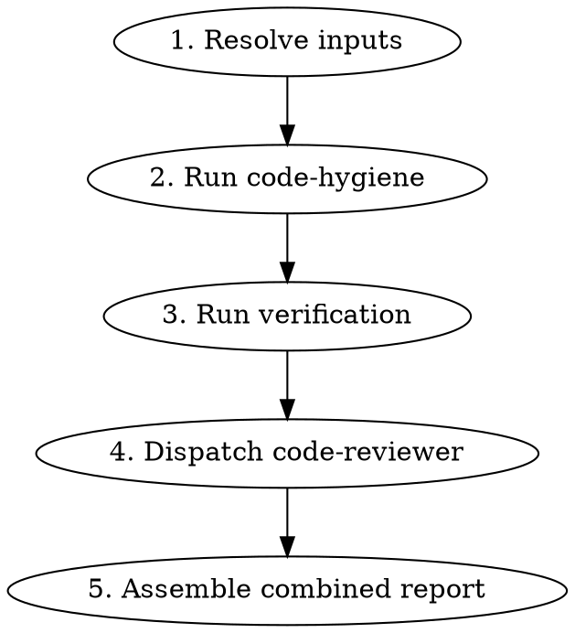

# Pre-PR Review

## Overview

Orchestrator skill that runs three review steps back-to-back before opening a PR: code hygiene cleanup, verification (typecheck/lint/tests), and code quality review. Produces a single combined report. No gates between steps — all run automatically.

## When to Use

- Before opening a pull request
- When you want a comprehensive branch review in one pass
- User says "review this branch", "is this ready for PR", "pre-pr check"

## When NOT to Use

- Mid-development cleanup only (use `code-hygiene` standalone)
- Quick verification only (just run typecheck/lint/test directly)

## Input Resolution

Resolve inputs **once** at the start — all three steps use the same context.

### Base Branch

```bash
BASE_BRANCH=$(git rev-parse --verify develop 2>/dev/null && echo develop || \
  git rev-parse --verify main 2>/dev/null && echo main || echo master)
MERGE_BASE=$(git merge-base $BASE_BRANCH HEAD)
```

### Scope Reference

Accept in priority order:
1. **Asana task ID/URL** — Pull description via Asana MCP (`get_task`)
2. **GitHub issue number** — Pull via `gh issue view <number>`
3. **Freeform text** — Engineer provides scope description inline
4. **None** — Ask. If still none, pass to code-hygiene without scope (it will skip scope compliance and note it)

### Empty Diff Guard

If `git diff --name-only $MERGE_BASE...HEAD` returns nothing, report "No changes found between HEAD and $BASE_BRANCH — nothing to review." and stop. Do not run any steps.

## Workflow



### Step 1 — Resolve Inputs

Detect base branch, compute merge base, resolve scope reference. These values are passed to all subsequent steps.

### Step 2 — Run Code Hygiene

Execute the full `code-hygiene` skill workflow:
- Phase 2: Auto-fix artifacts (console.*, debugger, commented-out code)
- Phase 3: Auto-add unit tests to existing suites
- Phase 4: Collect findings (scope compliance, TODOs, test suggestions, observations)

Capture the full report output (auto-fixed items + findings) for the combined report.

### Step 3 — Run Verification

Run after code-hygiene since it may have edited files.

```bash
# Typecheck
pnpm run typecheck

# Lint
pnpm run lint

# Tests
pnpm run test
```

If the project uses Turbo with change detection, scope to affected packages:

```bash
pnpm turbo typecheck --filter='...[{MERGE_BASE}]'
pnpm turbo lint --filter='...[{MERGE_BASE}]'
pnpm turbo test --filter='...[{MERGE_BASE}]'
```

Record pass/fail status and error counts. If auto-added tests from Step 2 fail, clearly attribute those failures separately from pre-existing test failures.

### Step 4 — Dispatch Code Reviewer

Dispatch the `superpowers:code-reviewer` agent using the existing `code-reviewer.md` template.

**Template values:**
- `{WHAT_WAS_IMPLEMENTED}` — derived from the scope reference (Asana task description, GH issue body, or freeform text)
- `{PLAN_OR_REQUIREMENTS}` — same scope reference, plus note any verification failures from Step 3
- `{BASE_SHA}` — the computed `MERGE_BASE`
- `{HEAD_SHA}` — current `HEAD`
- `{DESCRIPTION}` — one-line summary of the branch changes

The code reviewer operates on the branch **after** hygiene auto-fixes, so it won't flag artifacts that were already cleaned up.

### Step 5 — Assemble Combined Report

Combine all outputs into a single sequential report.

## Combined Report Format

```markdown
## Code Hygiene

### Auto-fixed
- Removed `console.log` at `src/lib/api/client.ts:47`
- Removed commented-out code block at `src/utils/format.ts:15-22`
- Added 2 unit tests to `src/lib/hooks/__tests__/useAuth.test.ts`

### Needs Your Review
- [Scope] `prisma/schema.prisma` was modified but not referenced in ticket scope
- [TODO] `src/components/FWButton.tsx:42` — `// TODO: add haptic feedback` — remove or keep?
- [Tests] No test file exists for `src/lib/utils/formatDate.ts` — consider creating one
- [Tests] Integration test suggestion: verify the full form submission flow

## Verification
- Typecheck: Pass (0 errors)
- Lint: Pass (2 warnings)
- Tests: 47/47 passing
  - Auto-added tests: 2/2 passing

## Code Review

### Strengths
- ...

### Issues

#### Critical (Must Fix)
- ...

#### Important (Should Fix)
- ...

#### Minor (Nice to Have)
- ...

### Recommendations
- ...

### Assessment
**Ready to merge?** Yes / No / With fixes
**Reasoning:** ...
```

## Rules

- **No gates** — all steps run automatically without waiting for engineer approval between them
- **Single input resolution** — base branch, merge base, and scope reference are resolved once and shared across all steps
- **Verification runs after hygiene** — since hygiene may edit files, verification must reflect the post-cleanup state
- **Code reviewer runs last** — reviews the cleaned branch with verification results as context
- **Report clearly separates concerns** — engineer can scan each section independently
- **Auto-added test failures are attributed** — if tests from Step 2 fail in Step 3, call this out explicitly so the engineer knows which failures are new
