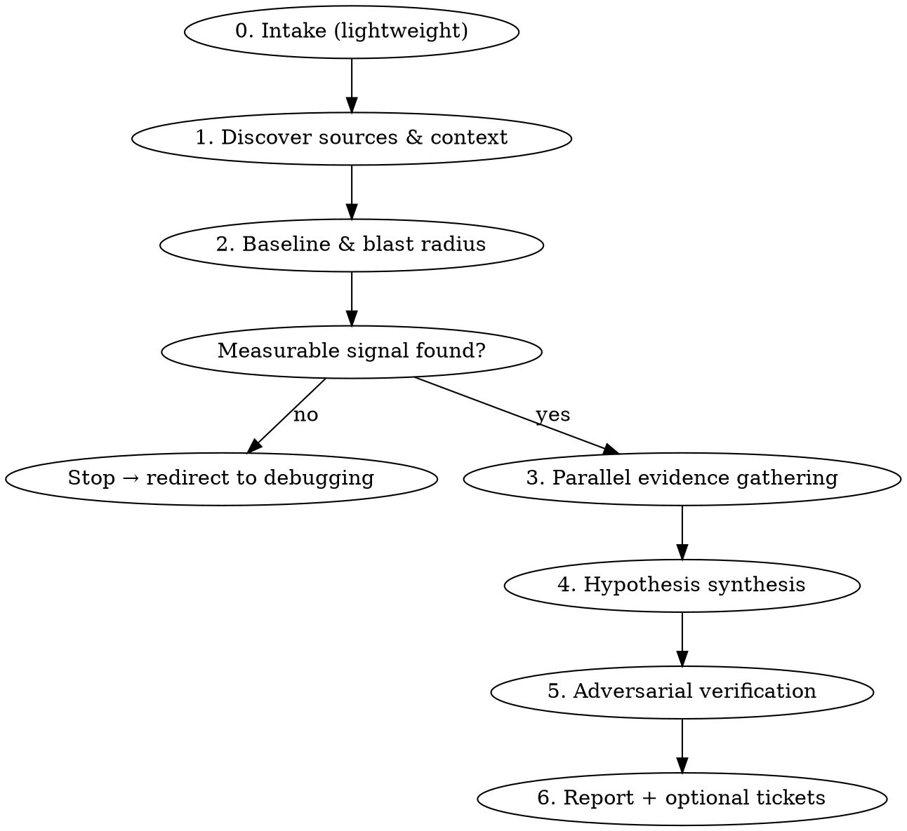

# Regression Analysis

## Overview

A disciplined deep-dive for **metric-grounded regressions** — something measurably got worse
(latency, error rate, throughput, saturation) and you want evidence-ranked hypotheses for *why*,
with each claim traceable to a concrete artifact (a metric value, a commit, a deploy, an error ID,
a code path). The deliverable is a research report that tells you **where to look next**, not a fix.

This skill orchestrates parallel sub-agents — one per relevant data source — so the heavy
observability payloads stay out of the main context. It is **read-only**: it never edits code,
proposes a fix implementation, or opens PRs.

## When to Use

- A symptom + time window ("checkout p95 regressed over the last two weeks")
- A pointer to a regressing metric or dashboard
- An alert, incident, or error spike used as the seed

## When NOT to Use

- A vague "feels slow" with nothing measured — there is no baseline to anchor to
- A "will this be fast enough?" concern during feature development
- A known bug needing a fix → use `investigate` / `superpowers:systematic-debugging`

A general *prompt* is fine ("the app got slow lately"). What's required is that **observable data
exists to ground the investigation** — the skill goes and finds it (Phase 2). If it can't, it exits.

## How Sources Are Selected — Read This

> **This skill has NO hardcoded list of data sources.** It discovers, at runtime, which
> observability MCP servers you have configured (they appear in-session as `mcp__<server>__<tool>`
> tools) and routes to whatever fills each **capability role** below. Specific product names in this
> file are *recognition examples only* — if you have Datadog instead of BetterStack, or Linear
> instead of Asana, the skill matches by role and proceeds with no edits. Install a new
> observability MCP tomorrow and it gets picked up automatically.

| Capability role | Example servers that fill it (not exhaustive) |
|---|---|
| Metrics / telemetry | BetterStack, Datadog, Grafana, Prometheus |
| Error / transaction tracking | Sentry |
| Product / session analytics | PostHog, Amplitude |
| Deploys / runtime logs | Vercel, Netlify, cloud platform logs |
| Change history | git (local — always present) |
| Ticketing (Phase 6, opt-in) | Asana, Linear, Jira, GitHub Issues |

If a role has **no** configured source, do not fail — note the gap in the report's Coverage section
so there are no silent blind spots.

## Workflow



### Phase 0 — Intake (lightweight)

Accept the prompt as-is. Capture any pointers the user happened to provide (a metric name, a time
window, an alert/issue ID). Do **not** gate on prompt specificity — the grounding happens in Phase 2.

### Phase 1 — Discover sources & context

Run two discoveries in parallel:

- **Codebase:** inspect deps, configs, and instrumentation to infer the stack (e.g. RN/Expo,
  serverless functions, a backend, a DB, queues) and what is actually instrumented.
- **Available MCPs:** enumerate the `mcp__*` tools present in the session and bucket them by the
  capability roles above. Also note which ticketing MCP exists (for Phase 6). Nothing is hardcoded.

Map stack → relevant data sources. Report which roles are covered and which are absent.

### Phase 2 — Baseline & blast radius (the grounding step)

Quantify the regression from real data:

- **Before/after windows** and the **onset** (when did it change?)
- **Magnitude** (p50/p95/p99, error rate, throughput — whichever applies)
- **Blast radius** — which endpoint / screen / route / job / cohort is affected

This produces the anchor every later claim must trace back to.

> **Evidence-based exit:** if no measurable signal can be established here, **stop** and redirect to
> `investigate` / `superpowers:systematic-debugging`. State plainly that there was nothing to ground
> the investigation in. Do not proceed to hypotheses without a baseline.

### Phase 3 — Parallel evidence gathering

Fan out **one focused sub-agent per relevant source** (use the Agent tool — `Explore` or
`general-purpose`, which can reach session MCP tools). Hand each the same window, symptom, and the
Phase 2 baseline numbers. Always include a **change-history** sub-agent over git commits / PRs /
merges intersecting the regression window.

Each sub-agent returns a **structured findings digest — not raw query output** — so heavy payloads
never reach the main context. Shared return schema:

```
- source: <role or server>
- findings[]:
    - claim: one sentence
    - evidence: concrete artifact (metric value + timestamp, commit SHA, deploy ID,
                error/issue ID, file:line, and the exact query used)
    - window_alignment: does it coincide with the regression onset?
    - strength: direct | suggestive | absent
```

### Phase 4 — Hypothesis synthesis

Correlate signals across sources into candidate causes. Each hypothesis must name a **causal
mechanism in the code/system**, not just a coincidence. Example:

> "p95 step-change at 2026-06-20 14:20 UTC aligns with deploy `abc123`, which merged PR #841
> introducing an N+1 query in `orders.ts:88`."

### Phase 5 — Adversarial verification

Challenge each candidate with a skeptic pass (dispatch skeptic sub-agents for the non-trivial ones):
is this causal or coincidental? Could the evidence be explained another way (a deploy that aligns in
time but only touched CSS)? Outcomes:

- **Survivors** → tagged **High / Medium / Low** confidence with the reasoning.
- **Refuted** → moved to a "Considered & ruled out" list with *why*.

## Evidence Standard (non-negotiable)

- **No claim without a linkable artifact.** "The DB got slower" is not a finding;
  "`getOrders` p95 rose 40ms→680ms starting 2026-06-20 14:20 UTC [chart link]" is.
- Anything asserted without an artifact is tagged `unverified` and **cannot rank above Low**.
- **Correlation ≠ causation.** Synthesis must state the mechanism; adversarial verification exists
  specifically to kill plausible-but-coincidental links.
- Report findings faithfully — if a role had no source, or a query returned nothing, say so.

## Phase 6 — Report + optional tickets

Write the report to `docs/regressions/YYYY-MM-DD-<slug>.md`:

1. **Summary** — the regression quantified (what, how much, since when).
2. **Ranked hypotheses** — each with: confidence tier, causal mechanism, cross-source evidence
   links, and **per-hypothesis suggested follow-ups** (e.g. "profile `getOrders` under load",
   "bisect deploys abc123..def456").
3. **Considered & ruled out** — refuted candidates and why.
4. **Coverage notes** — which sources were queried, which were unavailable, what couldn't be
   grounded. No silent gaps.

After presenting the report, **ask**: *"Want me to create follow-up tickets for any of these?"* If
yes, use the ticketing MCP discovered in Phase 1 (Asana / Linear / Jira / GitHub Issues) — one
ticket per selected hypothesis, with evidence and follow-ups inlined. Create no external artifacts
without explicit confirmation.
